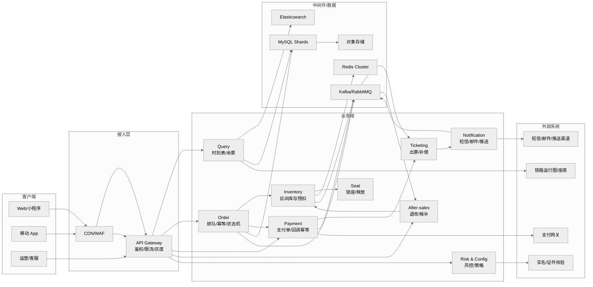
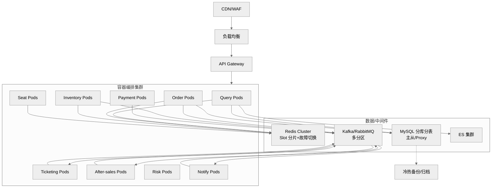
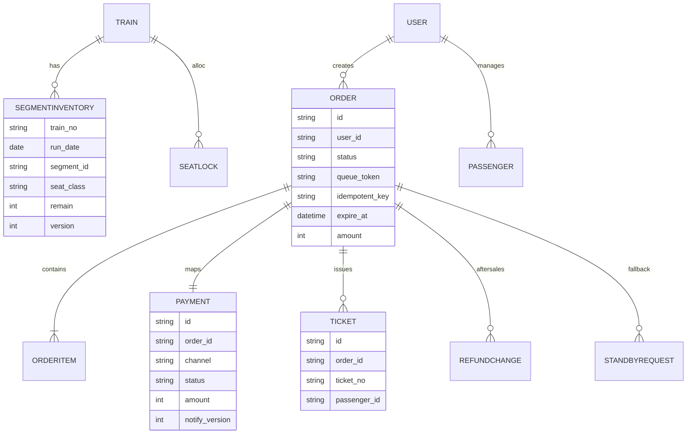
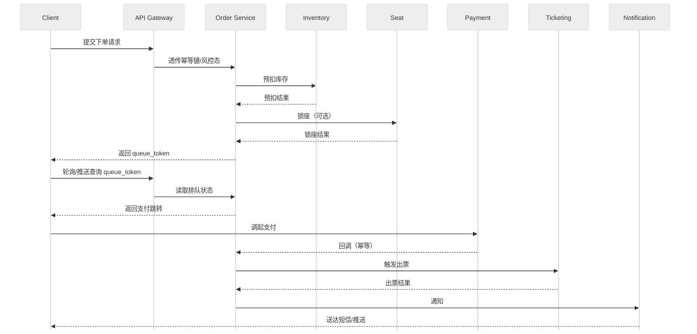
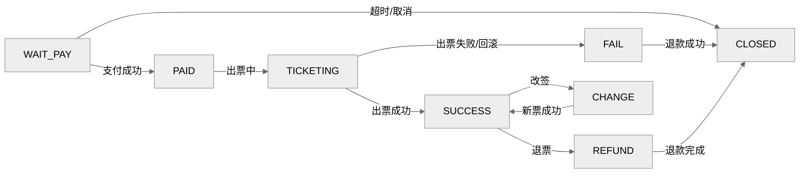

# 高并发火车票购票系统——概要设计说明书
> 版本：v2.0（2025-12-26）  
> 适用范围：互联网/移动售票场景，读峰值≥100 万 QPS、写峰值（出队后下单）≥20 万 TPS（排队削峰后）  
> 文档类型：概要设计（高层架构、模型、关键策略）  
> 渲染说明：包含 mermaid 图表，需在支持 mermaid 的环境查看；不支持时可用 mermaid Live Editor 或文字版关系/时序/状态描述。

---

## 目录
1. 引言  
2. 任务概述  
3. 总体设计（处理流程、结构与功能分配）  
4. 接口设计（外部接口、内部接口）  
5. 数据结构设计（逻辑/物理、数据与程序关系）  
6. 运行设计（模块组合、运行控制、运行时间）  
7. 出错处理设计  
8. 安全保密设计  
9. 维护设计  
10. 模型与视图（对象、ER、时序、状态机）  
11. 演化与 ADR 摘要  
12. 附录  

---

## 章节摘要
- 引言：目的、背景、定义、参考。
- 任务概述：目标、运行环境、需求概述、条件与限制。
- 总体设计：处理流程，总体结构/模块外部设计，功能分配。
- 接口设计：外部接口、内部接口。
- 数据结构设计：逻辑、物理、数据与程序关系。
- 运行设计：运行模块组合、运行控制、运行时间。
- 出错处理设计：输出信息与对策。
- 安全保密设计、维护设计。
- ADR 与演化、附录。

---

## 一．引言
1. 编写目的：提供高并发火车票购票系统的高层架构、关键策略、模型与演化决策，指导后续详细设计与实现，读者包括架构/开发/测试/运维。  
2. 项目背景：春运/节假日高峰，对接铁路运行图/实名/支付/通知等外部系统；委托/开发/运维单位协同。  
3. 定义：区间段（最小扣减单元）、预扣库存（缓存原子扣减待落库）、锁座（席位占用超时释放）、幂等键（请求唯一指纹）、排队 Token（排队查询凭据）、SLO/SLA（服务目标/协议）；关键架构决策记录在 ADR。  
4. 参考资料：项目任务书/合同（如有）；SRS；测试计划（初稿）；用户操作手册（初稿）；国家/行业规范（实名、安全、隐私、支付相关）；外部接口协议与验签规范（铁路运行图/实名/支付/短信）；内部安全/日志/加密规范；历史压测与容量评估数据。  

---

## 二．任务概述
1. 目标：支撑高并发查询与下单，零超卖，满足可用性/一致性/性能目标（查询 P95<120ms/可用性 99.99%；写 P95<3s/可用性 99.95%），覆盖查询、下单/排队、支付/出票、退改/候补、通知、风控与运营。[^sre][^ddia]  
2. 运行环境：云/数据中心 K8s，多 AZ；依赖 Redis/Kafka/MySQL/ES/对象存储等中间件。  
3. 需求概述：参见 SRS 功能/非功能需求，概要设计侧重架构与策略实现路径。  
4. 条件与限制：合规与外部依赖 SLA；容量/资源约束；发布与演练需灰度、回滚预案；mermaid 渲染需兼容或用文字版替代。  

---

## 三．总体设计
### 1．处理流程
- 核心流程：查询（缓存优先）→下单排队→库存预扣/锁座→支付→出票→通知→退改/候补补偿。详见时序图。

### 2．总体结构和模块外部设计
#### 上下文/组件关系图

**图解**：\n- 客户端（Web/APP/运营）首先经 CDN/WAF 抗 DDoS 与静态分发，再进入 API Gateway 做鉴权、限流、灰度与路由。\n- 网关将请求分发到业务域：查询（缓存+ES/DB）、订单（排队/幂等/状态机）、库存（预扣）、座位（锁座）、支付（支付单/回调）、出票、退改候补、风控/配置、通知。\n- 中间件层：Redis 做缓存/分布式锁；Kafka/RabbitMQ 传递事件（订单、库存、通知等）；MySQL 分片存 OLTP；ES 提供搜索；OSS 存放报表/归档。\n- 外部集成：支付网关回调推动订单/出票；实名核验；运行图/座席同步供查询与预扣；短信/邮件推送通知用户。

#### 部署视图（高并发场景）

**图解**：\n- 前端流量：CDN → LB → API Gateway，再进入 K8s 集群中的各微服务 Pod（查询、订单、库存、座位、支付、出票、退改候补、风控、通知）。\n- 数据/中间件：Redis Cluster（slot 分片+故障切换）、Kafka/RabbitMQ（多分区）、MySQL 分库分表（主从/Proxy）、ES 集群；对象存储/备份用于冷热归档。\n- 链路示意：各服务对 Redis/DB/ES 进行读写，对 Kafka 发送/消费事件（订单、库存、支付、通知）；备份/归档从数据库流向冷存储。\n- 可靠性：多 AZ 部署，中间件高可用，Pod 可横向扩展。

---

### 3．功能分配
- 接入层：鉴权、限流、灰度、路由、幂等键透传。
- 查询域：站点/车次/余票/价目，缓存+ES+只读库。
- 订单/库存/座位：排队、预扣、锁座、状态机、超时回收。
- 支付/出票：支付单、回调幂等、出票重试/补偿。
- 退改/候补：规则校验、双阶段改签、候补匹配与锁票。
- 风控与运营：黑名单、频控、灰度策略；通知：短信/邮件/推送。
- 数据与中间件：Redis/Kafka/MySQL/ES/OSS 提供缓存、事件、存储、索引。

---

## 四．接口设计
### 1．外部接口
- 运行图/座席：查询接口超时 500~1000ms，失败降级缓存；数据同步任务带重试与校验和。[^fault]
- 实名/证件：同步/异步校验，超时 3s，最多 3 次指数退避，必须验签。[^fault]
- 支付平台：创建支付单、回调通知；超时 3s，回调验签+幂等，失败重试+DLQ。[^fault]
- 短信/邮件/推送：模板化发送，超时 2s，失败重试+渠道熔断；备用通道切换。[^fault]
- 风控服务：评分/校验接口，超时 1s，失败时走验证码/拒绝分支。[^fault]

### 2．内部接口
- 服务间通过 API Gateway（HTTP/REST）和 Kafka/RabbitMQ 事件通信；同订单/车次使用分区键保证局部有序；所有写接口携带 `idempotent_key`。[^mq]
- 调用超时与重试：核心写链路仅一次幂等重试或不重试；查询类可短重试；统一熔断策略。[^fault]
- 接口安全：网关鉴权+签名校验；内部服务校验租户/渠道/幂等键。[^security]

---

## 五．数据结构设计
### 1．逻辑结构设计
- 缓存分层与热点治理：浏览器/APP 本地缓存→CDN/边缘→Gateway 本地缓存→Redis（5~20s TTL，二级本地缓存 200~500ms，弱一致）→只读库/ES；防击穿/雪崩：随机 TTL、请求合并、预热、兜底；版本戳/校验和纠偏。[^cache]
- 库存一致性/防超卖：区间库存 Redis Lua 原子预扣+版本号；写侧单线程/分片顺序消费 MQ 回写 MySQL 账本；定时对账与差值告警；支付超时/出票失败原路回补。[^dbmq]
- 幂等：入口 `idempotent_key`+`queue_token`（15 分钟），幂等记录在线 7 天、归档 30 天；状态只能前进。[^idemp]
- 支付回调：签名+幂等，指数退避重试（1/2/4/8... 最多 6~8 次），落库失败入 DLQ。[^fault]
- 排队与削峰：入口频控（账号/设备 3 QPS，突发桶 10），队列上限 5 万/车次/日，出队速率 `min(2%*remain, 2000)` 单/秒，超长转候补。[^queue]
- 分库分表：库按车次/日期哈希或区间，表按订单号雪花 ID 路由；跨分片读依赖 ES/OLAP；再平衡用双写/灰度切换和回放；历史归档策略。[^dbmq]
- MQ：按领域拆 topic（order/stock/payment/notify），同订单/车次分区键保证局部有序；消息含 `event_id/version`；延迟队列+DLQ 重试，支持 7 天回溯。[^mq]
- 候补：状态机（PENDING→MATCHING→LOCKED→AWAIT_PAY→SUCCESS/FAIL），分段队列与优先级（时间、会员、乘客数）；锁票/支付超时回补，库存/支付解耦。[^queue]
- 外部集成：实名/支付/短信等设定超时、最大重试（3 次指数退避）、熔断与降级返回码；SLA 明确，签名/验签算法契约化。[^fault]
- 安全与合规：实名、加密/脱敏、审计、风控联动；频控与灰度可配置（1%~20% 灰度）。[^security]
- 监控与告警：对账差值、补偿成功率、滞留订单、DLQ、支付回调重复率、排队 P95、缓存命中率、Redis/DB/消息 P95、外部超时/熔断。[^sre]
- 运行/批处理：运行图同步、库存对账、归档、告警巡检等批任务需错峰调度，避免与开售高峰冲突。[^sre]

### 2．物理结构设计
- 分库分表：库按车次/日期哈希或区间，表按订单号雪花 ID 路由；跨分片读依赖 ES/OLAP；再平衡用双写/灰度切换和回放；历史归档策略。[^dbmq]
- 核心表举例：订单表（分库分表）、库存账本表（分库）、支付表、票号表、候补表、退款/改签表；索引围绕订单号、train_no+date、用户维度设计。
- 缓存/队列：Redis Cluster slot 分片+故障切换，单分片 <5 万 QPS；Kafka/RabbitMQ 多分区，关键链路局部有序；热点 key 拆分。[^dbmq][^mq]
- 存储：对象存储用于报表/归档；备份与冷热分层按附录容量建议；ES 用于搜索索引，冷热节点分层。[^dbmq]

### 3．数据结构与程序的关系
- 服务与数据域映射：Query→ES/Redis/只读库；Order/Inventory/Seat→Redis+MySQL 账本；Payment→支付单表+回调事件；Ticketing→票号表；After-sales→退款/改签/候补表；事件通过 MQ 串联状态机。

---

## 六．运行设计
### 1．运行模块的组合
- K8s 部署的无状态服务（查询/订单/库存/座位/支付/出票/退改候补/风控/通知），对应上文的 Pods 与中间件集群。

### 2．运行控制
- 排队与速率控制：`min(2%*remain, 2000)` 控制出队；队列上限 5 万/车次/日；频控与灰度可配置。
- 超时控制：锁座/支付超时回收；外部接口超时+重试+熔断；幂等状态单向推进。
- 扩缩容：按 CPU/RT/队列长度触发弹性；开售前预热扩容；高峰后回缩。
- 定时任务：运行图同步、库存对账、数据归档、告警巡检。

### 3．运行时间
- 性能目标：查询 P95<120ms；下单出队后 P95<3s；排队等待 P95<60s。运行窗口需满足开售时段的弹性扩容与快速降级。
- 开售窗口：提前预热缓存与扩容；开售瞬时启用更严频控与队列限速；售罄后降级至候补。

---

## 七．出错处理设计
1. 出错输出信息：对外错误码（如 400/401/403/409/423/504）与可诊断信息；内部告警含事件 ID、分区键、版本号。  
2. 出错处理对策：重试（指数退避）、幂等返回已有结果、降级（转候补/缓存兜底）、熔断/隔离外部依赖、DLQ+回溯重放；锁座/库存失败即时回补。  
3. 典型场景：  
   - 支付回调重复/乱序：以 `payment_id+version` 幂等处理，低版本丢弃。  
   - 出票失败：回滚库存+退款，记录补偿事件，通知用户。  
   - 热点查询击穿：启用本地缓存+请求合并，必要时返回降级数据。  
   - MQ 消费失败：多次重试后入 DLQ，人工/自动回溯重放。  

---

## 八．安全保密设计
- 身份与鉴权：依赖网关鉴权，服务内鉴权/签名校验。
- 数据安全：传输全链路 TLS；数据加密/脱敏（实名、证件、手机号、支付要素）；访问审计与留痕。
- 风控与频控：黑白名单、设备指纹（可选）、验证码、滑窗频控、灰度策略。
- 审计字段：记录用户、设备、IP、时间、操作、结果、幂等键、版本号；脱敏展示。

---

## 九．维护设计
- 可观测性：指标、日志、链路追踪；告警阈值参考关键策略。
- 部署与变更：无状态服务滚动发布、灰度与回滚；健康检查与自动故障转移。
- 运行手册：压测与演练（排队/支付/回调/出票链路）、容量预测与再分片计划。

## 参考与注释
- [^sre] 《Site Reliability Engineering》/《SRE Workbook》关于 SLO、延迟目标与错误预算。  
- [^ddia] 《Designing Data-Intensive Applications》关于一致性、对账、补偿与分片。  
- [^dbmq] MySQL、Elasticsearch、Redis 官方文档；Kafka/RabbitMQ 官方文档关于分片、故障切换和典型用途。  
- [^mq] Kafka/RabbitMQ 官方文档关于分区有序、幂等、DLQ/延迟队列与回溯。  
- [^cache] 缓存雪崩/击穿防护模式（Nginx/Envoy 缓存与限流配置、行业大规模缓存实践）。  
- [^idemp] IETF RFC 7231 幂等语义、AWS/支付网关幂等键实践。  
- [^fault] Resilience4j/Hystrix 超时、退避、熔断、降级模式与 RFC 7231 错误码语义。  
- [^queue] 令牌桶/漏桶流控与容量保护实践（如 Nginx/Envoy 限流配置与 SRE 流量治理经验）。  
- [^security] OWASP ASVS/ISO 27001 关于认证、加密、脱敏、审计的要求。  

---

## 模型与视图

### 对象模型
- Train、Station、SegmentInventory、SeatLock、Order、OrderItem、Payment、Ticket、Refund/Change、StandbyRequest、RiskProfile、ConfigToggle。

### ER 示意

**图解**：\n- 车次域：TRAIN 对应多个 SEGMENTINVENTORY（按日期/区间/席别库存）和 SEATLOCK（锁座记录）。\n- 订单域：ORDER 关联 ORDERITEM（乘客/席别明细），一对一 PAYMENT（支付单）、一对多 TICKET（票号）、一对多 REFUNDCHANGE（退改）、一对多 STANDBYREQUEST（候补）。\n- 用户域：USER 与 PASSENGER 管理实名乘客，并与 ORDER 关联。\n- 关键字段：库存版本号（乐观锁）、金额（分）、状态/队列 token/幂等键，用于一致性与幂等控制。

### 时序（下单→支付→出票）

**图解**：\n- 客户端提交下单，经网关透传幂等键/风控态到订单服务。\n- 订单服务调用库存预扣，成功后调用座位锁座（可选），返回 queue_token 给客户端。\n- 客户端轮询/推送查看排队进度；订单服务准备支付跳转。\n- 客户端完成支付，支付平台回调订单服务（幂等+验签），触发出票。\n- 出票服务出票成功/失败结果写回订单；通知服务发送短信/推送给用户。

### 状态机（订单/支付/出票）

**图解**：\n- 订单初始 WAIT_PAY，支付成功进入 PAID，出票中为 TICKETING。\n- 出票成功进入 SUCCESS，失败进入 FAIL 并触发退款回补；支付超时/取消进入 CLOSED。\n- SUCCESS 可走退票（REFUND）或改签（CHANGE），退票完成回到 CLOSED；改签成功返回 SUCCESS（新票）。\n- 所有状态单向推进，保障幂等与可重复执行。

---

## 演化与 ADR 摘要
- 阶段演进：核心闭环→削峰与弹性→一致性与成本优化→多活与全链路治理。
- 排队削峰：`min(2%*remain, 2000)` 控速，超长队列转候补。
- 库存一致性：Redis 预扣+账本化+对账，放弃跨库分布式事务。
- Redis 选型：Cluster（slot 分片+自动故障转移），单分片 <5 万 QPS，热点拆 key。
- 数据分片迁移：双写灰度+回放，不停服迁移，历史归档。
- MQ 顺序/幂等：分区键保证局部有序，`event_id/version` 幂等，DLQ+回溯。
- 候补策略：分段队列+优先级，锁票/支付超时回补。
- 容灾：同城双活优先，RPO≈0，RTO<30 分钟；异地容灾按冷备演练推进。

---

## 附录
- 容量建议：峰值 100 万 QPS 查询 / 20 万 TPS 写；Redis 分片 8~16（单分片 <5 万 QPS）；Kafka 分区≥核数（32~64 示例）；MySQL 分片 TPS 5000 假设。
- 最小部署（非生产）：单 Region、多 AZ；双节点 Redis 主从、双节点 MySQL 主从、三节点 Kafka、3 节点 ES、2 节点 Gateway/业务服务；开启限流与压测隔离，带健康检查与自动故障转移，定期演练切换。
