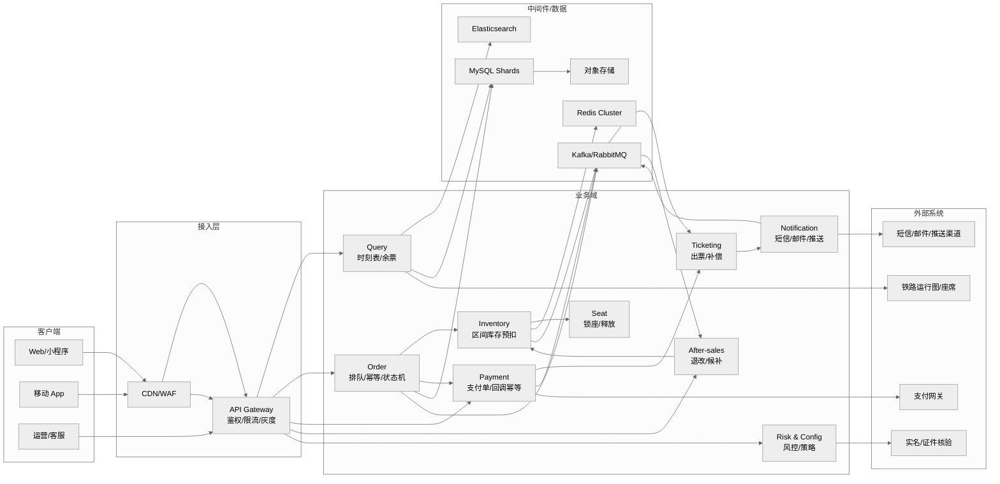
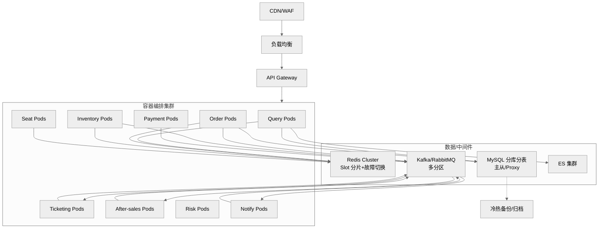
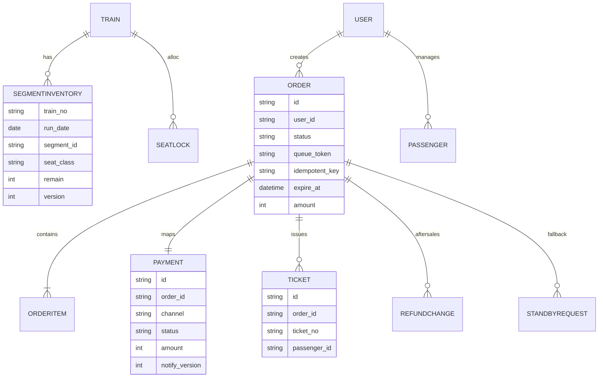
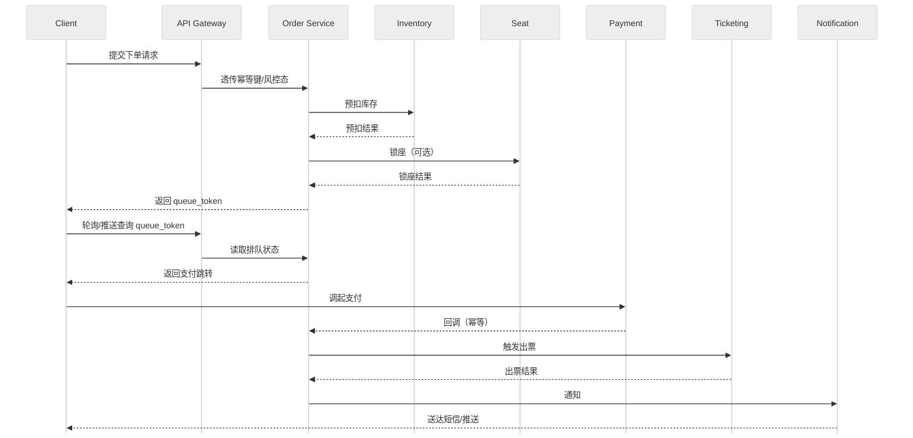
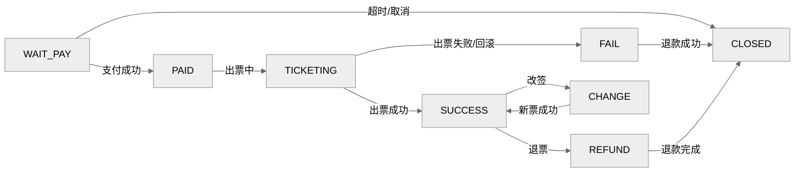

# 高并发火车票购票系统——概要设计说明书
> 版本：v2.0（2025-12-26）  
> 适用范围：互联网/移动售票场景，读峰值≥100 万 QPS、写峰值（出队后下单）≥20 万 TPS（排队削峰后）  
> 文档类型：概要设计（高层架构、模型、关键策略）  
> 渲染说明：包含 mermaid 图表，需在支持 mermaid 的环境查看；不支持时可用 mermaid Live Editor 或文字版关系/时序/状态描述。

---

## 章节摘要
- 架构与分层：上下文/组件、部署拓扑。
- 关键策略：缓存、库存一致性、防超卖、幂等、排队速率、降级、频控、安全、容量与告警、分库分表、MQ、候补、外部集成。
- 模型与视图：对象/ER 示意、时序、状态机。
- ADR 摘要与演化：阶段路线、关键决策。
- 附录：容量建议、最小部署与演练要求。

---

## 引言
- 编写目的：提供高并发火车票购票系统的高层架构、关键策略、模型与演化决策，指导后续详细设计与实现。
- 项目背景与范围：支撑春运/节假日高峰，覆盖查询、下单/排队、支付/出票、退改/候补、通知、风控与运营；与铁路运行图/实名/支付/通知等外部系统集成。
- 定义与参考：术语与缩写参考 SRS；架构决策参考 ADR 记录；图表需 mermaid 支持。

---

## 架构与分层

### 上下文/组件关系图

### 部署视图（高并发场景）

---

## 关键策略
- 缓存分层与热点治理：浏览器/APP 本地缓存→CDN/边缘→Gateway 本地缓存→Redis（5~20s TTL，二级本地缓存 200~500ms，弱一致）→只读库/ES；防击穿/雪崩：随机 TTL、请求合并、预热、兜底；版本戳/校验和纠偏。
- 库存一致性/防超卖：区间库存 Redis Lua 原子预扣+版本号；写侧单线程/分片顺序消费 MQ 回写 MySQL 账本；定时对账与差值告警；支付超时/出票失败原路回补。
- 幂等：入口 `idempotent_key`+`queue_token`（15 分钟），幂等记录在线 7 天、归档 30 天；状态只能前进。
- 支付回调：签名+幂等，指数退避重试（1/2/4/8... 最多 6~8 次），落库失败入 DLQ。
- 排队与削峰：入口频控（账号/设备 3 QPS，突发桶 10），队列上限 5 万/车次/日，出队速率 `min(2%*remain, 2000)` 单/秒，超长转候补。
- 分库分表：库按车次/日期哈希或区间，表按订单号雪花 ID 路由；跨分片读依赖 ES/OLAP；再平衡用双写/灰度切换和回放；历史归档策略。
- MQ：按领域拆 topic（order/stock/payment/notify），同订单/车次分区键保证局部有序；消息含 `event_id/version`；延迟队列+DLQ 重试，支持 7 天回溯。
- 候补：状态机（PENDING→MATCHING→LOCKED→AWAIT_PAY→SUCCESS/FAIL），分段队列与优先级（时间、会员、乘客数）；锁票/支付超时回补，库存/支付解耦。
- 外部集成：实名/支付/短信等设定超时、最大重试（3 次指数退避）、熔断与降级返回码；SLA 明确，签名/验签算法契约化。
- 安全与合规：实名、加密/脱敏、审计、风控联动；频控与灰度可配置（1%~20% 灰度）。
- 监控与告警：对账差值、补偿成功率、滞留订单、DLQ、支付回调重复率、排队 P95、缓存命中率、Redis/DB/消息 P95、外部超时/熔断。

---

## 模型与视图

### 对象模型
- Train、Station、SegmentInventory、SeatLock、Order、OrderItem、Payment、Ticket、Refund/Change、StandbyRequest、RiskProfile、ConfigToggle。

### ER 示意

### 时序（下单→支付→出票）

### 状态机（订单/支付/出票）

---

## 演化与 ADR 摘要
- 阶段演进：核心闭环→削峰与弹性→一致性与成本优化→多活与全链路治理。
- 排队削峰：`min(2%*remain, 2000)` 控速，超长队列转候补。
- 库存一致性：Redis 预扣+账本化+对账，放弃跨库分布式事务。
- Redis 选型：Cluster（slot 分片+自动故障转移），单分片 <5 万 QPS，热点拆 key。
- 数据分片迁移：双写灰度+回放，不停服迁移，历史归档。
- MQ 顺序/幂等：分区键保证局部有序，`event_id/version` 幂等，DLQ+回溯。
- 候补策略：分段队列+优先级，锁票/支付超时回补。
- 容灾：同城双活优先，RPO≈0，RTO<30 分钟；异地容灾按冷备演练推进。

---

## 附录
- 容量建议：峰值 100 万 QPS 查询 / 20 万 TPS 写；Redis 分片 8~16（单分片 <5 万 QPS）；Kafka 分区≥核数（32~64 示例）；MySQL 分片 TPS 5000 假设。
- 最小部署（非生产）：单 Region、多 AZ；双节点 Redis 主从、双节点 MySQL 主从、三节点 Kafka、3 节点 ES、2 节点 Gateway/业务服务；开启限流与压测隔离，带健康检查与自动故障转移，定期演练切换。
