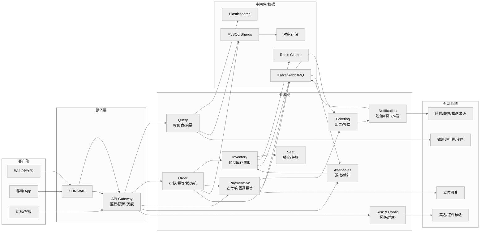
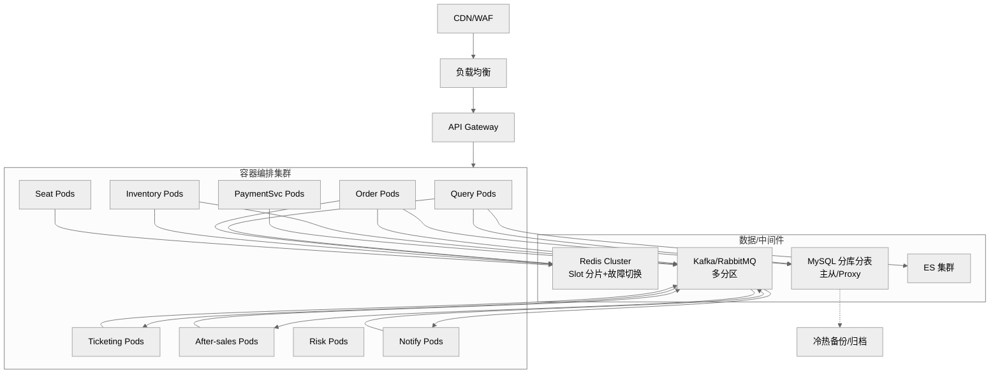
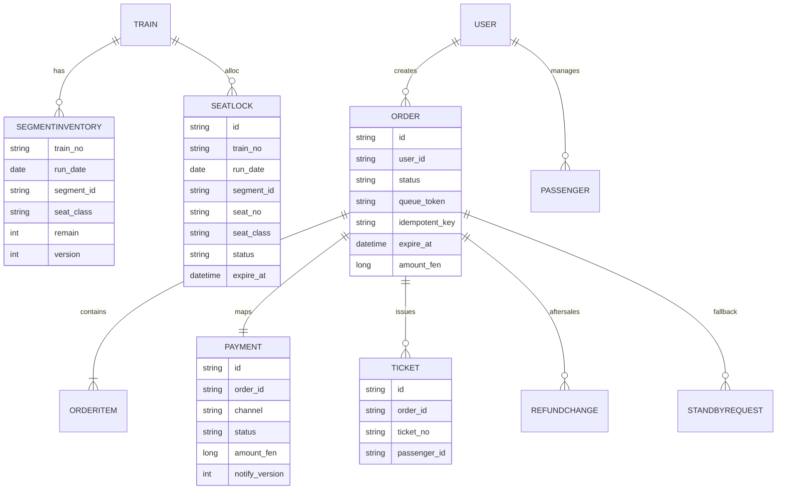
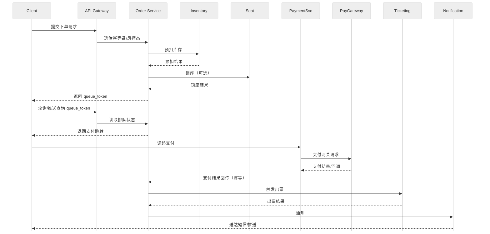
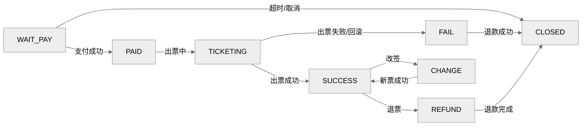

# 高并发火车票购票系统——概要设计说明书（ADS）

## 目录
1. 引言  
2. 任务概述  
3. 总体设计  
4. 接口设计  
5. 数据结构设计  
6. 运行设计  
7. 出错处理设计  
8. 安全保密设计  
9. 维护设计  
10. 附录  

---

## 一．引言
1. 编写目的：本文档给出高并发火车票购票系统的概要架构：系统边界、模块划分、关键链路与核心设计策略，用于指导详细设计与实现落地。读者包括架构、研发、测试、运维与联调合作方；文档重点回答“如何在开售峰值下保证可用性与一致性、如何治理外部依赖、如何降级与恢复、如何观测与审计”。本文与 SRS、测试计划建立可追溯关系：关键架构决策（限流/排队、幂等、验签、防重放、补偿、可观测与审计、故障演练）必须在测试计划中映射为可执行验证项，并在上线后通过监控指标、日志样例、压测/演练报告形成可核验证据。  
2. 项目背景：开售窗口（春运/节假日）产生短时极端峰值，对系统弹性扩展、链路稳定性与故障快速恢复提出要求。系统对接铁路运行图/余票与席位资源、实名核验、支付与退款、通知触达、风控等外部系统，交付由委托/开发/运维单位协同完成，因此必须将外部依赖的 SLA、容量上限、限流策略与故障模式 作为架构输入。设计需在峰值前完成容量评估与压测基线，并准备弹性与降级预案：核心链路优先（查询/下单/支付关键路径），非关键能力可延后或异步（通知、画像、部分风控增强）。所有关键链路需提供可追踪与可审计证据，支撑上线后故障定位、复盘与合规检查。  
3. 定义：  

   | 术语/缩写 | 解释 |
   | --- | --- |
   | 区间段 Segment | 相邻站点的最小扣减单元。 |
   | 区间票 | 跨多个区间段的票，扣减只能全成全败。 |
   | 预扣库存 | 在缓存或分布式存储中的原子扣减，待支付后落库确认。 |
   | 锁座 | 占用具体席位，支付超时自动释放。 |
   | 幂等键 Idempotent Key | 请求唯一指纹，避免重复执行。 |
   | 排队 Token | 进入削峰排队后的查询凭据。 |
   | 订单状态机 | 订单、支付、出票状态的有限状态流转。 |
   | QPS/TPS | 每秒查询/事务数。 |
   | TTL | 生存时间。 |
   | AZ | 可用区。 |
   | DLQ | 死信队列。 |
   | SLO/SLA | 服务水平目标/协议。 |
 
4. 参考资料：  
   
   | 标识 | 文档名称 | 编号 | 说明 |
   | --- | --- | --- | --- |
   | 1 | 《南京大学软件文档编写指南》 | - | 作为 SRS/概要设计的写作模板与评审检查清单依据。 |
   | 2 | 《Site Reliability Engineering》 | - | 支撑 SLO/错误预算、过载保护与可观测性方法论。 |
   | 3 | 《The Site Reliability Workbook》 | - | 支撑 SLO 落地、告警策略与演练/运行手册方法论。 |
   | 4 | 《Designing Data-Intensive Applications》 | - | 支撑一致性、分片、事件流与补偿/幂等思路。 |
   | 5 | MySQL 8.0 Reference Manual | - | 支撑事务/隔离级别、复制与分区等实现约束。 |
   | 6 | Elasticsearch 官方文档 | - | 支撑索引/查询与容量规划。 |
   | 7 | Redis Cluster 官方文档 | - | 支撑集群一致性折衷、过期与原子操作。 |
   | 8 | Kafka 官方文档 | - | 支撑顺序、幂等生产与重试/DLQ 策略。 |
   | 9 | RabbitMQ 官方文档 | - | 支撑可靠投递、死信队列与消费语义。 |
   | 10 | ISO 4217 | ISO 4217 | 货币编码与最小货币单位表达参考。 |
   | 11 | ISO 8601 | ISO 8601:2019 | 时间格式与时区表示参考。 |
   | 12 | RFC 3339 | RFC 3339 | 互联网时间戳格式参考（与 ISO 8601 协同）。 |
   | 13 | HTTP Semantics | RFC 9110 | HTTP 语义与状态码参考。 |
   | 14 | Hypertext Transfer Protocol (HTTP/1.1): Semantics and Content | RFC 7231 | HTTP/1.1 语义与状态码参考（兼容性参考）。 |
   | 15 | 个人信息安全规范 | GB/T 35273—2020 | 个人信息处理、最小化、授权与保护要求参考。 |
   | 16 | 电子支付系统安全保护框架 | GB/T 31502—2015 | 支付安全域/鉴别/审计等框架性要求参考。 |
   | 17 | 网络支付服务数据安全要求 | GB/T 42015—2022 | 支付数据分类、保护与管理要求参考。 |
   | 18 | App 个人信息安全测评规范 | GB/T 42582—2023 | 若包含移动端 App：用于合规测评要求参考。 |
   | 19 | 通用密码服务接口规范 | GB/T 43578—2023 | 签名/验签、加解密接口与验证方法参考。 |
   | 20 | 软件工程成本度量规范 | GB/T 36964—2018 | 用于成本/工作量口径。 |

---

## 二．任务概述
1. 目标：支撑高并发查询与下单，零超卖，满足可用性/一致性/性能目标（查询 P95<120ms/可用性 99.99%；写 P95<3s/可用性 99.95%），覆盖查询、下单/排队、支付/出票、退改/候补、通知、风控与运营。[^2][^4] 目标拆分为链路级指标与错误预算，并在监控与告警中落地。  
2. 运行环境：云/数据中心 K8s，多 AZ；依赖 Redis/Kafka/MySQL/ES/对象存储等中间件。中间件具备高可用、扩缩容、监控告警与演练机制，部署拓扑支持同城多 AZ 容灾。  
3. 需求概述：参见 SRS 功能与非功能部分，概要设计侧重架构与策略实现路径。标注与 SRS 的差异或补充点，并明确接口契约、数据一致性与容量假设。  
4. 条件与限制：合规与外部依赖 SLA；容量/资源约束；发布与演练采用灰度与回滚预案；mermaid 渲染可退化为文字版。开售窗口保持变更冻结与容量保护，无法渲染 mermaid 时提供文字版步骤与依赖描述。  

---

## 三．总体设计
### 1．处理流程
- 核心流程：查询（缓存优先）→下单排队→库存预扣/锁座→支付→出票→通知→退改/候补补偿。详见时序图。各阶段暴露关键事件与指标（命中率、延迟、失败率），异常时提供重试或补偿路径与队列削峰策略。  

### 2．总体结构和模块外部设计
#### 上下文/组件关系图

**图解**：
- 客户端（Web/APP/运营）经 CDN/WAF 抗 DDoS 与静态分发，再进入 API Gateway 做鉴权、限流、灰度与路由。
- 网关分发到业务域：查询（缓存+ES/DB）、订单（排队/幂等/状态机）、库存（预扣）、座位（锁座）、支付服务 PaymentSvc（支付单/回调）、出票、退改候补、风控/配置、通知。
- 中间件：Redis 缓存/分布式锁；Kafka/RabbitMQ 承载订单、库存、通知等事件；MySQL 分片存 OLTP；ES 搜索；OSS 报表/归档。
- 外部集成：PayGateway 回调驱动订单/出票；实名核验；运行图/座席同步供查询与预扣；短信/邮件推送通知。

#### 部署视图（高并发场景）

**图解**：
- 前端流量：CDN → LB → API Gateway，再进入 K8s 中的各微服务 Pod（查询、订单、库存、座位、PaymentSvc、出票、退改候补、风控、通知）。
- 数据/中间件：Redis Cluster（slot 分片+故障切换）、Kafka/RabbitMQ（多分区）、MySQL 分库分表（主从/Proxy）、ES 集群；对象存储/备份用于冷热归档。
- 链路：服务读写 Redis/DB/ES，向 Kafka 发送/消费订单、库存、通知等事件；备份/归档从数据库流向冷存储。
- 可靠性：多 AZ 部署，中间件高可用，Pod 横向扩展。

### 3．功能分配
- 接入层：鉴权、限流、灰度、路由、幂等键透传。负责统一安全与频控策略，支持按用户/地市/渠道灰度发布，并在回源失败时展示降级页面。  
- 查询域：站点/车次/余票/价目，缓存+ES+只读库。命中缓存优先，未命中读 ES/只读库，结合请求合并、防击穿与降级兜底。  
- 订单/库存/座位：排队、预扣、锁座、状态机、超时回收。排队限速避免写冲击；库存预扣与锁座保持幂等，超时自动回补，状态机单向推进。  
- 支付/出票：支付单、回调幂等、出票重试/补偿。支付回调落地签名与版本校验，出票失败触发退款或回补并入补偿队列。  
- 退改/候补：规则校验、双阶段改签、候补匹配与锁票。改签先锁新票成功再作废旧票；候补按优先级匹配区间库存并保障支付/锁票幂等。  
- 风控与运营：黑名单、频控、灰度策略；通知：短信/邮件/推送。风控提供策略下发与灰度开关，通知实现模板化、重试与渠道熔断。  
- 数据与中间件：Redis/Kafka/MySQL/ES/OSS 提供缓存、事件、存储、索引。明确分片、备份与容量阈值，监控缓存命中率、消息滞留与数据库延迟。  

### 4．模型与视图
#### 对象模型
- Train、Station、SegmentInventory、SeatLock、Order、OrderItem、Payment、Ticket、Refund/Change、StandbyRequest、RiskProfile、ConfigToggle。  

#### ER 示意

**图解**：
- 车次域：TRAIN 关联多个 SEGMENTINVENTORY（按日期/区间/席别库存）与 SEATLOCK（锁座记录）。
- 订单域：ORDER 关联 ORDERITEM（乘客/席别明细），一对一 PAYMENT（支付单）、一对多 TICKET（票号）、一对多 REFUNDCHANGE（退改）、一对多 STANDBYREQUEST（候补）。
- 用户域：USER 与 PASSENGER 管理实名乘客，并与 ORDER 关联。
- 关键字段：库存版本号（乐观锁）、金额（long、分）、状态/队列 token/幂等键，用于一致性与幂等控制。

#### 时序（下单→支付→出票）

**图解**：
- 客户端提交下单，经网关透传幂等键/风控态到订单服务。
- 订单服务调用库存预扣，成功后可选调用座位锁座，返回 queue_token。
- 客户端轮询/推送查询 queue_token，订单服务准备支付跳转。
- 客户端支付后，PaymentSvc 与 PayGateway 完成回调交互，再将幂等且验签后的支付结果传递给订单服务，触发出票。
- 出票结果写回订单；通知服务向用户发送短信/推送。

#### 状态机（订单/支付/出票）

**图解**：
- 订单初始 WAIT_PAY，支付成功进入 PAID，出票中为 TICKETING。
- 出票成功进入 SUCCESS，失败进入 FAIL 并触发退款回补；支付超时/取消进入 CLOSED。
- SUCCESS 可走退票（REFUND）或改签（CHANGE），退票完成回到 CLOSED；改签成功返回 SUCCESS（新票）。
- 状态单向推进，保障幂等与可重复执行。

---

## 四．接口设计
### 1．外部接口
- 运行图/座席：查询接口超时 500~1000ms，失败降级缓存；数据同步任务带重试与校验和。[^2][^3] 同步过程记录数据版本与来源，异常时回退上一版本，并在高峰前完成缓存预热。  
- 实名/证件：同步/异步校验，超时 3s，最多 3 次指数退避，必须验签。[^2][^3] 可用验证码或人工核验作为降级，并对失败次数实施频控与告警。  
- 支付平台：创建支付单、回调通知；超时 3s，回调验签+幂等，失败重试+DLQ。[^2][^3] 回调携带版本号与签名，落库失败进入重试队列并告警，退款与补偿路径保持闭环。  
- 短信/邮件/推送：模板化发送，超时 2s，失败重试+渠道熔断；备用通道切换。[^2][^3] 模板经过预审并落库，送达率与延迟纳入监控，渠道熔断后自动切换备用。  
- 风控服务：评分/校验接口，超时 1s，失败时走验证码/拒绝分支。[^2][^3] 风控策略支持灰度发布，命中风险时记录证据链并保留人工复核通道。  

### 2．内部接口
- 服务间通过 API Gateway（HTTP/REST）和 Kafka/RabbitMQ 事件通信；同订单/车次使用分区键保证局部有序；所有写接口携带 `idempotent_key`。[^8][^9] 接口声明契约版本与兼容策略，事件格式包含 `event_id/version/timestamp` 以便回放与幂等。  
- 调用超时与重试：核心写链路仅一次幂等重试或不重试；查询类可短重试；统一熔断策略。[^2][^3] 超时与重试参数按接口分级配置，失败进入告警与降级路径，并记录重试次数。  
- 接口安全：网关鉴权+签名校验；内部服务校验租户/渠道/幂等键。[^15][^19] 权限模型细化为最小权限与租户隔离，敏感字段做脱敏并记录审计日志。  

---

## 五．数据结构设计
### 1．逻辑结构设计
- 缓存分层与热点治理：浏览器/APP 本地缓存→CDN/边缘→Gateway 本地缓存→Redis（5~20s TTL，二级本地缓存 200~500ms，弱一致）→只读库/ES；防击穿/雪崩：随机 TTL、请求合并、预热、兜底；版本戳/校验和纠偏。[^7]  
- 库存一致性/防超卖：区间库存 Redis Lua 原子预扣+版本号；写侧单线程/分片顺序消费 MQ 回写 MySQL 账本；定时对账与差值告警；支付超时/出票失败原路回补。[^5][^8][^9]  
- 金额与时间：金额统一 `long amount_fen` 存储，币种独立字段对齐接口契约；时间字段采用 ISO8601（含时区）并依赖统一时钟服务。[^10][^11][^12]  
- 幂等：入口 `idempotent_key`+`queue_token`（15 分钟），幂等记录在线 7 天、归档 30 天；状态只能前进。[^13]  
- 支付回调：签名+幂等，指数退避重试（1/2/4/8... 最多 6~8 次），落库失败入 DLQ。[^2][^3]  
- 排队与削峰：入口频控（账号/设备 3 QPS，突发桶 10），队列上限 5 万/车次/日，出队速率 `min(2%*remain, 2000)` 单/秒，超长转候补。[^3]  
- 分库分表：库按车次/日期哈希或区间，表按订单号雪花 ID 路由；跨分片读依赖 ES/OLAP；再平衡用双写/灰度切换和回放；历史归档策略。[^5][^8][^9]  
- MQ：按领域拆 topic（order/stock/payment/notify），同订单/车次分区键保证局部有序；消息含 `event_id/version`；延迟队列+DLQ 重试，支持 7 天回溯。[^8][^9]  
- 候补：状态机（PENDING→MATCHING→LOCKED→AWAIT_PAY→SUCCESS/FAIL），分段队列与优先级（时间、会员、乘客数）；锁票/支付超时回补，库存/支付解耦。[^3]  
- 外部集成：实名/支付/短信等设定超时、最大重试（3 次指数退避）、熔断与降级返回码；SLA 明确，签名/验签算法契约化。[^2][^3]  
- 安全与合规：实名、加密/脱敏、审计、风控联动；频控与灰度可配置（1%~20% 灰度）。[^15][^19]  
- 监控与告警：对账差值、补偿成功率、滞留订单、DLQ、支付回调重复率、排队 P95、缓存命中率、Redis/DB/消息 P95、外部超时/熔断。[^2]  
- 运行/批处理：运行图同步、库存对账、归档、告警巡检等批任务错峰调度，避免与开售高峰冲突。[^2]  

### 2．物理结构设计
- 分库分表：库按车次/日期哈希或区间，表按订单号雪花 ID 路由；跨分片读依赖 ES/OLAP；再平衡用双写/灰度切换和回放；历史归档策略。[^5][^8][^9]  
- 核心表举例：订单表（分库分表）、库存账本表（分库）、支付表、票号表、候补表、退款/改签表；索引围绕订单号、train_no+date、用户维度设计。  
- 缓存/队列：Redis Cluster slot 分片+故障切换，单分片 <5 万 QPS；Kafka/RabbitMQ 多分区，关键链路局部有序；热点 key 拆分。[^5][^7][^8][^9]  
- 存储：对象存储用于报表/归档；备份与冷热分层按附录容量建议；ES 用于搜索索引，冷热节点分层。[^5]  

### 3．数据结构与程序的关系
- 服务与数据域映射：Query→ES/Redis/只读库；Order/Inventory/Seat→Redis+MySQL 账本；Payment→支付单表+回调事件；Ticketing→票号表；After-sales→退款/改签/候补表；事件通过 MQ 串联状态机。各服务声明主写库/从库策略、缓存 TTL 与失效处理，事件消费记录偏移与幂等键，保障跨域一致性与可回溯。  

---

## 六．运行设计
### 1．运行模块的组合
- K8s 部署的无状态服务（查询/订单/库存/座位/支付/出票/退改候补/风控/通知），对应上文的 Pods 与中间件集群。无状态服务通过 ConfigMap/Secret 获取配置，支持滚动升级与自动扩缩容，中间件实例结合亲和与反亲和策略保障多 AZ。  

### 2．运行控制
- 排队与速率控制：`min(2%*remain, 2000)` 控制出队；队列上限 5 万/车次/日；频控与灰度可配置。速率按库存动态调整并支持人工降档，队列超限自动转候补，入口频控按用户/设备/IP 维度下发。  
- 超时控制：锁座/支付超时回收；外部接口超时+重试+熔断；幂等状态单向推进。各类超时与重试策略在配置中心统一管理，并在告警与看板中透出失败率与回收率。  
- 扩缩容：按 CPU/RT/队列长度触发弹性；开售前预热扩容；高峰后回缩。弹性策略与中间件容量联动，预热阶段加载热点数据与连接池。  
- 定时任务：运行图同步、库存对账、数据归档、告警巡检。定时任务错峰调度与限流，支持手动重跑与幂等，避免与开售高峰冲突。  

### 3．运行时间
- 性能目标：查询 P95<120ms；下单出队后 P95<3s；排队等待 P95<60s。运行窗口覆盖开售时段的弹性扩容与快速降级，在指标异常时自动启用保护策略。  
- 开售窗口：提前预热缓存与扩容；开售瞬时启用更严频控与队列限速；售罄后降级至候补。监控与客服联动预案同步推进，及时向用户提示候补或售罄状态，减少重复刷新。  

---

## 七．出错处理设计
1. 出错输出信息：对外错误码（如 400/401/403/409/423/504）与可诊断信息；内部告警含事件 ID、分区键、版本号。  
2. 出错处理对策：重试（指数退避）、幂等返回已有结果、降级（转候补/缓存兜底）、熔断/隔离外部依赖、DLQ+回溯重放；锁座/库存失败即时回补。  
3. 典型场景：  
   - 支付回调重复/乱序：以 `payment_id+version` 幂等处理，低版本丢弃。  
   - 出票失败：回滚库存+退款，记录补偿事件，通知用户。  
   - 热点查询击穿：启用本地缓存+请求合并，必要时返回降级数据。  
   - MQ 消费失败：多次重试后入 DLQ，人工/自动回溯重放。  

---

## 八．安全保密设计
- 身份与鉴权：依赖网关鉴权，服务内鉴权/签名校验。用户、渠道与租户身份通过 token 与签名双重校验，跨服务调用传递用户上下文并验证权限。  
- 数据安全：传输全链路 TLS；数据加密/脱敏（实名、证件、手机号、支付要素）；访问审计与留痕。存储侧采用列级加密与密钥轮换，日志/监控中的敏感字段掩码，备份数据加密并隔离权限。  
- 风控与频控：黑白名单、设备指纹（可选）、验证码、滑窗频控、灰度策略。风控规则支持配置与灰度下发，触发风险后提供验证码、人工复核与阻断路径。  
- 审计字段：记录用户、设备、IP、时间、操作、结果、幂等键、版本号；脱敏展示。审计日志集中存储与检索，满足合规留存周期并支持异常追踪。  

---

## 九．维护设计
- 可观测性：指标、日志、链路追踪；告警阈值参考关键策略。看板按域拆分（查询/下单/支付/库存），覆盖 P95/P99、错误率、队列长度、缓存命中率、DLQ、对账差值，并提供追踪样本。  
- 部署与变更：无状态服务滚动发布、灰度与回滚；健康检查与自动故障转移。发布具备自动化校验与回滚剧本，支持蓝绿/金丝雀，变更窗口配合审批与冻结策略。  
- 运行手册与演化：压测与演练（排队/支付/回调/出票链路）、容量预测与再分片计划；对关键 ADR（排队削峰、幂等键策略、支付回调模式、分片与再平衡方案、消息顺序保证策略）保持与实现的映射清单。  

---

## 十．附录
- 参考：本概要设计与 SRS、测试计划、部署/运维手册保持追踪矩阵，后续补充的详细设计与 ADR 变更应同步更新本附录。  
- 与 SRS 一致性检查：本设计中的目标（查询/写延迟与可用性）、排队与预扣策略、外部接口超时与错误码口径、数据一致性与安全要求与 SRS 保持一致，未发现冲突；若 SRS 指标或规则更新，需同步调整本设计。

[^2]: 参考资料 2 《Site Reliability Engineering》
[^3]: 参考资料 3 《The Site Reliability Workbook》
[^4]: 参考资料 4 《Designing Data-Intensive Applications》
[^5]: 参考资料 5 MySQL 8.0 Reference Manual
[^7]: 参考资料 7 Redis Cluster 官方文档
[^8]: 参考资料 8 Kafka 官方文档
[^9]: 参考资料 9 RabbitMQ 官方文档
[^10]: 参考资料 10 ISO 4217
[^11]: 参考资料 11 ISO 8601:2019
[^12]: 参考资料 12 RFC 3339
[^13]: 参考资料 13 RFC 9110
[^15]: 参考资料 15 《个人信息安全规范》
[^19]: 参考资料 19 《通用密码服务接口规范》
