# 高并发火车票购票系统需求分析文档

## 版本历史

| 版本号 | 修订日期 | 修订人 | 修订原因 | 修订内容概述 |
|--------|----------|--------|----------|--------------|
| 1.0 | 2025-12-23 | Emma | 初始版本 | 创建系统需求分析文档 |
| 1.1 | 2025-12-24 | Emma | 规范优化 | 统一性能指标、规范UML图表、添加API文档 |

---

## 前言

### 文档目标读者

本文档面向以下读者群体：

- **产品经理**：了解系统功能规划和业务价值
- **系统架构师**：掌握系统整体架构和技术选型
- **开发工程师**：理解详细的功能需求和技术实现方案
- **测试工程师**：明确测试重点和性能指标
- **运维工程师**：了解系统部署和运维要求
- **项目管理人员**：把握项目范围和里程碑

### 文档版本历史

**版本 1.1（2025-12-24）**
- 统一性能指标表述
- 规范UML图表
- 删除具体代码实现
- 添加API接口文档
- 提升图表一致性

**版本 1.0（2025-12-23）**
- 初始版本创建
- 完成需求分析
- 定义功能需求

---

## 1. 引言

### 1.1 系统概述

高并发火车票购票系统是一个面向全国铁路旅客的在线购票平台，旨在为用户提供便捷、高效、安全的火车票预订服务。系统需要支持海量用户同时在线查询、预订和购买火车票，特别是在春运、节假日等高峰期，系统需要承受每秒数十万次的并发请求。

### 1.2 系统意义

**业务价值：**
- 提升旅客购票体验，减少线下排队时间
- 提高铁路运营效率，优化座位资源分配
- 实现实名制购票，保障旅客出行安全
- 支持大数据分析，为铁路运营决策提供依据

**技术挑战：**
- 高并发：春运期间峰值可达每秒50万+并发请求
- 高可用：系统可用性需达到99.99%
- 数据一致性：防止超卖和重复售票
- 秒杀场景：热门车次开售瞬间的流量洪峰

### 1.3 系统与其他系统的关系

本系统需要与多个外部系统集成协作：

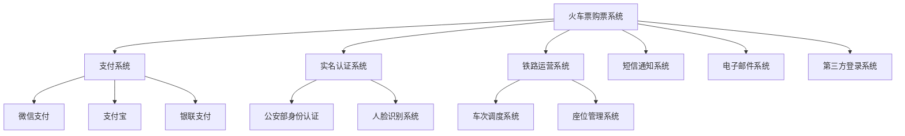

**系统集成说明：**
- **支付系统**：处理订单支付、退款、对账等金融交易
- **实名认证系统**：验证用户身份信息的真实性
- **铁路运营系统**：同步车次信息、座位库存、票价等数据
- **通知系统**：发送订单确认、出行提醒等消息
- **第三方登录**：支持微信、QQ等社交账号登录

### 1.4 业务目标与战略定位

**核心业务目标：**
1. 提供7×24小时不间断的在线购票服务
2. 支持春运期间日均1000万+订单处理能力
3. 确保热门车次开售时系统稳定运行
4. 实现用户购票全流程在线化、自助化

**战略定位：**
- 成为国内领先的铁路客运服务平台
- 打造智慧出行生态系统的核心入口
- 推动铁路客运数字化转型

---

## 2. 术语表

| 术语 | 英文 | 定义 | 说明 |
|------|------|------|------|
| 高并发 | High Concurrency | 系统同时处理大量请求的能力 | 本系统需支持每秒50万+并发 |
| QPS | Queries Per Second | 每秒查询率 | 衡量系统吞吐量的关键指标 |
| TPS | Transactions Per Second | 每秒事务数 | 衡量系统处理能力的指标 |
| RT | Response Time | 响应时间 | 从请求发出到收到响应的时间 |
| 超卖 | Overselling | 售出票数超过实际库存 | 需通过技术手段严格防止 |
| 限流 | Rate Limiting | 限制请求速率 | 保护系统不被流量冲垮 |
| 降级 | Degradation | 关闭非核心功能 | 保证核心功能在高负载下可用 |
| 熔断 | Circuit Breaking | 快速失败机制 | 防止故障扩散 |
| 分库分表 | Sharding | 数据库水平拆分 | 提升数据库处理能力 |
| 缓存穿透 | Cache Penetration | 查询不存在的数据 | 需要布隆过滤器等手段防护 |
| 缓存雪崩 | Cache Avalanche | 大量缓存同时失效 | 需要设置随机过期时间 |
| 热点数据 | Hot Data | 被频繁访问的数据 | 如热门车次信息 |
| 幂等性 | Idempotence | 多次操作结果一致 | 防止重复下单 |
| 分布式锁 | Distributed Lock | 跨节点的互斥锁 | 保证分布式环境下的数据一致性 |
| 消息队列 | Message Queue | 异步消息传递机制 | 削峰填谷、解耦系统 |
| 负载均衡 | Load Balancing | 流量分发机制 | 提高系统可用性和性能 |
| CDN | Content Delivery Network | 内容分发网络 | 加速静态资源访问 |
| 实名制 | Real-name System | 购票需实名认证 | 国家铁路安全要求 |
| 候补购票 | Waitlist Ticketing | 无票时排队候补 | 提升用户体验和座位利用率 |

---

## 3. 用户需求定义

### 3.1 目标用户群体分析

#### 3.1.1 用户画像

**主要用户群体：**

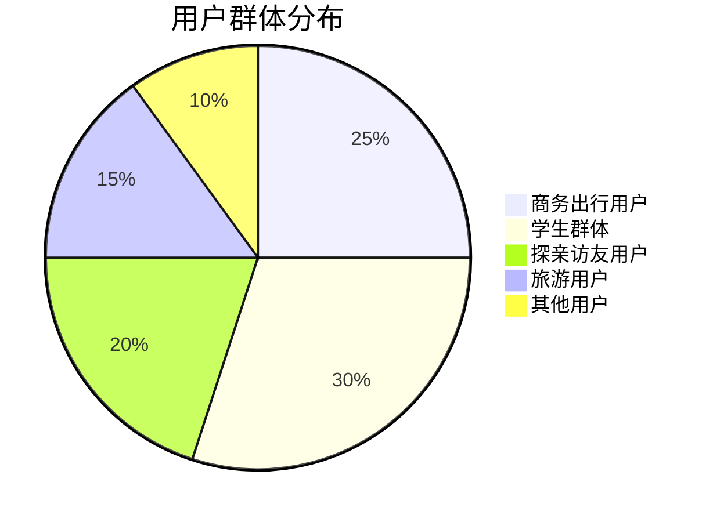

**用户特征分析：**

| 用户类型 | 年龄段 | 使用频率 | 主要需求 | 痛点 |
|----------|--------|----------|----------|------|
| 商务出行用户 | 25-45岁 | 高频（每月2-4次） | 快速购票、改签灵活、商务座 | 时间紧迫、需要发票 |
| 学生群体 | 18-25岁 | 中频（寒暑假、节假日） | 学生票优惠、抢票成功率 | 预算有限、高峰期抢票难 |
| 探亲访友用户 | 30-60岁 | 低频（春节、节假日） | 操作简单、多人购票 | 不熟悉操作、需要帮助 |
| 旅游用户 | 25-50岁 | 中低频（节假日、周末） | 行程规划、往返票 | 需要灵活退改 |
| 老年用户 | 60岁以上 | 低频 | 界面友好、语音辅助 | 操作困难、需要子女协助 |

#### 3.1.2 用户使用场景

**场景1：春运抢票**
- **用户**：返乡学生、务工人员
- **时间**：春运开售前后
- **行为**：提前设置抢票、多次尝试、使用候补功能
- **系统要求**：高并发承载、快速响应、公平性保证

**场景2：商务出行**
- **用户**：企业白领、销售人员
- **时间**：工作日
- **行为**：临时购票、频繁改签、需要报销凭证
- **系统要求**：实时库存、快速出票、电子发票

**场景3：家庭出游**
- **用户**：家庭用户
- **时间**：节假日、周末
- **行为**：多人购票、选择相邻座位、往返票
- **系统要求**：批量购票、座位分配优化

### 3.2 业务场景分析

#### 3.2.1 核心业务流程

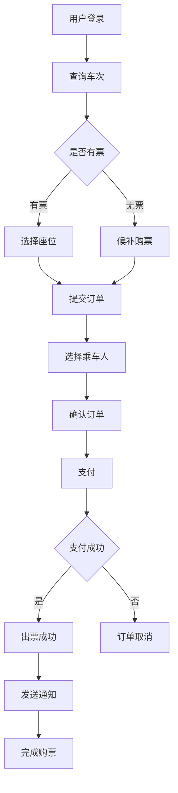

#### 3.2.2 详细业务场景

**场景A：车票查询**

用户需要根据出发地、目的地、出发日期查询可用车次。系统需要展示车次号、出发/到达时间、历时、票价、余票数量等信息。

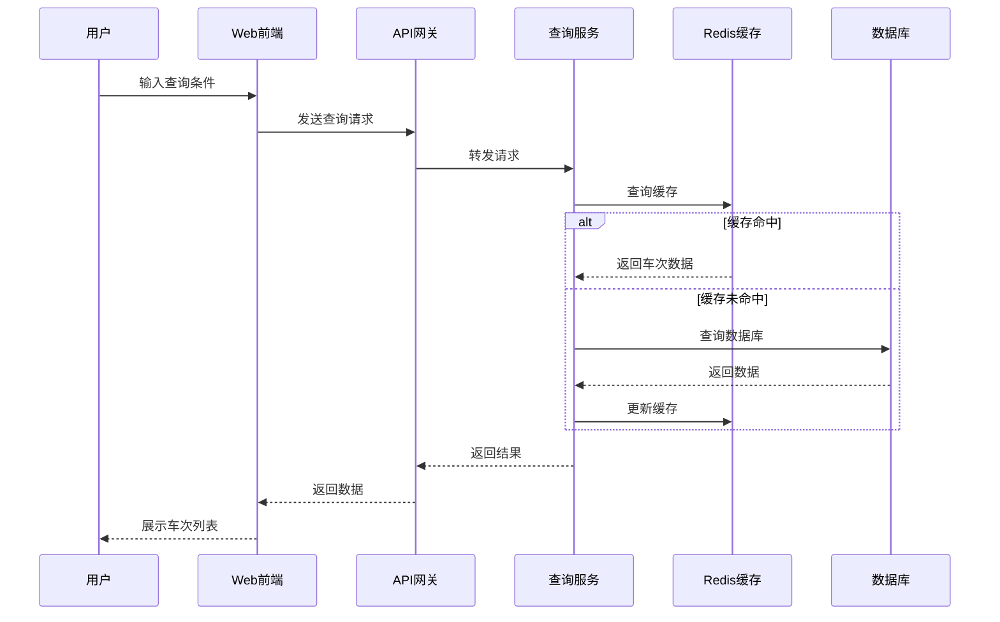

**场景B：购票流程**

用户选择车次和座位后，需要填写乘车人信息、提交订单并完成支付。系统需要锁定座位、验证身份信息、处理支付并出票。

**关键步骤：**
1. **座位锁定**：用户提交订单后，系统锁定座位15分钟
2. **身份验证**：验证乘车人身份证信息的真实性
3. **订单创建**：生成唯一订单号，记录订单详情
4. **支付处理**：调用支付接口，等待支付结果
5. **出票**：支付成功后生成电子车票

**场景C：退票流程**

用户可以在开车前申请退票，系统根据退票时间计算退票费，处理退款并释放座位。

**退票规则表：**

| 退票时间 | 退票费率 | 说明 |
|----------|----------|------|
| 开车前15天以上 | 不收费 | 全额退款 |
| 开车前48小时至15天 | 5% | 扣除5%票款 |
| 开车前24小时至48小时 | 10% | 扣除10%票款 |
| 开车前24小时以内 | 20% | 扣除20%票款 |

**退票费计算公式：**

```
退票费 = 票面价格 × 退票费率
实际退款金额 = 票面价格 - 退票费
```

**场景D：改签流程**

用户可以将车票改签到其他车次，系统需要检查目标车次余票、计算差价并处理改签。

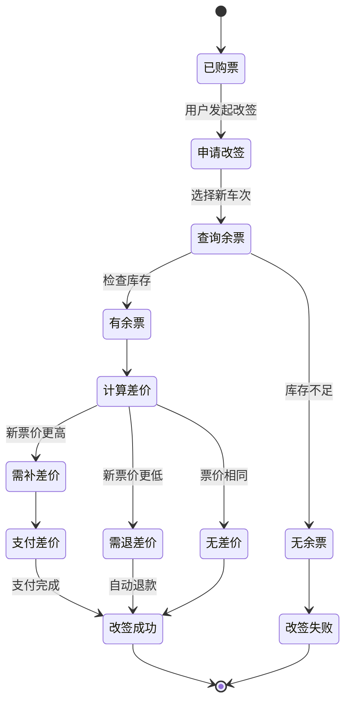

**场景E：候补购票**

当用户查询的车次无票时，可以提交候补订单。系统在有退票或新增座位时，自动为候补用户购票。

**候补规则：**
- 每个用户最多可以提交2个候补订单
- 每个候补订单最多可以选择3个车次
- 候补有效期最长为7天
- 按照候补提交时间先后顺序处理
- 候补成功后自动扣款并出票

### 3.3 用例图

#### 3.3.1 用户管理用例

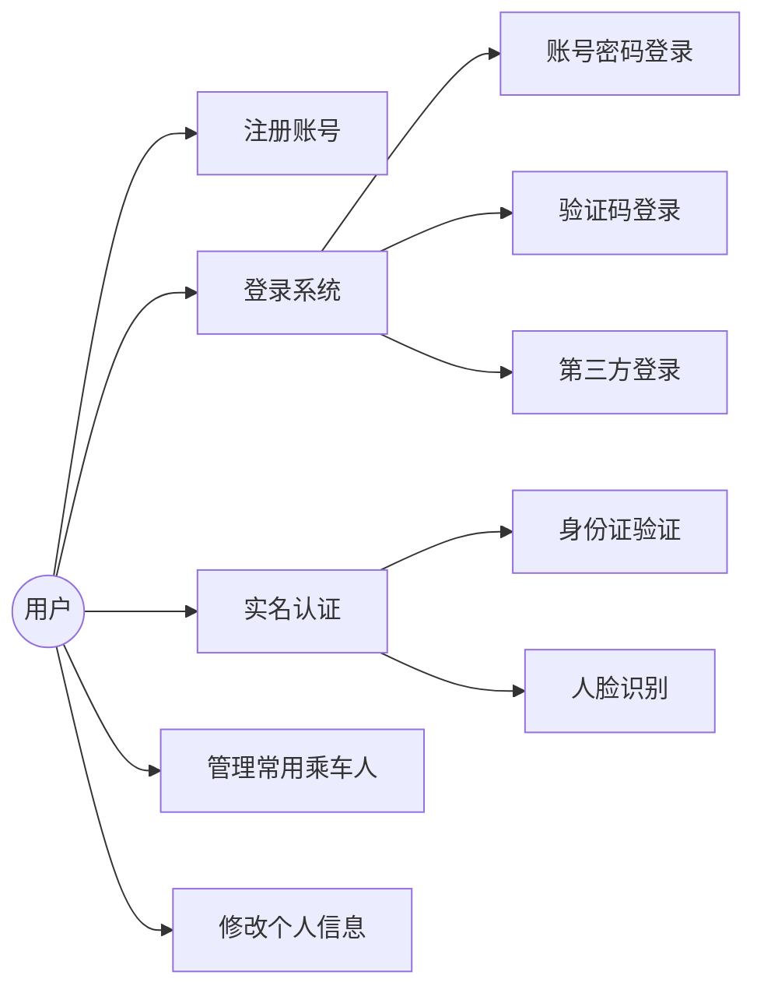

#### 3.3.2 购票流程用例

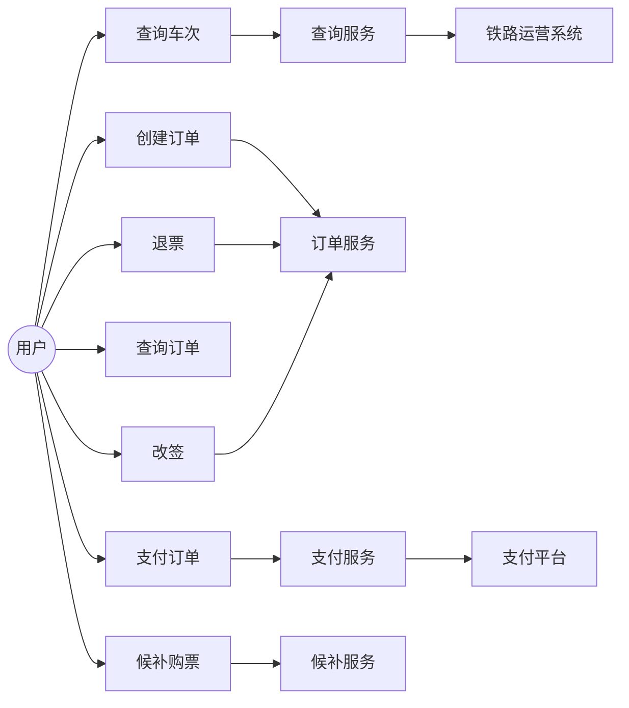

### 3.4 功能需求

#### 3.4.1 用户管理模块

**FR-UM-001：用户注册**
- **优先级**：P0（必须实现）
- **描述**：用户可以通过手机号或邮箱注册账号
- **输入**：手机号/邮箱、密码、验证码
- **输出**：注册成功/失败提示
- **规则**：
  - 手机号必须通过验证码验证
  - 密码长度8-20位，包含字母和数字
  - 同一手机号只能注册一个账号

**FR-UM-002：用户登录**
- **优先级**：P0
- **描述**：用户可以通过多种方式登录系统
- **登录方式**：
  - 账号密码登录
  - 手机验证码登录
  - 第三方登录（微信、QQ、支付宝）
  - 扫码登录
- **安全措施**：
  - 密码错误5次锁定账号30分钟
  - 支持双因素认证
  - 异地登录提醒

**FR-UM-003：实名认证**
- **优先级**：P0
- **描述**：用户必须完成实名认证才能购票
- **认证信息**：姓名、身份证号、手机号
- **验证方式**：
  - 与公安部身份信息库对接验证
  - 支持人脸识别认证
- **规则**：
  - 一个身份证最多关联5个账号
  - 认证信息不可修改，如需修改需联系客服

**FR-UM-004：常用乘车人管理**
- **优先级**：P1
- **描述**：用户可以添加、编辑、删除常用乘车人
- **乘车人信息**：姓名、证件类型、证件号、手机号、旅客类型
- **规则**：
  - 每个账号最多添加15个常用乘车人
  - 所有乘车人必须完成实名认证

#### 3.4.2 车次查询模块

**FR-TQ-001：车次查询**
- **优先级**：P0
- **描述**：用户可以查询指定日期、出发地到目的地的所有车次
- **查询条件**：
  - 出发地（必填）
  - 目的地（必填）
  - 出发日期（必填）
  - 车次类型（可选：高铁/动车/普快等）
  - 出发时间段（可选）
  - 座位类型（可选）
- **返回信息**：
  - 车次号
  - 出发/到达站点和时间
  - 历时
  - 各座位类型余票数量和价格
  - 是否可购买、候补

**FR-TQ-002：车次详情查询**
- **优先级**：P1
- **描述**：查看车次的详细信息
- **详情内容**：
  - 完整经停站信息
  - 各站到达/出发时间
  - 停靠时间
  - 各区间余票情况

**FR-TQ-003：余票监控**
- **优先级**：P2
- **描述**：用户可以设置余票提醒
- **功能**：
  - 监控指定车次余票变化
  - 有票时通过短信/推送通知用户
  - 最多可监控5个车次

#### 3.4.3 订单管理模块

**FR-OM-001：创建订单**
- **优先级**：P0
- **描述**：用户选择车次和座位后创建订单
- **流程**：
  1. 选择乘车人（支持多人购票）
  2. 选择座位类型
  3. 确认订单信息
  4. 提交订单
- **规则**：
  - 单次最多购买5张票
  - 订单提交后锁定座位15分钟
  - 超时未支付自动取消

**FR-OM-002：订单支付**
- **优先级**：P0
- **描述**：用户选择支付方式完成支付
- **支付方式**：
  - 微信支付
  - 支付宝
  - 银联支付
  - 铁路畅行会员余额
- **支付流程**：
  1. 选择支付方式
  2. 跳转支付页面
  3. 完成支付
  4. 接收支付结果回调
  5. 更新订单状态
  6. 出票

**FR-OM-003：订单查询**
- **优先级**：P0
- **描述**：用户可以查询历史订单
- **查询条件**：
  - 订单状态（全部/待支付/已支付/已取消/已退票）
  - 时间范围
  - 车次号
- **订单信息**：
  - 订单号
  - 车次信息
  - 乘车人信息
  - 订单金额
  - 订单状态
  - 操作按钮（支付/退票/改签）

**FR-OM-004：订单退票**
- **优先级**：P0
- **描述**：用户可以申请退票
- **退票流程**：
  1. 选择要退票的订单
  2. 系统计算退票费
  3. 用户确认退票
  4. 处理退款
  5. 释放座位
  6. 发送退票通知
- **规则**：
  - 按照退票规则表计算退票费
  - 开车后不可退票
  - 退款原路返回

**FR-OM-005：订单改签**
- **优先级**：P1
- **描述**：用户可以将车票改签到其他车次
- **改签规则**：
  - 只能改签一次
  - 开车前48小时可改签
  - 只能改签到同等级或更高等级座位
  - 差价多退少补

#### 3.4.4 候补购票模块

**FR-WL-001：提交候补订单**
- **优先级**：P1
- **描述**：无票时用户可以提交候补订单
- **候补信息**：
  - 选择1-3个备选车次
  - 选择座位类型
  - 选择乘车人
  - 设置候补截止时间
- **规则**：
  - 每个用户最多2个候补订单
  - 候补有效期最长7天
  - 需要预付全款

**FR-WL-002：候补订单处理**
- **优先级**：P1
- **描述**：系统自动处理候补订单
- **处理逻辑**：
  1. 监控候补车次余票
  2. 有票时按提交顺序处理候补
  3. 自动扣款并出票
  4. 发送候补成功通知
- **失败处理**：
  - 候补失败自动退款
  - 候补过期自动退款

#### 3.4.5 支付管理模块

**FR-PM-001：支付接口集成**
- **优先级**：P0
- **描述**：集成多种支付方式
- **支付渠道**：
  - 微信支付
  - 支付宝
  - 银联在线支付
  - 铁路畅行会员余额
- **支付功能**：
  - 支付
  - 退款
  - 对账

**FR-PM-002：支付安全**
- **优先级**：P0
- **描述**：保证支付过程的安全性
- **安全措施**：
  - HTTPS加密传输
  - 支付密码/指纹/面容验证
  - 支付限额设置
  - 异常支付拦截
  - 支付日志记录

#### 3.4.6 通知服务模块

**FR-NS-001：消息通知**
- **优先级**：P1
- **描述**：向用户发送各类通知消息
- **通知类型**：
  - 订单确认通知
  - 支付成功通知
  - 出行提醒（开车前24小时）
  - 退票/改签通知
  - 候补成功通知
  - 余票提醒
- **通知渠道**：
  - 短信
  - App推送
  - 邮件
  - 微信服务号

### 3.5 非功能性需求

#### 3.5.1 性能需求

**性能指标说明：**

系统需要支持三种不同的流量场景，性能指标如下：

| 流量场景 | QPS | TPS | 日订单量 | 瞬时并发 | 说明 |
|---------|-----|-----|---------|---------|------|
| 日常流量 | 10万/秒 | 2万/秒 | 500万单 | 50万 | 工作日正常业务量 |
| 高峰流量 | 50万/秒 | 10万/秒 | 1000万单 | 100万 | 节假日、春运期间 |
| 极限流量 | 100万/秒 | 20万/秒 | 2000万单 | 200万 | 热门车次开售瞬间 |

**NFR-P-001：响应时间要求**

| 操作类型 | 平均响应时间 | 95分位响应时间 | 99分位响应时间 |
|----------|--------------|----------------|----------------|
| 车次查询 | < 200ms | < 500ms | < 1s |
| 订单提交 | < 500ms | < 1s | < 2s |
| 支付处理 | < 1s | < 2s | < 3s |
| 订单查询 | < 300ms | < 800ms | < 1.5s |
| 退票/改签 | < 800ms | < 1.5s | < 3s |

**NFR-P-002：吞吐量要求**

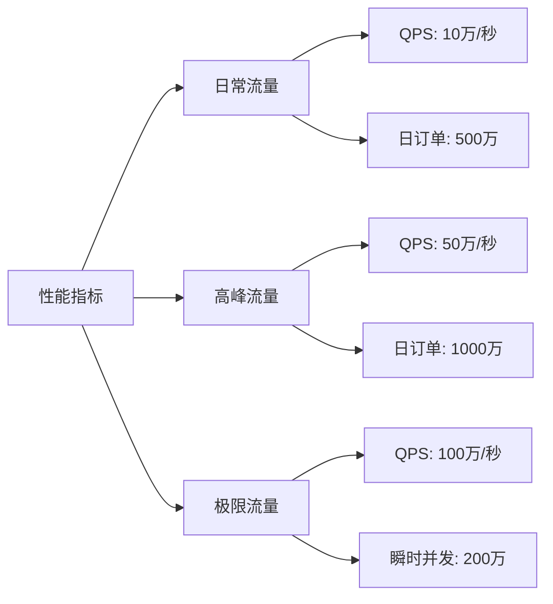

**NFR-P-003：容量规划**

- **用户规模**：注册用户5亿，日活用户5000万
- **数据存储**：
  - 订单数据：每年新增50亿条
  - 用户数据：5亿条
  - 车次数据：10万条
  - 总存储容量：100TB+

#### 3.5.2 可用性需求

**NFR-A-001：系统可用性**
- **目标**：99.99%可用性（年停机时间<53分钟）
- **措施**：
  - 多机房部署
  - 异地容灾
  - 故障自动切换
  - 实时监控告警

**NFR-A-002：故障恢复**
- **RTO（恢复时间目标）**：< 5分钟
- **RPO（恢复点目标）**：< 1分钟
- **措施**：
  - 数据实时备份
  - 主备切换机制
  - 灰度发布策略

**NFR-A-003：降级策略**

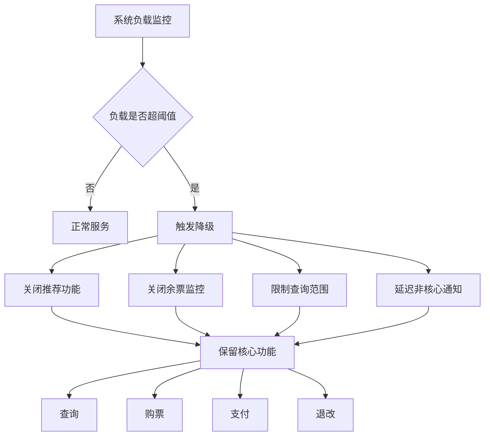

**降级优先级：**
1. **保留功能**（P0）：查询、购票、支付、退改
2. **降级功能**（P1）：推荐、余票监控、历史订单查询
3. **关闭功能**（P2）：数据统计、报表生成、营销活动

#### 3.5.3 安全性需求

**NFR-S-001：数据安全**
- **传输安全**：全站HTTPS加密
- **存储安全**：
  - 敏感数据加密存储（身份证号、手机号、银行卡号）
  - 密码使用bcrypt加密
  - 数据库访问权限控制
- **数据备份**：
  - 每日全量备份
  - 实时增量备份
  - 异地备份存储

**NFR-S-002：身份认证与授权**
- **认证机制**：
  - 用户名密码认证
  - 短信验证码认证
  - 第三方OAuth认证
  - 双因素认证（可选）
- **授权机制**：
  - 基于RBAC的权限控制
  - API接口鉴权
  - 操作日志记录

**NFR-S-003：防攻击措施**

| 攻击类型 | 防护措施 | 说明 |
|----------|----------|------|
| DDoS攻击 | CDN防护、流量清洗 | 防止流量洪水攻击 |
| SQL注入 | 参数化查询、输入验证 | 防止数据库被注入 |
| XSS攻击 | 输出编码、CSP策略 | 防止脚本注入 |
| CSRF攻击 | Token验证 | 防止跨站请求伪造 |
| 暴力破解 | 验证码、账号锁定 | 防止密码暴力破解 |
| 刷票行为 | IP限流、设备指纹 | 防止黄牛刷票 |

**NFR-S-004：隐私保护**
- **数据脱敏**：
  - 身份证号显示：`320***********1234`
  - 手机号显示：`138****5678`
  - 姓名显示：`张*`
- **权限控制**：
  - 用户只能查看自己的订单
  - 管理员操作需审计
- **合规要求**：
  - 符合《网络安全法》
  - 符合《个人信息保护法》
  - 符合《数据安全法》

#### 3.5.4 可扩展性需求

**NFR-E-001：水平扩展能力**
- **应用层**：支持无状态水平扩展，可快速增加服务器节点
- **数据层**：支持分库分表，可按需扩展数据库容量
- **缓存层**：支持Redis集群扩展
- **存储层**：支持分布式文件存储扩展

**NFR-E-002：业务扩展能力**
- **支持新车次类型**：如城际铁路、市域铁路
- **支持新支付方式**：如数字人民币
- **支持新业务场景**：如包车服务、团体票

#### 3.5.5 可维护性需求

**NFR-M-001：监控与告警**
- **系统监控**：
  - CPU、内存、磁盘、网络使用率
  - 应用性能监控（APM）
  - 数据库性能监控
  - 缓存命中率监控
- **业务监控**：
  - 订单量、支付成功率
  - 接口调用量、错误率
  - 用户行为分析
- **告警机制**：
  - 多级告警（警告、严重、紧急）
  - 多渠道通知（短信、邮件、电话）
  - 告警收敛和抑制

**NFR-M-002：日志管理**
- **日志类型**：
  - 应用日志
  - 访问日志
  - 错误日志
  - 审计日志
- **日志要求**：
  - 统一日志格式
  - 集中日志存储
  - 日志检索和分析
  - 日志保留策略（至少6个月）

**NFR-M-003：运维支持**
- **自动化部署**：支持CI/CD流水线
- **灰度发布**：支持按比例流量切换
- **快速回滚**：支持一键回滚到上一版本
- **配置管理**：支持动态配置更新

#### 3.5.6 兼容性需求

**NFR-C-001：浏览器兼容性**
- Chrome 90+
- Firefox 88+
- Safari 14+
- Edge 90+
- 移动端浏览器（iOS Safari、Android Chrome）

**NFR-C-002：设备兼容性**
- PC端（Windows、macOS、Linux）
- 移动端（iOS 12+、Android 8+）
- 平板设备

**NFR-C-003：接口兼容性**
- RESTful API向后兼容
- 版本化API管理
- 废弃API提前通知

### 3.6 系统集成需求

#### 3.6.1 支付系统集成

**集成目标**：
- 支持微信支付、支付宝、银联等主流支付方式
- 实现支付、退款、对账等完整功能
- 保证支付安全和数据一致性

**接口要求**：

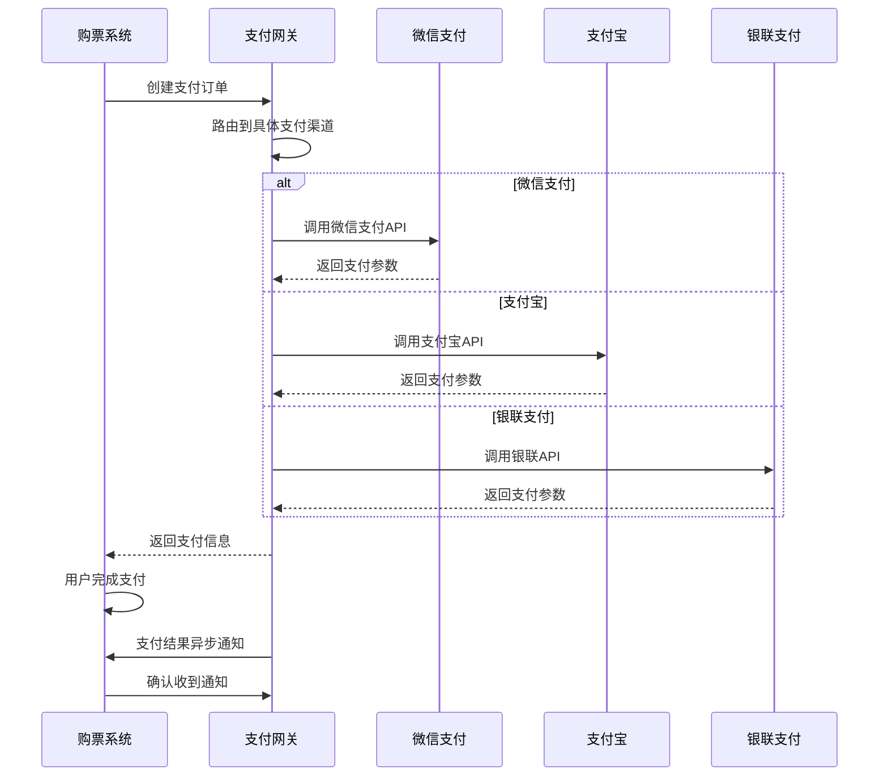

**数据交互**：
- **支付请求**：订单号、金额、商品描述、回调地址
- **支付响应**：支付流水号、支付状态、支付时间
- **退款请求**：原订单号、退款金额、退款原因
- **退款响应**：退款流水号、退款状态、退款时间

**对账机制**：
- 每日凌晨自动对账
- 对比系统订单与支付平台账单
- 发现差异自动告警并人工处理

#### 3.6.2 实名认证系统集成

**集成目标**：
- 与公安部身份信息库对接
- 验证用户身份信息真实性
- 支持人脸识别核验

**认证流程**：

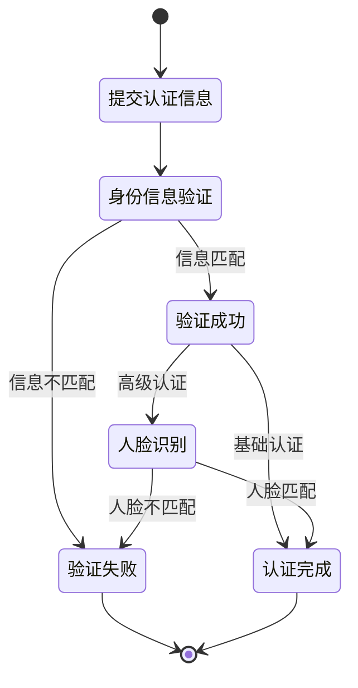

**接口规范**：
- **身份验证接口**：
  - 输入：姓名、身份证号
  - 输出：验证结果（通过/不通过）、失败原因
- **人脸识别接口**：
  - 输入：身份证号、人脸照片
  - 输出：相似度评分、验证结果

#### 3.6.3 铁路运营系统集成

**集成目标**：
- 同步车次信息和时刻表
- 实时更新座位库存
- 接收车次调整通知

**数据同步**：

| 数据类型 | 同步频率 | 同步方式 | 说明 |
|----------|----------|----------|------|
| 车次基础信息 | 每日1次 | 全量同步 | 车次号、车型、经停站等 |
| 票价信息 | 每日1次 | 全量同步 | 各座位类型价格 |
| 座位库存 | 实时 | 增量同步 | 余票数量变化 |
| 车次调整 | 实时 | 消息推送 | 停运、晚点等异常情况 |

**库存同步机制**：
- 购票系统本地缓存座位库存
- 每次购票后实时同步库存变化
- 定期（每5分钟）全量校验库存一致性
- 发现不一致立即触发全量同步

#### 3.6.4 短信/邮件通知系统集成

**集成目标**：
- 发送订单通知、出行提醒等消息
- 支持短信、邮件多渠道
- 保证消息送达率

**消息类型与模板**：

| 消息类型 | 发送时机 | 渠道 | 优先级 |
|----------|----------|------|--------|
| 注册验证码 | 用户注册时 | 短信 | 高 |
| 登录验证码 | 验证码登录时 | 短信 | 高 |
| 订单确认 | 支付成功后 | 短信+邮件 | 高 |
| 出行提醒 | 开车前24小时 | 短信+推送 | 中 |
| 退票通知 | 退票成功后 | 短信+邮件 | 中 |
| 改签通知 | 改签成功后 | 短信+邮件 | 中 |
| 候补成功 | 候补出票后 | 短信+推送 | 高 |
| 营销活动 | 活动期间 | 邮件+推送 | 低 |

**发送策略**：
- 高优先级消息：实时发送，失败重试3次
- 中优先级消息：异步发送，失败重试2次
- 低优先级消息：批量发送，失败不重试
- 用户可设置消息接收偏好

---

## 4. API接口文档

### 4.1 用户服务API

#### 4.1.1 用户注册

**接口描述**：用户通过手机号注册新账号

**请求方式**：POST

**URL路径**：`/api/user/register`

**请求参数**：

| 参数名 | 类型 | 必填 | 说明 |
|--------|------|------|------|
| mobile | string | 是 | 手机号，11位数字 |
| password | string | 是 | 密码，8-20位，包含字母和数字 |
| verifyCode | string | 是 | 短信验证码，6位数字 |

**请求示例**：
```json
{
  "mobile": "13800138000",
  "password": "Password123",
  "verifyCode": "123456"
}
```

**响应格式**：

成功响应（200）：
```json
{
  "code": 0,
  "message": "注册成功",
  "data": {
    "userId": 123456,
    "mobile": "13800138000",
    "token": "eyJhbGciOiJIUzI1NiIsInR5cCI6IkpXVCJ9..."
  }
}
```

错误响应（400）：
```json
{
  "code": 40001,
  "message": "手机号格式错误",
  "data": null
}
```

#### 4.1.2 用户登录

**接口描述**：用户通过账号密码登录系统

**请求方式**：POST

**URL路径**：`/api/user/login`

**请求参数**：

| 参数名 | 类型 | 必填 | 说明 |
|--------|------|------|------|
| mobile | string | 是 | 手机号或用户名 |
| password | string | 是 | 密码 |
| loginType | int | 是 | 登录类型：1-密码登录，2-验证码登录 |
| verifyCode | string | 否 | 验证码登录时必填 |

**请求示例**：
```json
{
  "mobile": "13800138000",
  "password": "Password123",
  "loginType": 1
}
```

**响应格式**：

成功响应（200）：
```json
{
  "code": 0,
  "message": "登录成功",
  "data": {
    "userId": 123456,
    "username": "张三",
    "mobile": "13800138000",
    "token": "eyJhbGciOiJIUzI1NiIsInR5cCI6IkpXVCJ9...",
    "expiresIn": 7200
  }
}
```

错误响应（401）：
```json
{
  "code": 40101,
  "message": "用户名或密码错误",
  "data": null
}
```

#### 4.1.3 实名认证

**接口描述**：用户提交实名认证信息

**请求方式**：POST

**URL路径**：`/api/user/realname/verify`

**请求头**：
```
Authorization: Bearer {token}
```

**请求参数**：

| 参数名 | 类型 | 必填 | 说明 |
|--------|------|------|------|
| realName | string | 是 | 真实姓名 |
| idCard | string | 是 | 身份证号，18位 |
| mobile | string | 是 | 手机号 |

**请求示例**：
```json
{
  "realName": "张三",
  "idCard": "320106199001011234",
  "mobile": "13800138000"
}
```

**响应格式**：

成功响应（200）：
```json
{
  "code": 0,
  "message": "认证成功",
  "data": {
    "verified": true,
    "verifyTime": "2025-12-24T10:30:00Z"
  }
}
```

错误响应（400）：
```json
{
  "code": 40301,
  "message": "身份证信息验证失败",
  "data": null
}
```

### 4.2 查询服务API

#### 4.2.1 车次查询

**接口描述**：根据出发地、目的地和日期查询车次

**请求方式**：GET

**URL路径**：`/api/search/trains`

**请求参数**：

| 参数名 | 类型 | 必填 | 说明 |
|--------|------|------|------|
| fromStation | string | 是 | 出发站代码，如BJP |
| toStation | string | 是 | 到达站代码，如SHH |
| departDate | string | 是 | 出发日期，格式YYYY-MM-DD |
| trainType | string | 否 | 车次类型：G/D/Z/T/K |
| departTime | string | 否 | 出发时间段 |

**请求示例**：
```
GET /api/search/trains?fromStation=BJP&toStation=SHH&departDate=2025-01-15&trainType=G
```

**响应格式**：

成功响应（200）：
```json
{
  "code": 0,
  "message": "查询成功",
  "data": {
    "total": 156,
    "trains": [
      {
        "trainNo": "G123",
        "trainType": "高铁",
        "fromStation": "北京南",
        "toStation": "上海虹桥",
        "departTime": "08:00",
        "arriveTime": "13:28",
        "duration": "5小时28分",
        "seats": [
          {
            "seatType": "商务座",
            "seatTypeCode": 1,
            "price": 1748.0,
            "available": 10,
            "canBuy": true
          },
          {
            "seatType": "一等座",
            "seatTypeCode": 2,
            "price": 933.0,
            "available": 56,
            "canBuy": true
          },
          {
            "seatType": "二等座",
            "seatTypeCode": 3,
            "price": 553.0,
            "available": 0,
            "canBuy": false,
            "canWaitlist": true
          }
        ],
        "canBuy": true
      }
    ]
  }
}
```

#### 4.2.2 余票查询

**接口描述**：查询指定车次的实时余票信息

**请求方式**：GET

**URL路径**：`/api/search/inventory/{trainNo}`

**路径参数**：

| 参数名 | 类型 | 必填 | 说明 |
|--------|------|------|------|
| trainNo | string | 是 | 车次号 |

**查询参数**：

| 参数名 | 类型 | 必填 | 说明 |
|--------|------|------|------|
| departDate | string | 是 | 出发日期 |
| fromStation | string | 是 | 出发站 |
| toStation | string | 是 | 到达站 |

**请求示例**：
```
GET /api/search/inventory/G123?departDate=2025-01-15&fromStation=BJP&toStation=SHH
```

**响应格式**：

成功响应（200）：
```json
{
  "code": 0,
  "message": "查询成功",
  "data": {
    "trainNo": "G123",
    "departDate": "2025-01-15",
    "seats": [
      {
        "seatType": "商务座",
        "totalSeats": 20,
        "availableSeats": 10,
        "price": 1748.0
      },
      {
        "seatType": "一等座",
        "totalSeats": 100,
        "availableSeats": 56,
        "price": 933.0
      },
      {
        "seatType": "二等座",
        "totalSeats": 500,
        "availableSeats": 0,
        "price": 553.0
      }
    ]
  }
}
```

### 4.3 订单服务API

#### 4.3.1 创建订单

**接口描述**：用户提交购票订单

**请求方式**：POST

**URL路径**：`/api/order/create`

**请求头**：
```
Authorization: Bearer {token}
```

**请求参数**：

| 参数名 | 类型 | 必填 | 说明 |
|--------|------|------|------|
| trainNo | string | 是 | 车次号 |
| departDate | string | 是 | 出发日期 |
| fromStation | string | 是 | 出发站 |
| toStation | string | 是 | 到达站 |
| seatType | int | 是 | 座位类型代码 |
| passengers | array | 是 | 乘车人列表 |

**请求示例**：
```json
{
  "trainNo": "G123",
  "departDate": "2025-01-15",
  "fromStation": "北京南",
  "toStation": "上海虹桥",
  "seatType": 3,
  "passengers": [
    {
      "name": "张三",
      "idCard": "320106199001011234",
      "mobile": "13800138000",
      "passengerType": 1
    }
  ]
}
```

**响应格式**：

成功响应（200）：
```json
{
  "code": 0,
  "message": "订单创建成功",
  "data": {
    "orderId": "ORDER20250115001",
    "orderNo": "E202501150001",
    "totalPrice": 553.0,
    "status": "PENDING",
    "expireTime": "2025-01-15T10:45:00Z",
    "createTime": "2025-01-15T10:30:00Z"
  }
}
```

错误响应（400）：
```json
{
  "code": 40501,
  "message": "库存不足",
  "data": null
}
```

#### 4.3.2 查询订单

**接口描述**：查询用户订单列表

**请求方式**：GET

**URL路径**：`/api/order/list`

**请求头**：
```
Authorization: Bearer {token}
```

**查询参数**：

| 参数名 | 类型 | 必填 | 说明 |
|--------|------|------|------|
| status | string | 否 | 订单状态：PENDING/PAID/CANCELLED/REFUNDED |
| startDate | string | 否 | 开始日期 |
| endDate | string | 否 | 结束日期 |
| page | int | 否 | 页码，默认1 |
| pageSize | int | 否 | 每页数量，默认10 |

**请求示例**：
```
GET /api/order/list?status=PAID&page=1&pageSize=10
```

**响应格式**：

成功响应（200）：
```json
{
  "code": 0,
  "message": "查询成功",
  "data": {
    "total": 25,
    "page": 1,
    "pageSize": 10,
    "orders": [
      {
        "orderId": "ORDER20250115001",
        "orderNo": "E202501150001",
        "trainNo": "G123",
        "fromStation": "北京南",
        "toStation": "上海虹桥",
        "departTime": "2025-01-15T08:00:00Z",
        "seatType": "二等座",
        "seatNo": "05车06A",
        "passengerName": "张三",
        "totalPrice": 553.0,
        "status": "PAID",
        "createTime": "2025-01-15T10:30:00Z",
        "payTime": "2025-01-15T10:32:00Z"
      }
    ]
  }
}
```

#### 4.3.3 退票

**接口描述**：申请订单退票

**请求方式**：POST

**URL路径**：`/api/order/refund`

**请求头**：
```
Authorization: Bearer {token}
```

**请求参数**：

| 参数名 | 类型 | 必填 | 说明 |
|--------|------|------|------|
| orderId | string | 是 | 订单ID |
| reason | string | 否 | 退票原因 |

**请求示例**：
```json
{
  "orderId": "ORDER20250115001",
  "reason": "行程取消"
}
```

**响应格式**：

成功响应（200）：
```json
{
  "code": 0,
  "message": "退票成功",
  "data": {
    "orderId": "ORDER20250115001",
    "refundAmount": 525.85,
    "refundFee": 27.15,
    "refundTime": "2025-01-15T11:00:00Z"
  }
}
```

错误响应（400）：
```json
{
  "code": 40601,
  "message": "订单已开车，无法退票",
  "data": null
}
```

#### 4.3.4 改签

**接口描述**：申请订单改签

**请求方式**：POST

**URL路径**：`/api/order/change`

**请求头**：
```
Authorization: Bearer {token}
```

**请求参数**：

| 参数名 | 类型 | 必填 | 说明 |
|--------|------|------|------|
| orderId | string | 是 | 原订单ID |
| newTrainNo | string | 是 | 新车次号 |
| newDepartDate | string | 是 | 新出发日期 |
| newSeatType | int | 是 | 新座位类型 |

**请求示例**：
```json
{
  "orderId": "ORDER20250115001",
  "newTrainNo": "G125",
  "newDepartDate": "2025-01-16",
  "newSeatType": 3
}
```

**响应格式**：

成功响应（200）：
```json
{
  "code": 0,
  "message": "改签成功",
  "data": {
    "newOrderId": "ORDER20250115002",
    "priceDiff": 20.0,
    "changeTime": "2025-01-15T11:00:00Z"
  }
}
```

### 4.4 支付服务API

#### 4.4.1 发起支付

**接口描述**：创建支付订单

**请求方式**：POST

**URL路径**：`/api/payment/create`

**请求头**：
```
Authorization: Bearer {token}
```

**请求参数**：

| 参数名 | 类型 | 必填 | 说明 |
|--------|------|------|------|
| orderId | string | 是 | 订单ID |
| paymentMethod | int | 是 | 支付方式：1-微信，2-支付宝，3-银联 |
| returnUrl | string | 否 | 支付完成后跳转地址 |

**请求示例**：
```json
{
  "orderId": "ORDER20250115001",
  "paymentMethod": 1,
  "returnUrl": "https://ticket.com/order/detail"
}
```

**响应格式**：

成功响应（200）：
```json
{
  "code": 0,
  "message": "支付订单创建成功",
  "data": {
    "paymentId": "PAY20250115001",
    "paymentUrl": "https://pay.weixin.qq.com/...",
    "qrCode": "data:image/png;base64,...",
    "expireTime": "2025-01-15T10:45:00Z"
  }
}
```

#### 4.4.2 查询支付状态

**接口描述**：查询支付订单状态

**请求方式**：GET

**URL路径**：`/api/payment/status/{paymentId}`

**请求头**：
```
Authorization: Bearer {token}
```

**路径参数**：

| 参数名 | 类型 | 必填 | 说明 |
|--------|------|------|------|
| paymentId | string | 是 | 支付订单ID |

**请求示例**：
```
GET /api/payment/status/PAY20250115001
```

**响应格式**：

成功响应（200）：
```json
{
  "code": 0,
  "message": "查询成功",
  "data": {
    "paymentId": "PAY20250115001",
    "orderId": "ORDER20250115001",
    "status": "PAID",
    "amount": 553.0,
    "payTime": "2025-01-15T10:32:00Z",
    "transactionId": "4200001234567890"
  }
}
```

---

## 5. 系统模型

### 5.1 对象模型（类图）

**核心领域对象**：

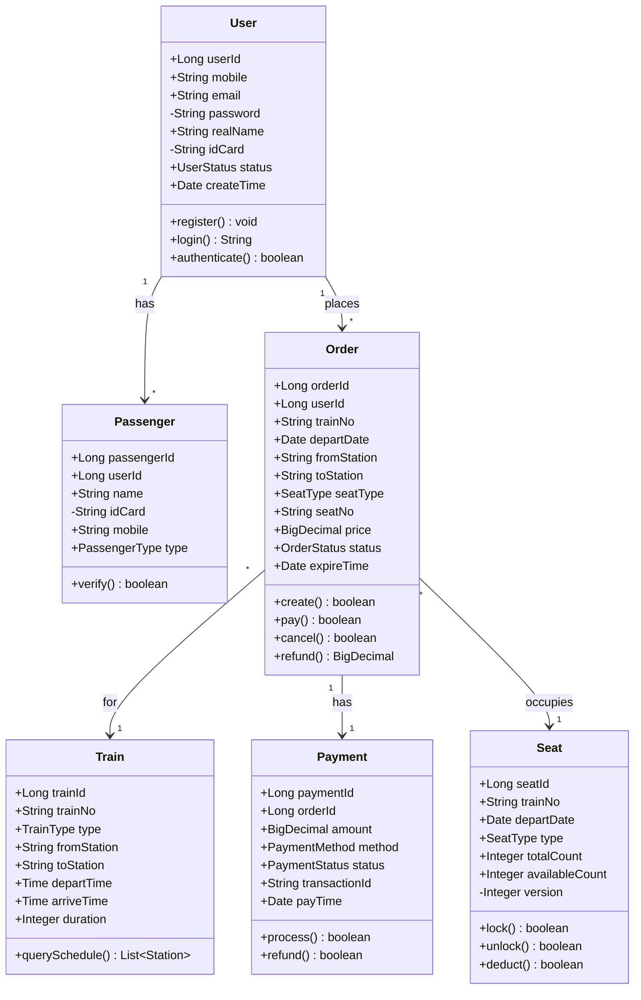

**图例说明**：
- `+` 表示public（公有）
- `-` 表示private（私有）
- `#` 表示protected（受保护）

### 5.2 订单状态机

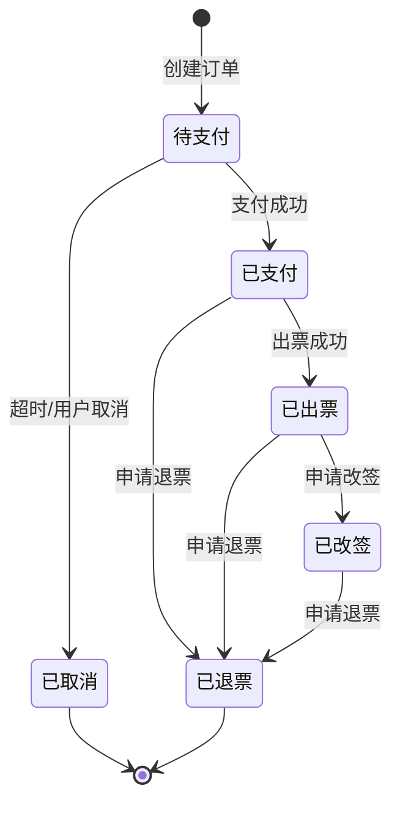

**状态说明**：
- **待支付（PENDING）**：订单已创建，等待支付
- **已支付（PAID）**：支付完成，等待出票
- **已出票（ISSUED）**：车票已生成
- **已取消（CANCELLED）**：订单已取消
- **已退票（REFUNDED）**：退票完成
- **已改签（CHANGED）**：改签完成

### 5.3 数据流模型

**订单创建数据流**：

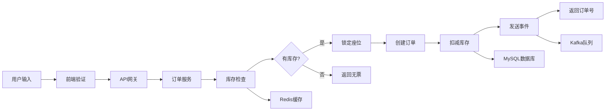

**支付数据流**：

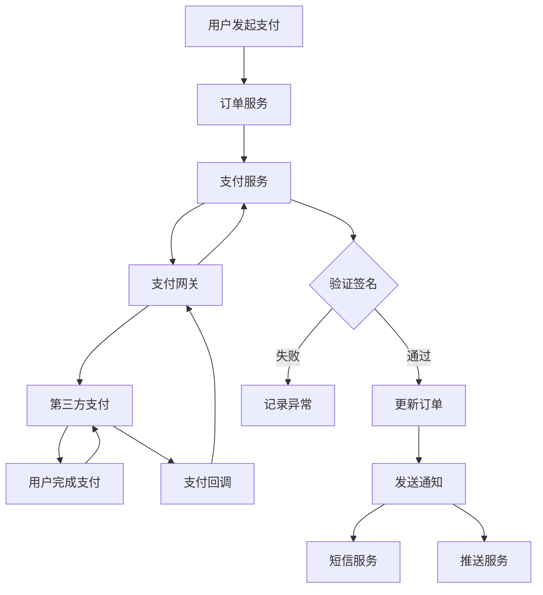

---

## 6. 附录

### 6.1 术语索引

- **高并发**：第2章 术语表
- **QPS/TPS**：第2章 术语表、第3.5.1节 性能需求
- **超卖**：第2章 术语表
- **分库分表**：第2章 术语表
- **缓存穿透/雪崩/击穿**：第2章 术语表

### 6.2 图表索引

- **用户群体分布饼图**：第3.1.1节
- **性能指标图**：第3.5.1节
- **系统集成关系图**：第1.3节
- **核心业务流程图**：第3.2.1节
- **用例图**：第3.3节
- **类图**：第5.1节
- **状态机图**：第5.2节
- **数据流图**：第5.3节

### 6.3 功能需求索引

- **用户注册**：FR-UM-001
- **用户登录**：FR-UM-002
- **实名认证**：FR-UM-003
- **车次查询**：FR-TQ-001
- **订单创建**：FR-OM-001
- **订单支付**：FR-OM-002
- **订单退票**：FR-OM-004
- **候补购票**：FR-WL-001

---

## 文档结束

本文档详细描述了高并发火车票购票系统的需求分析，涵盖了从用户需求到功能规格的各个方面。文档采用了标准UML图表和规范化描述，包括：

- **用例图**：展示用户与系统的交互
- **时序图**：展示跨系统的业务流程
- **状态机图**：展示订单等对象的状态转换
- **类图**：展示核心领域对象的结构（含可见性修饰符）
- **数据流图**：展示数据在系统中的流转
- **API文档**：详细的RESTful接口规范

文档遵循了需求分析的标准结构，确保了文档的完整性、规范性和可读性。