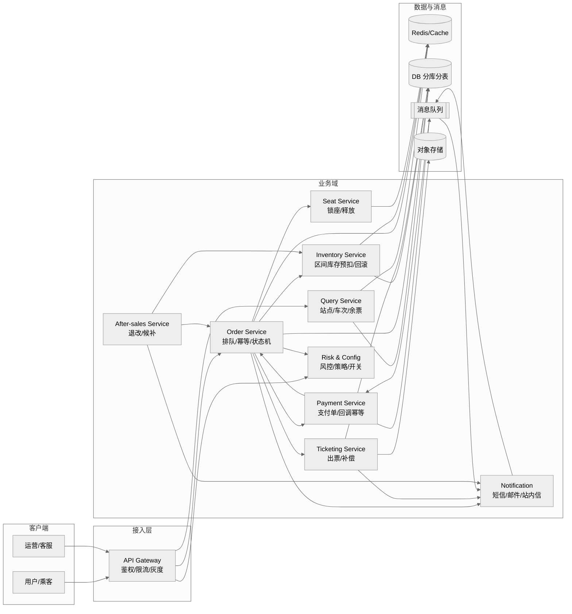
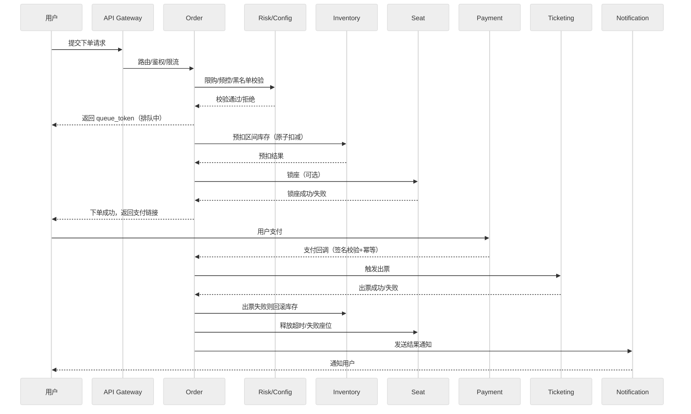
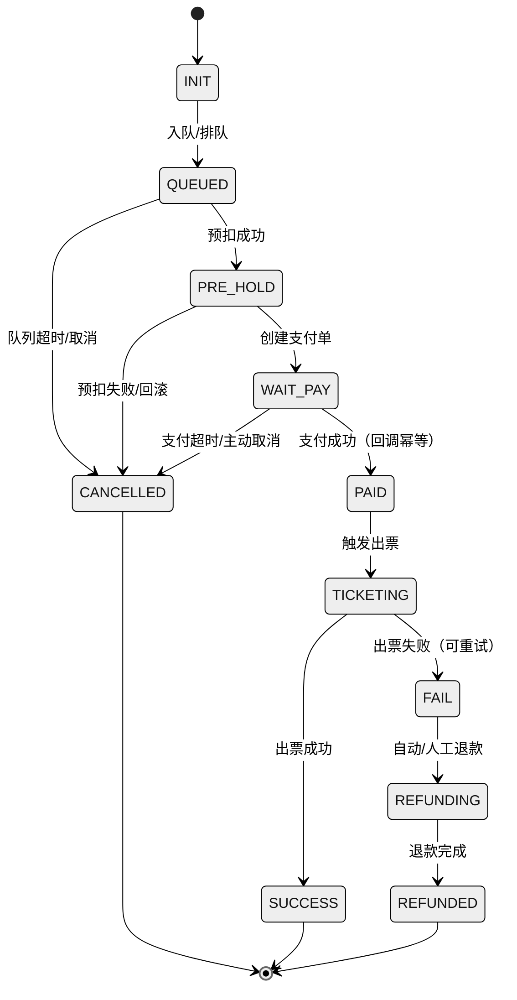

# 高并发火车票购票系统——需求分析与系统设计
> 版本：v1.0（2025-12-25）  
> 适用范围：互联网售票场景，读峰值百万级 QPS、写峰值十万级 TPS（排队削峰后）  
> 文档类型：需求+设计合并版，覆盖表格所列章节

---

## 前言

### 目标读者
产品经理、架构师、后端/前端/客户端工程师、测试、运维、风控/安全、项目管理。

### 版本历史
| 版本 | 日期 | 作者 | 变更 |
| --- | --- | --- | --- |
| 1.0 | 2025-12-25 | GPT | 初始版本，按模板输出需求与设计 |

---

## 引言

### 文档目的与背景
- 说明为何需要建设高并发火车票购票系统：保障春运/节假日流量洪峰下的稳定售票，提升旅客体验与资源利用率。  
- 概述与其他系统的关系：对接铁路运行图/时刻表、实名校验、支付网关、短信/邮件、风控、运营后台、客服系统。

### 范围与业务目标
- 范围：车次/站点查询、余票/票价查询、下单/支付/出票、退改签、候补、风控、通知、运营配置与监控。
- 业务目标：零超卖、快速出票、稳定可用（查询≥99.99%，下单≥99.95%）、低延迟（查询 P95<100ms，出队后下单 P95<1s）。

---

## 术语表
- **区间段（Segment）**：相邻站点之间的最小库存扣减单元。
- **区间票**：覆盖 [i, j) 多个区间段，扣减需“全成功否则全失败”。
- **预扣库存**：在缓存/分布式存储中原子扣减的临时库存，待支付确认后落库。
- **锁座**：占用具体席位，支付超时自动释放。
- **幂等键**：去重请求的唯一标识（如 order_token、idempotent_key）。
- **排队 Token**：进入排队后的查询凭据。
- **状态机**：订单/支付/出票状态流转的有限状态机。

---

## 用户需求定义

### 业务服务
1) **查询**：站点/车次/时刻表、余票、票价与规则、订单/行程。  
2) **下单与支付**：选择乘客/席别/区间 → 校验规则 → 进入排队 → 预扣库存/锁座 → 支付。  
3) **出票**：出票成功生成票号/检票码/电子凭证；失败自动退款或重试。  
4) **退改签**：手续费规则、库存回补、退款跟踪、改签双阶段（新票成功后取消旧票）。  
5) **候补**：登记缺口，来票后自动锁票/通知。  
6) **通知与客服**：短信/邮件/站内信，异常工单。  
7) **运营/风控**：黑白名单、限购/频控、验证码、设备指纹、配置开关。  
8) **可观测**：监控看板、审计日志、压测/演练。

### 主要约束
- 强一致库存，严禁超卖；实名购票；法规合规（数据安全/隐私）。
- 高峰写流量需排队削峰，避免 DB 行锁风暴。
- 支付回调可能乱序/重复，必须幂等。

---

## 系统体系结构（高层）

### 组件与分层
- **接入层**：API Gateway（鉴权、限流、灰度、WAF、路由）。  
- **查询域**：Query Service（站点/车次/余票/票价，强缓存+读写分离）。  
- **下单域**：Order Service（状态机、幂等、排队、订单管理）。  
- **库存域**：Inventory Service（区间段库存、原子预扣/回滚、账本对账）。  
- **座位域（可选）**：Seat Service（席位锁定、超时释放）。  
- **支付域**：Payment Service（支付单、回调幂等、账务记录）。  
- **出票域**：Ticketing Service（出票、补偿、票号生成）。  
- **退改候补域**：After-sales Service（退票/改签/候补、费用规则）。  
- **风控与运营**：Risk/Config Service（限流、黑名单、策略、开关）。  
- **通知域**：Notification Service（短信/邮件/站内信）。  
- **数据与对账**：DB、缓存、消息队列、离线仓/报表，对账/巡检任务。  
- **支撑与运维**：监控、日志、链路追踪、压测平台、演练平台。

### 数据流/控制流概述
- 查询链路：API → Query Service → 缓存命中；未命中落库/搜索 → 返回。  
- 下单链路：API → Order 校验 → 排队 → Inventory 预扣 → Seat 锁座 → 创建订单 → 返回支付链接。  
- 支付链路：用户支付 → 支付网关回调 → Payment 幂等 → Order 状态推进 → Ticketing 出票 → 通知。  
- 退改候补链路：触发 After-sales → 调用 Inventory 回补/重新扣减 → 变更订单/出票记录。

---

## 系统需求规格说明（功能+接口级概述）

### 功能需求（按域）
- **查询域**：站点联想、车次列表筛选、余票/票价查询、退改/候补规则查询、订单/行程查询、缓存降级。  
- **下单域**：实名乘客管理、限购/行程冲突校验、频控/验证码、排队 token、幂等下单、区间库存/锁座、订单状态机（待支付→已支付待出票→出票成功/失败→退款）。  
- **支付与出票**：多支付渠道、支付单与订单解耦、回调幂等/重放防护、出票重试/失败退款、票号生成与校验。  
- **退改候补**：手续费/退改时限校验、库存回补、改签双阶段（新票成功后废除旧票）、候补抢票与通知、退款跟踪。  
- **运营/风控**：黑名单、设备指纹（可选）、灰度开关、流控阈值、规则动态下发。  
- **通知/客服**：统一模板、失败重试、用户/客服侧查询接口。  
- **可观测**：指标（库存命中率、排队长度、出票成功率）、日志审计、压测/演练。

### 非功能需求
- **可用性**：查询≥99.99%，下单≥99.95%。  
- **性能**：查询 P95<100ms（缓存命中），出队后下单处理 P95<1s；支持百万级 QPS 读、排队后 20k~50k TPS 写。  
- **一致性**：库存 0 超卖；资金/订单/库存最终一致（分钟级对账）；幂等保证。  
- **安全合规**：实名/隐私保护、数据脱敏、访问审计、风控策略。  
- **扩展性**：按车次/日期/站点分库分表；服务无状态可横向扩容；模块化演进。  
- **运维性**：全链路监控、自动扩缩容、演练与压测能力。

### 关键接口（示例）
- `POST /order/queue`：提交下单请求，返回 queue_token。  
- `GET /order/queue/{token}`：查询排队进度/结果。  
- `POST /order/pay`：创建支付单，返回支付链接/二维码。  
- `POST /payment/callback`：支付回调，要求幂等。  
- `POST /ticket/refund`、`POST /ticket/change`、`POST /ticket/standby`：退票/改签/候补操作。

---

## 系统模型

### 对象模型（核心实体）
- **Train**（车次）、**Station**（站点）、**SegmentInventory**（区间库存）、**SeatLock**（座位锁）、**Order**、**OrderItem**、**Payment**、**Ticket**、**Refund/Change**、**StandbyRequest**、**User/Passenger**、**RiskProfile**、**ConfigToggle**。

### 数据流模型
- 输入：用户查询/下单请求、支付回调、运营配置。  
- 处理：缓存查询→库存预扣→订单状态机→支付幂等→出票/回滚→通知。  
- 输出：查询结果、订单/票据、通知消息、对账/监控指标。

### 统一 UML 图示例（保持多图一致）
> 规范：统一主题（neutral）、左到右布局、统一节点命名与分组；序列图展示关键时序，状态机描述生命周期。

#### 组件/上下文（Flowchart）

#### 下单链路时序（Queue→Pre-hold→Pay→Ticket）

#### 订单状态机（含异常分支）

---

## 系统演化
- 假设：车次/时刻表由上游同步，视为可信但需容错；支付回调可能延迟/重复；热点车次集中。  
- 未来变化应对：  
  - 流量增长：按车次/日期分片，库存 Key 拆分，排队分区。  
  - 业务扩展：支持多渠道（小程序/APP/网页）、多支付方式、国际化。  
  - 技术演进：引入区间库存专用存储、席位图压缩编码、基于事件的库存账本。  
  - 可靠性：持续演练（故障注入）、多活/容灾、自动化巡检与对账。

---

## 附录
- **容量基线**：读峰值 1,000,000 QPS；写入口 100,000 TPS（排队削峰，实际处理 20k~50k TPS）；支付回调 10,000 QPS。  
- **硬件/部署建议**：无状态服务弹性扩容；缓存集群（Redis/KeyDB）主从+哨兵/集群模式；消息队列（如 Kafka/RocketMQ）；数据库分库分表（车次/日期维度）；对象存储用于票据/日志归档。  
- **数据与关系（简要）**：订单与订单项 1:N；订单与支付 1:1..N；订单与票 1:N；区间库存与车次/日期 1:N；座位锁与区间库存 1:N；候补与车次/区间/席别绑定。

---

## 索引
关键词：高并发、区间库存、排队削峰、幂等、最终一致、出票、退改签、候补、风控、可观测、分库分表、缓存、消息队列。
