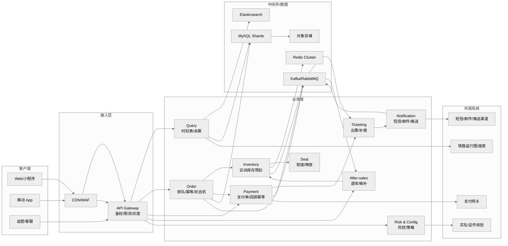
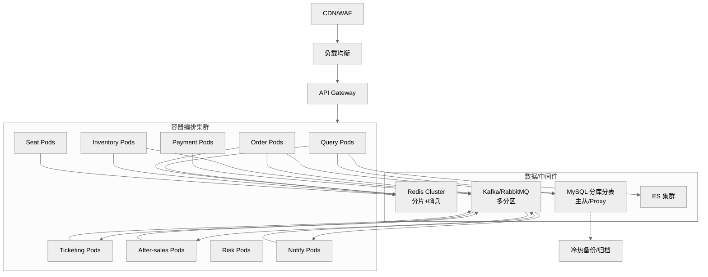
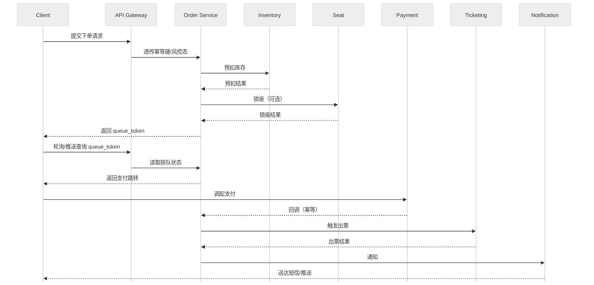
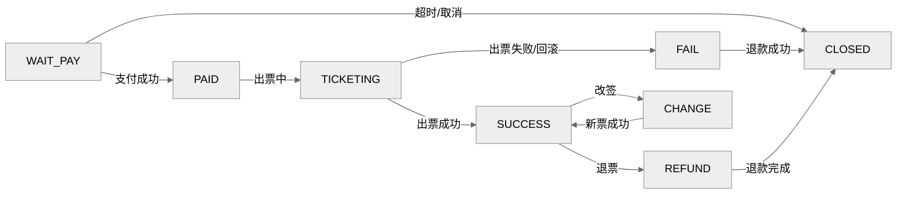

# 高并发火车票购票系统——需求分析与系统设计
> 版本：v2.0（2025-12-26）  
> 适用范围：互联网/移动售票场景，读峰值≥100万 QPS、写峰值≥20万 TPS（排队削峰后）  
> 文档类型：需求+设计合并版，覆盖模板章节，图表遵循统一 UML 风格

---

## 前言

### 目标读者与范围
- 产品、架构、后端/前端/客户端工程师、测试、运维、风控、安全、项目管理及合作方。  
- 版本历史：

| 版本 | 日期 | 作者 | 变更 |
| --- | --- | --- | --- |
| 2.0 | 2025-12-26 | GPT | 新增需求与设计并行文档，补充演化与附录、统一 UML 主题 |

---

## 引言

### 背景与目标
- 背景：春运/节假日热销车次瞬时流量陡增，需要“零超卖、可观测、可扩展”的高并发购票系统。  
- 总体目标：
  - 查询：P95 < 120ms，峰值命中率≥95%，系统可用性 99.99%。
  - 下单：P95 < 3s（出队后），峰值 20万 TPS，系统可用性 99.95%。
  - 一致性：库存 0 超卖，订单/支付/出票最终一致（对账分钟级纠偏）。

### 与相关系统的关系
- 依赖：铁路运行图/座席同步、实名/证件核验、支付平台、短信/邮件/推送、风控与反欺诈、监控与压测平台。  
- 输出：车票、订单、票号/检票码、报表与审计日志；向外部支付/通知回调。

---

## 术语表
- **区间段（Segment）**：相邻站点的最小扣减单元。
- **区间票**：跨多个区间段的票，扣减需全成全败。
- **预扣库存**：在缓存/分布式存储中的原子扣减，待支付后落库确认。
- **锁座**：占用具体席位，支付超时自动释放。
- **幂等键（Idempotent Key）**：请求唯一指纹，防重复执行。
- **排队 Token**：进入削峰排队后的查询凭据。
- **订单状态机**：订单/支付/出票状态的有限状态流转。

---

## 用户需求定义

### 功能性需求（面向用户与合作方）
1. 查询：站点/车次/余票/票价、退改/候补规则、行程/订单查询。  
2. 下单：实名乘客选择、限购/冲突校验、排队获取 token、预扣库存+锁座、支付链接生成。  
3. 出票：支付成功后出票，生成票号/检票码/电子凭证；失败自动回滚库存并退款。  
4. 退改签：规则校验、手续费计算、改签双阶段（新票成功后取消旧票）、退款跟踪。  
5. 候补：登记缺口，来票自动锁票、通知并引导支付；支持多车次/席别偏好。  
6. 通知与客服：短信/邮件/推送，异常工单与人工介入。  
7. 运营与风控：黑白名单、设备指纹（可选）、验证码/频控、灰度与配置开关。  
8. 可观测：监控看板、日志审计、压测与演练开关。

### 非功能需求
- 可用性：查询 ≥99.99%，下单 ≥99.95%。
- 性能：百万级查询 QPS，出队后下单 20万 TPS；P95 延迟满足上述目标。
- 一致性：库存 0 超卖，支付/订单/库存最终一致并可对账补偿。
- 安全与合规：实名购票、数据脱敏与加密、访问审计、风控联动。  
- 扩展与运维：按车次/日期/站点分库分表，服务无状态可水平扩展；支持弹性伸缩、灰度、演练。

### 关键策略补充（针对评审意见）
- **缓存分层与热点治理**：浏览器/APP 本地缓存（短 TTL、弱一致）→ CDN/边缘缓存（站点、时刻表，TTL 30~300s，带版本号）→ Gateway 本地缓存（开售黑名单、频控规则，TTL 5~30s）→ Redis 集群（余票/价目 TTL 5~20s，二级本地 Guava/LRU 缓存 200~500ms）→ 只读库/ES。缓存回源限流+熔断，热点车次拆 Key（train_no+date+coach/seat_class）。
- **库存扣减防超卖**：按区间段维护 `segment_inventory`，Redis Lua 原子预扣（带版本号/乐观锁），失败即排队或候补；写侧单线程/分片顺序消费 MQ 回写 MySQL 账本，账本包含 `version` 防止乱序；定时对账（账本 vs. Redis）+ 异常差值报警；支付超时/出票失败触发原路回补。
- **幂等性生命周期**：入口生成 `idempotent_key` + `queue_token`（过期 15 min），Order/Payment/Ticketing/MQ 消费均以幂等表或 Redis SETNX 落盘，状态仅前向推进；幂等记录保留 7~15 天（线上），归档后落冷存储，防重放时校验过期策略。
- **支付回调重试**：支付渠道回调采用指数退避（例如 1s/2s/4s/8s，最多 6~8 次）+ 签名校验；服务侧消费回调时按 `payment_id+notify_version` 去重，版本小于当前拒绝；落库失败进入重试队列（DLQ），人工告警。
- **对账流程（订单/支付/票号）**：
  - T+0：实时事件流双写对账表，票号生成记录 `ticket_no` 与 `order_id` 绑定。  
  - T+1：批处理对账（订单↔支付↔票号↔库存账本），校验金额、状态、数量；差异进入补偿队列，自动回滚/退款/补票或人工介入。  
  - 指标：对账差值、补偿成功率、滞留订单数。  
- **座位锁定与超时**：锁座 TTL 5~10 分钟（与支付超时一致，默认 15 分钟可配置），Redis 锁座记录携带 `seat_id/coach/segment`，到期自动回收并回补库存；锁座与预扣同事务边界，失败则回滚。  
- **连座/优先窗口并发控制**：连座请求进入专用分区队列（按车次/车厢分段），Seat Service 按窗口/连座策略排序；同分区串行分配，避免并发打散；若连座失败可降级为非连座或候补。  
- **排队令牌削峰参数**：入口频控（同账号/设备 QPS≤3，突发桶 10），每车次/日期队列长度上限 N（默认 5 万，可动态下发），超限立即拒绝或切候补；出队速率与库存预估绑定（如每秒 2% 剩余票量上限），支持动态调节。  
- **队列分段策略**：按车次+日期+席别分段，热点再按车厢/区间拆分；每段独立速率与长度，避免全局阻塞；Queue Token 携带段信息，查询只命中所属分段。  
- **候补匹配算法**：按优先级（下单时间、会员等级、乘客数）排序，采用区间覆盖匹配（基于 Segment Graph），支持多车次/席别偏好列表；匹配成功先预扣+锁座，再通知支付；失败降级重试/延期。  
- **故障与降级**：
  - 查询链路：缓存降级→只读库→ES，部分字段置灰；热点车次限流。  
  - 下单链路：库存服务不可用时，直接转候补；Seat Service 故障时仅做区间预扣不锁具体座；通知失败重试+人工补发。  
  - 外部依赖：实名/支付/短信失败时启用熔断与快速失败，告警并提供人工通道。  
- **频控规则细节**：账号/设备/IP 三级限流；策略包含滑窗 QPS、日购票次数（如 5 次/日）、同乘客/同车次间隔；风控命中需验证码或拉黑；规则可灰度下发。  
- **敏感数据加密范围**：实名信息、证件号、手机号、支付要素、设备指纹全链路 TLS；落库字段使用列级加密（AES/GCM），日志脱敏（掩码）；密钥托管于 KMS，访问审计。  
- **Redis 分片依据**：按车次+日期哈希分片，目标单分片 QPS < 5 万；热点 key 再做 key 前缀拆分（coach/seat_class 分桶）；哨兵/集群自动故障转移。  
- **MySQL 分库分表路由**：库维度按车次/日期哈希或区间（如日期分区+train_no hash）；表维度按订单号雪花 ID 中的库表位路由；跨分片查询依赖 ES/OLAP，在线事务只打到单分片。  
- **冷热数据分层**：近 90 天订单/支付/库存账本保留在热库；90 天~2 年归档到冷库（分区表或低成本存储），仅读查询走异步索引；>2 年仅保留审计摘要与脱敏数据，业务查询默认不返回。  

---

## 系统体系结构（高层）

### 架构与模块分层
- 接入层：CDN/WAF、API Gateway（鉴权、限流、灰度、幂等 token 透传）。
- 查询域：Query Service（时刻表/余票/票价、缓存优先、搜索与只读库）。
- 订单域：Order Service（排队、幂等、状态机、超时处理）。
- 库存域：Inventory Service（区间库存账本、原子预扣/回滚、段位拆分）。
- 座位域：Seat Service（锁座/释放，优先窗口/连座策略）。
- 支付域：Payment Service（支付单、回调幂等、账务记录）。
- 出票域：Ticketing Service（出票、补偿、票号生成、失败退款）。
- 退改候补域：After-sales Service（退票/改签/候补抢票、费用规则）。
- 风控与运营：Risk/Config Service（黑白名单、频控、AB 实验、策略开关）。
- 通知域：Notification Service（短信/邮件/推送，统一模板与重试）。
- 数据与中间件：Redis/MQ/ES/OLTP 分库、对象存储；监控与日志平台。

### 上下文/组件关系图

### 部署视图（高并发场景）

---

## 系统需求规格说明

### 功能需求分解（领域→用例→约束）
- 查询域：站点联想、车次筛选、余票/票价查询、规则查询、行程/订单查询；缓存优先，未命中读只读库/ES。  
- 下单域：实名校验、限购/冲突校验、验证码/频控、排队 token、幂等下单；库存预扣与锁座原子执行；超时释放。  
- 支付域：支付单生成、渠道适配、回调幂等/验签、防重放；账务记录与对账。
- 出票域：支付成功触发出票；失败回滚库存并退款，支持自动重试与人工兜底。  
- 退改候补域：退票手续费、改签双阶段（新票成功→作废旧票）、候补登记/抢票、退款跟踪。  
- 风控与运营：黑白名单、设备指纹（可选）、灰度开关、动态规则下发；监控/压测/演练开关。
- 通知域：统一模板、批量发送、失败重试、限流、渠道熔断。  
- 可观测与运维：指标、日志、链路追踪、压测、演练、告警、容量预测。

### 非功能需求细化
- 性能：
  - 查询缓存命中 P95 < 120ms，未命中 < 300ms；QPS 100万级。  
  - 出队后下单链路 P95 < 3s；TPS 20万级（排队削峰后写）。
- 可靠性：多活或同城双活，跨 AZ 部署；核心链路降级（候补/延迟通知）；服务自动扩缩容。  
- 安全：实名、频控、防黄牛、验证码、敏感数据加密/脱敏；访问审计。
- 一致性：库存扣减与订单/支付状态机单向推进；分钟级对账补偿；消息幂等消费。
- 运维性：一键压测/演练、SLO/SLA 监控、可回溯日志、容量告警。

### 接口约束（示例）
- `POST /order/queue`：提交下单，返回 `queue_token`；要求携带 `idempotent_key`。  
- `GET /order/queue/{token}`：查询排队/扣库存/锁座进度。  
- `POST /order/pay`：创建支付单，返回支付链接/二维码。  
- `POST /payment/callback`：支付回调，签名校验+幂等；状态只允许前向推进。  
- `POST /ticket/refund`、`POST /ticket/change`、`POST /ticket/standby`：退票/改签/候补。  
- `GET /config/toggles`：获取灰度/频控/风控策略。

---

## 系统模型

### 核心对象模型
- **Train**（车次）、**Station**（站点）、**SegmentInventory**（区间库存）、**SeatLock**（席位占用）、**Order**、**OrderItem**、**Payment**、**Ticket**、**Refund/Change**、**StandbyRequest**、**RiskProfile**、**ConfigToggle**。

### 关键时序（下单→支付→出票）

### 状态机（订单/支付/出票）

### 数据模型要点
- 库存：`segment_inventory(date, train_no, seat_class, segment_id, remain, version)`；Redis 原子扣减 + MySQL 账本对账。  
- 订单：`order(id, user_id, status, queue_token, idempotent_key, expire_at, amount)`；状态只前进。  
- 支付：`payment(id, order_id, channel, status, notify_version, amount)`；回调版本号防乱序。  
- 候补：`standby_request(id, user_id, intents[], priority, status)`；分段匹配与排队。  
- 审计/监控：指标、日志、轨迹表，支持追溯和压测分流标签。

---

## 系统演化

- **阶段 1：核心闭环** —— 查询/下单/支付/出票闭环，单 Region，多 AZ 高可用；Redis 分片 + MySQL 分库分表；基础监控。  
- **阶段 2：削峰与弹性** —— 引入排队/令牌桶、写入削峰；K8s 水平扩容；冷/热缓存与热点隔离；异步落库与批量刷盘。  
- **阶段 3：一致性与成本优化** —— 库存账本化，对账与巡检自动纠偏；冷热数据分层（历史订单归档到 OSS/冷库）；索引/分区/分片再均衡。  
- **阶段 4：多活与全链路治理** —— 同城/异地多活，跨机房数据同步；故障演练、自动化压测、全链路灰度与观测；AI 辅助风控与容量预测。

---

## 附录

- **硬件与容量建议（峰值 100万 QPS 查询 / 20万 TPS 写）**
  - Gateway/查询：按 10万 QPS/节点估算，预留 30% 余量；支持弹性伸缩。  
  - Redis：分片 8~16，使用集群模式与哨兵；热点 key 拆分 + 本地缓存。  
  - MQ：Kafka 分区≥集群核数，开启压缩；幂等消费与重试策略。  
  - MySQL：分库按车次/日期/站点；Proxy + 读写分离；冷数据归档。  
  - ES：仅承载查询索引，写入异步落盘；冷热节点分层。  
  - 压测：覆盖查询/下单/回调/出票链路，具备数据隔离与标签。

- **最小部署（非生产）**：单 Region，多 AZ；双节点 Redis（主从）、双节点 MySQL 主从、三节点 Kafka、3 节点 ES、2 节点 Gateway/业务服务；开启限流与压测隔离。

---

## 索引
| 章节 | 关键内容 | 位置 |
| --- | --- | --- |
| 前言 | 目标读者、版本 | 前言 |
| 引言 | 背景、目标、外部依赖 | 引言 |
| 术语 | 核心术语定义 | 术语表 |
| 用户需求 | 功能/非功需求 | 用户需求定义 |
| 体系结构 | 分层与组件图、部署图 | 系统体系结构 |
| 规格说明 | 功能与非功能细化、接口 | 系统需求规格说明 |
| 模型 | 对象、时序、状态机、数据要点 | 系统模型 |
| 演化 | 阶段性路线 | 系统演化 |
| 附录 | 容量/硬件/最小部署 | 附录 |
| 索引 | 本表 | 索引 |
