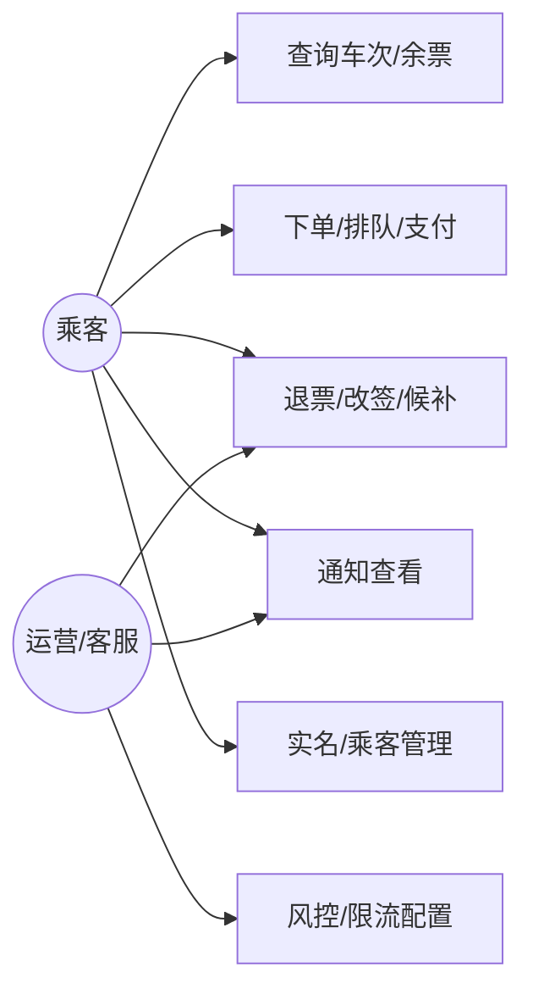

# 高并发火车票购票系统——需求规格说明书（Requirements Specification）
> 版本：v2.0（2025-12-26）  
> 适用范围：互联网/移动售票场景，读峰值≥100 万 QPS、写峰值（出队后下单）≥20 万 TPS（排队削峰后）  
> 文档类型：需求规格（独立于概要设计）

---

## 一．引言
1. 编写目的：阐明本需求说明书的目的，供产品/架构/设计/测试/运维等读者使用，作为设计与验收依据。  
2. 项目背景：春运/节假日高并发售票需求；委托/开发/运维单位共同建设；系统需对接铁路运行图/实名/支付/通知/风控等外部系统。  
3. 定义：术语与缩写见下节。  
4. 参考资料：项目任务书或合同（如有）、行业/法规要求、外部接口协议（支付/实名/短信）、相关标准与技术规范。

## 二．任务概述
1. 目标：  
   查询：P95 < 120ms，命中率≥95%，可用性 99.99%。  
   写峰值/出队后下单：P95 < 3s，峰值 ≥20 万 TPS，可用性 99.95%。  
   一致性：库存 0 超卖，订单/支付/出票最终一致（分钟级对账纠偏）。  
2. 运行环境：云/数据中心，K8s 部署，同城多 AZ；依赖 Redis/Kafka/MySQL/ES/对象存储等。  
3. 条件与限制：实名与隐私合规；外部依赖 SLA/超时限制；上线需配合开售节奏；容量/资源约束；发布需灰度与回滚预案。  

## 三．数据描述
1. 静态数据：站点/车次基础、席别/座席布局、价格和退改费率、黑白名单、风控/灰度策略。  
2. 动态数据：余票/库存、订单/明细、支付单、票号、候补请求、通知记录、日志/审计事件。  
3. 数据库描述：OLTP 分库分表 MySQL；搜索/索引用 ES；缓存用 Redis；文件/报表用对象存储；事件用 Kafka/RabbitMQ。  
4. 数据词典：关键实体字段见本节与接口字段约定，完整字段/约束在数据字典（另行维护）。  
5. 数据采集：运行图/座席同步、实名结果、支付回调、客户端埋点（需脱敏）、监控/日志采集用于运维与分析。  

## 四．功能需求
1. 功能划分：查询、下单、支付与出票、退改候补、运营/风控、通知/客服、可观测。  
2. 功能描述：见下方功能/用例要点与规则。  

## 五．性能需求
1. 数据精确度：金额以分为单位；库存/票数强一致；时间使用 ISO8601（含时区）。  
2. 时间特性：查询 P95<120ms；下单出队后 P95<3s；排队等待 P95<60s。  
3. 适应性：支持多终端，多 AZ 部署与弹性扩容；兼容外部接口版本演进。  

## 六．运行需求
1. 用户界面：需覆盖 Web/APP/小程序，支持排队状态/支付跳转/订单与候补查询；界面细节在 UI 规范中定义。  
2. 硬件接口：依赖网络、负载均衡、K8s 节点与中间件集群；具体规格在部署文档中。  
3. 软件接口：对接运行图/实名/支付/通知/风控等外部接口；内部接口见接口约束与示例。  
4. 故障处理：外部依赖超时/失败返回可诊断错误码，触发重试/降级；下单幂等返回已有结果；排队超限返回 423 并引导候补；核心异常按告警规则上报。  

## 七．其他需求
- 可用性：查询 ≥99.99%，下单 ≥99.95%；核心接口错误率 <0.1%。  
- 安全与合规：实名、加密/脱敏、访问审计、风控联动。  
- 可维护性/可移植性：服务无状态，支持滚动升级与多 AZ 部署；配置与代码分离。  
- 可使用性：排队进度可视化、错误提示友好；多语言/无障碍可选（如有需求）。  

---

## 术语与缩写
 区间段（Segment）：相邻站点的最小扣减单元。
 区间票：跨多个区间段的票，扣减需全成全败。
 预扣库存：在缓存/分布式存储中的原子扣减，待支付后落库确认。
 锁座：占用具体席位，支付超时自动释放。
 幂等键（Idempotent Key）：请求唯一指纹，防重复执行。
 排队 Token：进入削峰排队后的查询凭据。
 订单状态机：订单/支付/出票状态的有限状态流转。
 缩写：QPS/TPS（每秒查询/事务数）、TTL（生存时间）、AZ（可用区）、DLQ（死信队列）、SLO/SLA（服务水平目标/协议）。

---

## 用户需求定义

### 用户画像与场景
- 乘客端：高频通勤、节假日抢票、多乘客代购。需求：极速查询、限购/冲突提示、排队透明、改签/退票便捷。
- 运营/客服：批量通知、异常单处理、候补人工介入、风控申诉。需求：可视化监控、可追溯日志、手工补单/补偿。
- 外部合作方：支付、实名、运行图/座席、短信/邮件渠道。需求：清晰 SLA、超时/重试/降级协议。

### 用例概览（用例图）


### 用例规约要点
- 查询：前置实名，命中缓存返回；未命中读只读库/ES；运行图失败降级提示。
- 下单：前置登录+实名+频控；主成功“排队→预扣+锁座→创建订单→返回支付”；扩展“库存不足→候补”“幂等重放返回已有结果”“风控→验证码/拒绝”。
- 退改/候补：前置“订单可退/可改/可候补”；主成功“校验规则→回补/重扣→退款/支付→状态前进”；扩展“改签失败保留旧票”“候补失败继续排队或结束”。

### 功能需求
- 查询：站点/车次/余票/票价，退改/候补规则，行程/订单查询，缓存降级。
- 下单：实名乘客选择、限购/冲突校验、排队 token、幂等下单、区间预扣与锁座、支付链接生成。
- 支付与出票：支付单、回调幂等/验签、防重放；出票重试/失败退款、票号生成。
- 退改候补：费用/时间规则、改签双阶段（新票成功后作废旧票）、候补登记/抢票、退款跟踪。
- 运营/风控：黑白名单、设备指纹（可选）、验证码/频控、灰度与配置开关。
- 通知/客服：统一模板、失败重试、渠道熔断，异常单人工介入。
- 可观测：监控看板、日志审计、压测与演练开关。

### 非功能需求
- 可用性：查询 ≥99.99%，下单 ≥99.95%。
- 性能：查询 QPS 百万级；写峰值/出队后下单 ≥20 万 TPS，P95 <3s。
- 一致性：库存 0 超卖，订单/支付/库存最终一致。
- 安全与合规：实名、脱敏与加密、访问审计、风控联动。
- 运维/扩展：分库分表，可水平扩展，弹性伸缩、灰度、演练。
- 数据精确度：金额以分为单位；库存/票数强一致；时间使用 ISO8601（含时区）。
- 适应性：支持多终端，支持多 AZ 部署与弹性扩容；兼容外部接口版本演进。

---

## 业务规则与约束
- 改签与多票：改签需满足时间/车次限制（如开车前≥30 分钟），差额+手续费按规则计算；改签成功作废旧票并回补库存；同乘客同一时间窗（如 2 小时）限持一张有效票，冲突需退/改后再购。
- 排队速率：`r = min(0.02 * remain, 2000)` 单/秒，随剩余票量动态调整并封顶；超长队列转候补。
- 频控/灰度：默认阈值（账号 3 QPS、设备 3 QPS、IP 10 QPS、日购票 5 次/账号、同乘客同车次 30 分钟冷却），灰度按标签/地市 1%~20% 可调，支持回滚窗口。
- 外部依赖：实名/支付/短信等需明确 SLA、超时、最大重试（如 3 次指数退避）、熔断与降级返回码；依赖字段、签名/验签算法需契约化。

---

## 接口概览

### 接口约束
- 写接口需 `idempotent_key`；签名/鉴权头（token）、渠道标识；幂等冲突返回 409，频控返回 429。
- 错误码示例：`400_PARAM_INVALID`、`401_UNAUTHORIZED`、`403_RISK_REJECT`、`409_DUPLICATE`、`423_QUEUE_LIMIT`、`504_UPSTREAM_TIMEOUT`。
- 字段约定：金额分（int），时间 ISO8601，布尔小写。
- 故障处理：外部依赖超时/失败需返回可诊断错误码并触发重试/降级；下单幂等返回已有结果；排队超限返回 423 并引导候补。

### 接口示例
- `POST /order/queue`
  - 请求
  ```json
  {
    "train_no": "G1234",
    "date": "2025-02-01",
    "segment": ["BJP", "SHH"],
    "seat_class": "2ND",
    "passengers": [{"id": "P1", "name": "Zhang San", "id_type": "ID", "id_no": "xxxx"}],
    "idempotent_key": "u123-20250201-G1234-2ND-abc",
    "channel": "app"
  }
  ```
  - 响应
  ```json
  {
    "queue_token": "qt-8f3d",
    "status": "IN_QUEUE",
    "estimate_sec": 60
  }
  ```
- `GET /order/queue/{token}`
  - 响应
  ```json
  {
    "status": "READY_TO_PAY",
    "order_token": "ord-123",
    "pay_url": "https://pay.example.com/xxx"
  }
  ```
- `POST /payment/callback`
  - 请求
  ```json
  {
    "payment_id": "pay-123",
    "order_id": "ord-123",
    "status": "SUCCESS",
    "amount": 56000,
    "notify_version": 3,
    "sign": "xxx"
  }
  ```
  - 响应
  ```json
  { "code": 0, "msg": "ok" }
  ```

---

## 验收标准与监控指标
- 功能：零超卖；订单状态单向流转；支付回调幂等；改签/退票/候补可回滚。
- 性能：查询 P95<120ms、下单出队后 P95<3s，峰值写 TPS≥20 万；排队等待 P95<60s。
- 可用性：查询 99.99%、下单 99.95%，核心接口错误率 <0.1%。
- 安全：实名通过率达标，异常登录/下单触发风控；日志脱敏与审计可追溯。
- 监控：队列长度/出队速率、库存预扣成功率、锁座成功率、支付回调重复率/延迟、对账差值、DLQ 长度、缓存命中率、Redis/DB/消息 P95、外部依赖超时/熔断次数。

---

## 附录
- 参考：本需求文档为概要设计的输入，详细设计、测试计划、部署/运维手册另行编制。
