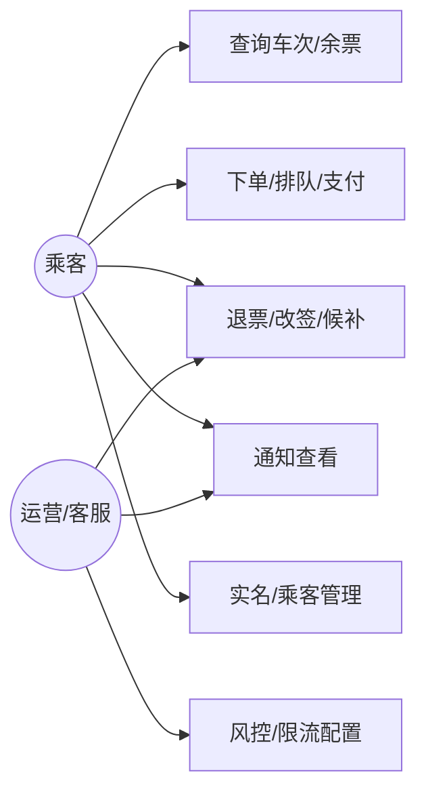

# 高并发火车票购票系统——需求规格说明书（SRS）


## 目录
1. 引言  
2. 任务概述  
3. 数据描述  
4. 功能需求  
5. 性能需求  
6. 运行需求  
7. 其他需求  
8. 附录  

---

## 一．引言
1. 编写目的：本需求说明书用于定义高并发火车票购票系统的业务范围、功能需求与非功能性要求，为产品、架构、研发、测试与运维提供统一依据。本文档作为后续系统设计、开发实现、测试验证、上线交付与验收评审的基准文件，支持需求项到设计实现、测试用例与验收标准的可追溯。本文档同时明确外部依赖与约束（铁路运行图/库存、实名核验、支付、通知、风控等），并给出关键假设与边界条件，用于联调计划、容量评估与风险控制。涉及个人信息与支付安全等内容时，系统应遵循适用的国家/行业标准及组织安全规范，并以可核验的过程证据（日志、审计记录、测试报告、演练记录等）支撑验收。
2. 项目背景：春运及节假日开售窗口会出现短时间极端峰值流量，对系统并发承载、稳定性、库存一致性与支付链路可靠性提出更高要求。本项目由委托单位、开发单位与运维单位协同建设，系统需对接铁路运行图/余票库存、实名核验、支付与退款、通知触达、风控反作弊等外部系统，形成端到端闭环。由于外部系统存在延迟、限流与不确定性，系统需具备限流/熔断/重试/补偿等容错机制，并为关键链路提供可观测、可审计的证据。项目需兼顾平峰成本与峰值弹性，确保在极端流量下核心功能可用且用户体验可接受。
3. 定义：  

   | 术语/缩写 | 解释 |
   | --- | --- |
   | 区间段 Segment | 相邻站点的最小扣减单元。 |
   | 区间票 | 跨多个区间段的票，扣减只能全成全败。 |
   | 预扣库存 | 在缓存或分布式存储中的原子扣减，待支付后落库确认。 |
   | 锁座 | 占用具体席位，支付超时自动释放。 |
   | 幂等键 Idempotent Key | 请求唯一指纹，避免重复执行。 |
   | 排队 Token | 进入削峰排队后的查询凭据。 |
   | 订单状态机 | 订单、支付、出票状态的有限状态流转。 |
   | QPS/TPS | 每秒查询/事务数。 |
   | TTL | 生存时间。 |
   | AZ | 可用区。 |
   | DLQ | 死信队列。 |
   | SLO/SLA | 服务水平目标/协议。 |
  
4. 参考资料：  

   | 标识 | 文档名称 | 编号 | 说明 |
   | --- | --- | --- | --- |
   | 1 | 《南京大学软件文档编写指南》 | - | 作为 SRS/概要设计的写作模板与评审检查清单依据。 |
   | 2 | 《Site Reliability Engineering》 | - | 支撑 SLO/错误预算、过载保护与可观测性方法论。 |
   | 3 | 《The Site Reliability Workbook》 | - | 支撑 SLO 落地、告警策略与演练/运行手册方法论。 |
   | 4 | 《Designing Data-Intensive Applications》 | - | 支撑一致性、分片、事件流与补偿/幂等思路。 |
   | 5 | MySQL 8.0 Reference Manual | - | 支撑事务/隔离级别、复制与分区等实现约束。 |
   | 6 | Elasticsearch 官方文档 | - | 支撑索引/查询与容量规划。 |
   | 7 | Redis Cluster 官方文档 | - | 支撑集群一致性折衷、过期与原子操作。 |
   | 8 | Kafka 官方文档 | - | 支撑顺序、幂等生产与重试/DLQ 策略。 |
   | 9 | RabbitMQ 官方文档 | - | 支撑可靠投递、死信队列与消费语义。 |
   | 10 | ISO 4217 | ISO 4217 | 货币编码与最小货币单位表达参考。 |
   | 11 | ISO 8601 | ISO 8601:2019 | 时间格式与时区表示参考。 |
   | 12 | RFC 3339 | RFC 3339 | 互联网时间戳格式参考（与 ISO 8601 协同）。 |
   | 13 | HTTP Semantics | RFC 9110 | HTTP 语义与状态码参考。 |
   | 14 | Hypertext Transfer Protocol (HTTP/1.1): Semantics and Content | RFC 7231 | HTTP/1.1 语义与状态码参考（兼容性参考）。 |
   | 15 | 个人信息安全规范 | GB/T 35273—2020 | 个人信息处理、最小化、授权与保护要求参考。 |
   | 16 | 电子支付系统安全保护框架 | GB/T 31502—2015 | 支付安全域/鉴别/审计等框架性要求参考。 |
   | 17 | 网络支付服务数据安全要求 | GB/T 42015—2022 | 支付数据分类、保护与管理要求参考。 |
   | 18 | App 个人信息安全测评规范 | GB/T 42582—2023 | 若包含移动端 App：用于合规测评要求参考。 |
   | 19 | 通用密码服务接口规范 | GB/T 43578—2023 | 签名/验签、加解密接口与验证方法参考。 |
   | 20 | 软件工程成本度量规范 | GB/T 36964—2018 | 用于成本/工作量口径。 |

---

## 二．任务概述
1. 目标：  
   - 查询：P95 < 120ms，命中率≥95%，可用性 99.99%。[^2] 缓存命中率长期保持在 95% 以上，未命中回源时配合熔断或降级兜底，避免瞬时雪崩。  
   - 写峰值/出队后下单：P95 < 3s，峰值 ≥20 万 TPS，可用性 99.95%。[^2] 写链路拆分排队、预扣、锁座、落账各阶段并单独监控，超阈值自动限速或转候补。  
   - 一致性：库存 0 超卖，订单/支付/出票最终一致（分钟级对账纠偏）。[^4] 对账覆盖订单↔支付↔票号↔库存账本，差异进入补偿流程并允许人工介入。  
2. 运行环境：云/数据中心，K8s 部署，同城多 AZ；依赖 Redis/Kafka/MySQL/ES/对象存储等。各组件配置自动扩缩容、健康检查与故障转移，跨 AZ 部署并定期演练切换。  
3. 条件与限制：实名与隐私合规；外部依赖 SLA/超时限制；上线配合开售节奏；容量/资源约束；发布采用灰度与回滚预案。开售前必须完成压测与频控/排队参数校准，并与支付/实名等外部 SLA 对齐。  
4. 用户画像与场景：  
   - 乘客端：高频通勤、节假日抢票、多乘客代购。关注极速查询、限购/冲突提示、排队透明、改签/退票便捷。  
   - 运营/客服：批量通知、异常单处理、候补人工介入、风控申诉。关注可视化监控、可追溯日志、手工补单/补偿。  
   - 外部合作方：支付、实名、运行图/座席、短信/邮件渠道。关注清晰 SLA、超时/重试/降级协议。  
5. 用例概览（用例图）  

6. 用例规约要点：  
   - 查询：前置实名，命中缓存返回；未命中读只读库/ES；运行图失败降级提示。记录查询来源/渠道并限制频率，提供模糊与精确查询切换，降级时提示数据时效。  
   - 下单：前置登录+实名+频控；主成功“排队→预扣+锁座→创建订单→返回支付”；扩展“库存不足→候补”“幂等重放返回已有结果”“风控→验证码/拒绝”。下单流程返回 queue_token、预计等待时间与支付有效期，失败分支提供重试或候补路径。  
   - 退改/候补：前置“订单可退/可改/可候补”；主成功“校验规则→回补/重扣→退款/支付→状态前进”；扩展“改签失败保留旧票”“候补失败继续排队或结束”。明确费用与时间限制，标注退款路径与到账时间，候补失败时可重新排队或终止。  

---

## 三．数据描述
1. 静态数据：站点/车次基础、席别/座席布局、价格和退改费率、黑白名单、风控/灰度策略。静态数据包含版本号与签名校验，支持全量与增量同步，并在缓存和只读库中保留回滚版本以便快速恢复。  
2. 动态数据：余票/库存、订单/明细、支付单、票号、候补请求、通知记录、日志/审计事件。动态数据携带时间戳与来源标识，关键链路写入账本并支持补偿回放，满足审计留痕与可追溯性。  
3. 数据库描述：OLTP 分库分表 MySQL；搜索/索引用 ES；缓存用 Redis；文件/报表用对象存储；事件用 Kafka/RabbitMQ。[^5][^8][^9] 各存储定义容量与分片策略，具备高可用与故障切换，并落地冷热分层与备份恢复流程。  
4. 数据词典：关键实体字段见本节与接口字段约定，完整字段/约束在数据字典（另行维护）。数据字典标注字段含义、类型、单位、是否加密/脱敏及索引/约束，并与接口契约双向校验。  
5. 数据采集：运行图/座席同步、实名结果、支付回调、客户端埋点（脱敏）、监控/日志采集用于运维与分析。采集链路定义频率、超时与重试策略，保证埋点不影响主链路性能，数据入湖前完成清洗脱敏。  

---

## 四．功能需求
1. 功能划分：查询、下单、支付与出票、退改候补、运营/风控、通知/客服、可观测。  
2. 功能描述：见下方功能/用例要点与规则。  
3. 功能需求细则：  
   - 查询：站点/车次/余票/票价，退改/候补规则，行程/订单查询，缓存降级。支持按车次/日期/席别筛选与排序，提供缓存命中率与数据版本提示，未命中时限制回源并展示友好降级信息。  
   - 下单：实名乘客选择、限购/冲突校验、排队 token、幂等下单、区间预扣与锁座、支付链接生成。接口返回 queue_token、幂等键校验结果与支付有效期，冲突时给出具体规则提示与可操作建议。  
   - 支付与出票：支付单、回调幂等/验签、防重放；出票重试/失败退款、票号生成。支付覆盖多渠道并校验金额/币种一致性，出票失败进入补偿流程并通知用户。  
   - 退改候补：费用/时间规则、改签双阶段（新票成功后作废旧票）、候补登记/抢票、退款跟踪。展示费用明细与预计到账时间，候补匹配成功后锁票并引导支付，失败时重试或自动转其它偏好。  
   - 运营/风控：黑白名单、设备指纹（可选）、验证码/频控、灰度与配置开关。策略支持分区域/分渠道/分用户发布与审计。  
   - 通知/客服：统一模板、失败重试、渠道熔断，异常单人工介入。跟踪送达率与延迟，客服可人工补发并切换渠道。  
   - 可观测：监控看板、日志审计、压测与演练开关。看板按域拆分指标，压测与演练与生产流量隔离并可快速关闭。  
4. 业务规则与约束：  
   - 改签与多票：改签遵循时间与车次限制（如开车前≥30 分钟），差额与手续费按规则计算；改签成功作废旧票并回补库存；同乘客同一时间窗（如 2 小时）限持一张有效票，冲突场景先退/改再购。  
   - 排队速率：`r = min(0.02 * remain, 2000)` 单/秒，随剩余票量动态调整并封顶；超长队列转候补。[^3]  
   - 频控/灰度：默认阈值（账号 3 QPS、设备 3 QPS、IP 10 QPS、日购票 5 次/账号、同乘客同车次 30 分钟冷却），灰度按标签/地市 1%~20% 可调，支持回滚窗口。  
   - 外部依赖：实名、支付、短信等明确 SLA、超时、最大重试（如 3 次指数退避）、熔断与降级返回码；依赖字段、签名/验签算法契约化。  

---

## 五．性能需求
1. 数据精确度：金额以分为单位[^10]；库存/票数强一致；时间使用 ISO8601（含时区）。[^11][^12] 金额统一使用 int64 存分并校验币种，时间字段记录时区偏移并依赖 NTP/Chrony 校时，库存读写附带版本号以防脏写与超卖。  
2. 时间特性：查询 P95<120ms；下单出队后 P95<3s；排队等待 P95<60s。[^2] 监控面板分层展示 P95/P99 与错误率，超过阈值时自动启用限流、降级或扩容，错误预算耗尽触发发布冻结。  
3. 适应性：支持多终端，多 AZ 部署与弹性扩容；兼容外部接口版本演进。多终端统一鉴权/风控策略并兼容弱网，跨 AZ 配置数据与状态解耦，外部接口提供版本灰度与回滚能力。  
4. 可用性与容量：查询 ≥99.99%，下单 ≥99.95%；核心接口错误率 <0.1%。明确可用性口径（是否计入外部依赖），在开售窗口设立变更冻结与容量保护，并配合自动化回滚与演练。  
5. 验收标准与监控指标：  
   - 功能：零超卖；订单状态单向流转；支付回调幂等；改签/退票/候补可回滚。  
   - 性能：查询 P95<120ms、下单出队后 P95<3s，峰值写 TPS≥20 万；排队等待 P95<60s。  
   - 可用性：查询 99.99%、下单 99.95%，核心接口错误率 <0.1%。  
   - 安全：实名通过率达标，异常登录/下单触发风控；日志脱敏与审计可追溯。  
   - 监控：队列长度/出队速率、库存预扣成功率、锁座成功率、支付回调重复率/延迟、对账差值、DLQ 长度、缓存命中率、Redis/DB/消息 P95、外部依赖超时/熔断次数。  

---

## 六．运行需求
1. 用户界面：覆盖 Web/APP/小程序，支持排队状态、支付跳转、订单与候补查询；界面细节在 UI 规范中定义。界面展示预计等待时间与进度条，错误提示包含可操作建议（重试/转候补/联系客服），并预留无障碍与多语言扩展。  
2. 硬件接口：依赖网络、负载均衡、K8s 节点与中间件集群；具体规格在部署文档中。开售期间提前扩容 LB/节点与中间件容量上限，并启用健康检查与自动摘除故障节点。  
3. 软件接口：对接运行图/实名/支付/通知/风控等外部接口；内部接口见接口约束与示例。外部接口明确 SLA、超时、签名/验签与幂等策略，内部接口统一鉴权、限流、幂等键透传与分区键规则。  
4. 故障处理：外部依赖超时/失败返回可诊断错误码，触发重试/降级；下单幂等返回已有结果；排队超限返回 423 并引导候补；核心异常按告警规则上报。[^2][^3] 故障时提供备用通道切换、熔断后快速恢复验证，以及可复用的演练脚本。  
5. 接口约束：写接口携带 `idempotent_key`；签名/鉴权头（token）、渠道标识；幂等冲突返回 409，频控返回 429。错误码示例：`400_PARAM_INVALID`、`401_UNAUTHORIZED`、`403_RISK_REJECT`、`409_DUPLICATE`、`423_QUEUE_LIMIT`、`504_UPSTREAM_TIMEOUT`。字段约定：金额分（int64），时间 ISO8601，布尔小写。故障处理遵循外部依赖超时/重试/降级、下单幂等返回已有结果、排队超限返回 423 并引导候补的通用模式。[^2][^3]  
6. 接口示例：  
   - `POST /order/queue`  
     - 请求
     ```json
     {
       "train_no": "G1234",
       "date": "2025-02-01",
       "segment": ["BJP", "SHH"],
       "seat_class": "2ND",
       "passengers": [{"id": "P1", "name": "Zhang San", "id_type": "ID", "id_no": "xxxx"}],
       "idempotent_key": "u123-20250201-G1234-2ND-abc",
       "channel": "app"
     }
     ```
     - 响应
     ```json
     {
       "queue_token": "qt-8f3d",
       "status": "IN_QUEUE",
       "estimate_sec": 60
     }
     ```
   - `GET /order/queue/{token}`  
     - 响应
     ```json
     {
       "status": "READY_TO_PAY",
       "order_token": "ord-123",
       "pay_url": "https://pay.example.com/xxx"
     }
     ```
   - `POST /notify/retry`  
     - 请求
     ```json
     { "notice_id": "n-1", "channel": "sms", "force": false }
     ```
     - 响应
     ```json
     { "code": 0, "msg": "ok" }
     ```

---

## 七．其他需求
- 可用性：查询 ≥99.99%，下单 ≥99.95%；核心接口错误率 <0.1%。明确可用性口径（是否计入外部依赖），在开售窗口设立变更冻结与容量保护，并配合自动化回滚与演练。  
- 安全与合规：实名、加密/脱敏、访问审计、风控联动。安全范围覆盖数据全生命周期（采集/传输/存储/访问/删除），运营与客服操作采用最小权限与双人审批，日志审计保持可追溯。  
- 可维护性/可移植性：服务无状态，支持滚动升级与多 AZ 部署；配置与代码分离。结合配置中心、特性开关与灰度/蓝绿发布能力，支撑跨 AZ/Region 的灾备切换与演练。  
- 可使用性：排队进度可视化、错误提示友好；多语言/无障碍可选（作为可配置项）。提供等待时间预估、候补成功率提示与客服/帮助入口，减少用户反复刷新与误操作。  
- 运维/扩展：分库分表，可水平扩展，弹性伸缩、灰度、演练。支持自动扩缩容、容量预测、再分片计划与压测隔离，发布过程可蓝绿/金丝雀并自动回滚。  

---

## 八．附录
- 参考：本需求文档为概要设计的输入，详细设计、测试计划、部署/运维手册另行编制。  

[^2]: 参考资料 2 《Site Reliability Engineering》
[^3]: 参考资料 3 《The Site Reliability Workbook》
[^4]: 参考资料 4 《Designing Data-Intensive Applications》
[^5]: 参考资料 5 MySQL 8.0 Reference Manual
[^7]: 参考资料 7 Redis Cluster 官方文档
[^8]: 参考资料 8 Kafka 官方文档
[^9]: 参考资料 9 RabbitMQ 官方文档
[^10]: 参考资料 10 ISO 4217
[^11]: 参考资料 11 ISO 8601:2019
[^12]: 参考资料 12 RFC 3339
