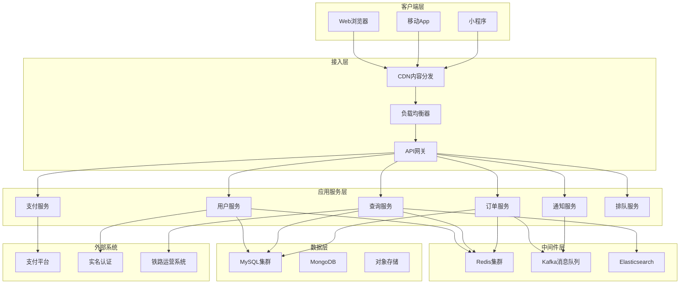

# 高并发火车票购票系统架构设计文档

## 版本历史

| 版本号 | 修订日期 | 修订人 | 修订原因 | 修订内容概述 |
|--------|----------|--------|----------|--------------|
| 1.0 | 2025-12-23 | Emma | 初始版本 | 创建系统架构设计文档 |
| 1.1 | 2025-12-24 | Emma | 规范优化 | 统一性能指标、规范UML图表、删除业务代码、添加组件图 |

---

## 1. 系统整体架构

### 1.1 架构设计原则

- **高可用性**: 系统可用性达到99.99%，年停机时间不超过52.56分钟
- **高并发**: 支持三种流量场景（日常10万QPS、高峰50万QPS、极限100万QPS）
- **高性能**: 查询响应时间<200ms，下单响应时间<3s
- **可扩展性**: 支持水平扩展，弹性伸缩
- **数据一致性**: 保证订单和库存的强一致性

### 1.2 性能指标说明

系统需要支持三种不同的流量场景：

| 流量场景 | QPS | TPS | 日订单量 | 瞬时并发 | 说明 |
|---------|-----|-----|---------|---------|------|
| 日常流量 | 10万/秒 | 2万/秒 | 500万单 | 50万 | 工作日正常业务量 |
| 高峰流量 | 50万/秒 | 10万/秒 | 1000万单 | 100万 | 节假日、春运期间 |
| 极限流量 | 100万/秒 | 20万/秒 | 2000万单 | 200万 | 热门车次开售瞬间 |

**性能目标**：
- 查询服务：支持100万QPS
- 订单服务：支持20万TPS
- 平均响应时间：查询<200ms，下单<3s
- 系统可用性：99.99%

### 1.3 微服务架构划分

#### 1.3.1 组件图



#### 1.3.2 核心服务模块

**1. 用户服务 (User Service)**
- 用户注册、登录、认证
- 用户信息管理
- 常用联系人管理
- 用户权限管理

**2. 车票查询服务 (Search Service)**
- 车次查询
- 余票查询
- 站点查询
- 价格查询
- 热点数据缓存

**3. 订单服务 (Order Service)**
- 订单创建
- 订单查询
- 订单状态管理
- 订单超时处理

**4. 库存服务 (Inventory Service)**
- 库存管理
- 库存扣减
- 库存回退
- 座位分配

**5. 支付服务 (Payment Service)**
- 支付接口集成
- 支付状态查询
- 退款处理
- 对账管理

**6. 排队服务 (Queue Service)**
- 虚拟排队
- 流量控制
- 令牌分发
- 排队状态查询

**7. 通知服务 (Notification Service)**
- 短信通知
- 邮件通知
- 站内消息
- 推送通知

**8. 风控服务 (Risk Service)**
- 防刷票检测
- 异常行为识别
- 黑名单管理
- 验证码服务

**9. 车票服务 (Ticket Service)**
- 车票信息管理
- 车次管理
- 站点管理
- 票价管理

---

## 2. 技术选型

### 2.1 编程语言与框架

| 组件类型 | 技术选型 | 说明 |
|---------|---------|------|
| 后端语言 | Java 17 | 成熟稳定，生态丰富 |
| 微服务框架 | Spring Cloud Alibaba | 国内最佳实践，集成Nacos、Sentinel等 |
| RPC框架 | Dubbo 3.x | 高性能RPC，支持多协议 |
| Web框架 | Spring Boot 3.x | 快速开发，约定优于配置 |
| 前端框架 | React 18 + TypeScript | 组件化开发，类型安全 |

### 2.2 中间件选型

| 中间件类型 | 技术选型 | 说明 |
|-----------|---------|------|
| 注册中心 | Nacos 2.x | 服务发现、配置管理 |
| 配置中心 | Nacos Config | 动态配置管理 |
| 网关 | Spring Cloud Gateway | 统一入口，路由转发 |
| 负载均衡 | Nginx + LVS | 四层+七层负载均衡 |
| 缓存 | Redis Cluster | 分布式缓存 |
| 消息队列 | Kafka + RabbitMQ | Kafka削峰填谷，RabbitMQ业务解耦 |
| 搜索引擎 | Elasticsearch | 车次搜索、日志分析 |
| 限流熔断 | Sentinel | 流量控制、熔断降级 |
| 分布式事务 | Seata | TCC、AT模式 |
| 任务调度 | XXL-Job | 分布式任务调度 |
| 链路追踪 | SkyWalking | 全链路监控 |
| 监控告警 | Prometheus + Grafana | 指标监控、可视化 |

### 2.3 数据存储选型

| 存储类型 | 技术选型 | 说明 |
|---------|---------|------|
| 关系数据库 | MySQL 8.0 | 主数据存储 |
| 缓存数据库 | Redis 7.x | 热点数据缓存 |
| 文档数据库 | MongoDB | 日志、会话存储 |
| 时序数据库 | InfluxDB | 监控指标存储 |
| 对象存储 | MinIO/OSS | 文件存储 |

---

## 3. 数据库设计

### 3.1 分库分表策略

#### 3.1.1 分库策略

**用户库分库**: 按用户ID取模分16库
```
database_index = user_id % 16
database_name = user_db_{database_index}
```

**订单库分库**: 按订单ID取模分32库
```
database_index = order_id % 32
database_name = order_db_{database_index}
```

**车票库**: 按车次号哈希分8库
```
database_index = hash(train_number) % 8
database_name = ticket_db_{database_index}
```

#### 3.1.2 分表策略

**订单表分表**: 每库按时间分256表
```
table_index = order_id % 256
table_name = t_order_{table_index}
```

**用户表分表**: 每库按用户ID分64表
```
table_index = user_id % 64
table_name = t_user_{table_index}
```

#### 3.1.3 核心表结构

**用户表 (t_user)**
```sql
CREATE TABLE t_user_{N} (
    id BIGINT PRIMARY KEY COMMENT '用户ID',
    username VARCHAR(50) UNIQUE NOT NULL COMMENT '用户名',
    password VARCHAR(128) NOT NULL COMMENT '密码(加密)',
    real_name VARCHAR(50) COMMENT '真实姓名',
    id_card VARCHAR(18) UNIQUE COMMENT '身份证号',
    phone VARCHAR(11) UNIQUE COMMENT '手机号',
    email VARCHAR(100) COMMENT '邮箱',
    user_type TINYINT DEFAULT 0 COMMENT '用户类型:0普通,1VIP',
    status TINYINT DEFAULT 1 COMMENT '状态:0禁用,1正常',
    create_time DATETIME DEFAULT CURRENT_TIMESTAMP,
    update_time DATETIME DEFAULT CURRENT_TIMESTAMP ON UPDATE CURRENT_TIMESTAMP,
    version INT DEFAULT 0 COMMENT '乐观锁版本号',
    INDEX idx_phone (phone),
    INDEX idx_id_card (id_card)
) ENGINE=InnoDB DEFAULT CHARSET=utf8mb4 COMMENT='用户表';
```

**订单表 (t_order)**
```sql
CREATE TABLE t_order_{N} (
    id BIGINT PRIMARY KEY COMMENT '订单ID',
    order_no VARCHAR(32) UNIQUE NOT NULL COMMENT '订单号',
    user_id BIGINT NOT NULL COMMENT '用户ID',
    train_number VARCHAR(20) NOT NULL COMMENT '车次号',
    departure_station VARCHAR(50) NOT NULL COMMENT '出发站',
    arrival_station VARCHAR(50) NOT NULL COMMENT '到达站',
    departure_time DATETIME NOT NULL COMMENT '出发时间',
    arrival_time DATETIME NOT NULL COMMENT '到达时间',
    seat_type TINYINT NOT NULL COMMENT '座位类型',
    seat_number VARCHAR(10) COMMENT '座位号',
    passenger_name VARCHAR(50) NOT NULL COMMENT '乘客姓名',
    passenger_id_card VARCHAR(18) NOT NULL COMMENT '乘客身份证',
    ticket_price DECIMAL(10,2) NOT NULL COMMENT '票价',
    order_status TINYINT DEFAULT 0 COMMENT '订单状态:0待支付,1已支付,2已取消,3已退款',
    pay_time DATETIME COMMENT '支付时间',
    expire_time DATETIME COMMENT '过期时间',
    create_time DATETIME DEFAULT CURRENT_TIMESTAMP,
    update_time DATETIME DEFAULT CURRENT_TIMESTAMP ON UPDATE CURRENT_TIMESTAMP,
    version INT DEFAULT 0 COMMENT '乐观锁版本号',
    INDEX idx_user_id (user_id),
    INDEX idx_order_no (order_no),
    INDEX idx_train_number (train_number),
    INDEX idx_create_time (create_time)
) ENGINE=InnoDB DEFAULT CHARSET=utf8mb4 COMMENT='订单表';
```

**库存表 (t_inventory)**
```sql
CREATE TABLE t_inventory (
    id BIGINT PRIMARY KEY AUTO_INCREMENT,
    train_number VARCHAR(20) NOT NULL COMMENT '车次号',
    train_date DATE NOT NULL COMMENT '发车日期',
    departure_station VARCHAR(50) NOT NULL COMMENT '出发站',
    arrival_station VARCHAR(50) NOT NULL COMMENT '到达站',
    seat_type TINYINT NOT NULL COMMENT '座位类型',
    total_seats INT NOT NULL COMMENT '总座位数',
    available_seats INT NOT NULL COMMENT '可用座位数',
    locked_seats INT DEFAULT 0 COMMENT '锁定座位数',
    create_time DATETIME DEFAULT CURRENT_TIMESTAMP,
    update_time DATETIME DEFAULT CURRENT_TIMESTAMP ON UPDATE CURRENT_TIMESTAMP,
    version INT DEFAULT 0 COMMENT '乐观锁版本号',
    UNIQUE KEY uk_train_route_seat (train_number, train_date, departure_station, arrival_station, seat_type),
    INDEX idx_train_date (train_number, train_date)
) ENGINE=InnoDB DEFAULT CHARSET=utf8mb4 COMMENT='库存表';
```

**车次表 (t_train)**
```sql
CREATE TABLE t_train (
    id BIGINT PRIMARY KEY AUTO_INCREMENT,
    train_number VARCHAR(20) UNIQUE NOT NULL COMMENT '车次号',
    train_type TINYINT NOT NULL COMMENT '列车类型:1高铁,2动车,3普快',
    departure_station VARCHAR(50) NOT NULL COMMENT '始发站',
    arrival_station VARCHAR(50) NOT NULL COMMENT '终点站',
    departure_time TIME NOT NULL COMMENT '发车时间',
    arrival_time TIME NOT NULL COMMENT '到达时间',
    duration INT NOT NULL COMMENT '运行时长(分钟)',
    status TINYINT DEFAULT 1 COMMENT '状态:0停运,1正常',
    create_time DATETIME DEFAULT CURRENT_TIMESTAMP,
    update_time DATETIME DEFAULT CURRENT_TIMESTAMP ON UPDATE CURRENT_TIMESTAMP,
    INDEX idx_train_number (train_number),
    INDEX idx_departure_station (departure_station),
    INDEX idx_arrival_station (arrival_station)
) ENGINE=InnoDB DEFAULT CHARSET=utf8mb4 COMMENT='车次表';
```

### 3.2 读写分离方案

#### 3.2.1 主从架构
- **主库**: 1主，负责写操作
- **从库**: 2-4从，负责读操作
- **同步方式**: 半同步复制，保证数据一致性

#### 3.2.2 读写分离中间件
使用 **ShardingSphere-JDBC** 实现读写分离和分库分表

```yaml
spring:
  shardingsphere:
    datasource:
      names: master,slave0,slave1
      master:
        type: com.zaxxer.hikari.HikariDataSource
        driver-class-name: com.mysql.cj.jdbc.Driver
        jdbc-url: jdbc:mysql://master:3306/ticket_db
      slave0:
        type: com.zaxxer.hikari.HikariDataSource
        driver-class-name: com.mysql.cj.jdbc.Driver
        jdbc-url: jdbc:mysql://slave0:3306/ticket_db
      slave1:
        type: com.zaxxer.hikari.HikariDataSource
        driver-class-name: com.mysql.cj.jdbc.Driver
        jdbc-url: jdbc:mysql://slave1:3306/ticket_db
    rules:
      readwrite-splitting:
        data-sources:
          ticket_ds:
            type: Static
            props:
              write-data-source-name: master
              read-data-source-names: slave0,slave1
              load-balancer-name: round_robin
```

---

## 4. 缓存架构

### 4.1 Redis集群设计

#### 4.1.1 集群模式
采用 **Redis Cluster** 模式，16384个槽位分布在6个节点(3主3从)

```
Master1 (0-5460)  ←→  Slave1
Master2 (5461-10922) ←→  Slave2
Master3 (10923-16383) ←→  Slave3
```

#### 4.1.2 缓存分层策略

**L1缓存 - 本地缓存 (Caffeine)**
- 缓存车次基础信息
- TTL: 5分钟
- 容量: 10000条

**L2缓存 - Redis缓存**
- 缓存余票信息、订单信息
- TTL: 根据业务场景设置

**L3缓存 - 数据库**
- 持久化存储

### 4.2 缓存策略

#### 4.2.1 热点数据缓存

**余票信息缓存**
```
Key: ticket:inventory:{train_number}:{train_date}:{departure}:{arrival}:{seat_type}
Value: {
    "total_seats": 1000,
    "available_seats": 856,
    "locked_seats": 144
}
TTL: 60秒
```

**车次信息缓存**
```
Key: train:info:{train_number}
Value: {JSON格式车次详情}
TTL: 1小时
```

**用户会话缓存**
```
Key: session:{session_id}
Value: {用户信息}
TTL: 30分钟
```

**排队令牌缓存**
```
Key: queue:token:{user_id}
Value: {token_id, position, expire_time}
TTL: 10分钟
```

#### 4.2.2 缓存更新策略

**Cache Aside Pattern (旁路缓存)**
- 读操作: 先查缓存，缓存未命中则查数据库并写入缓存
- 写操作: 先更新数据库，再删除缓存

**预扣库存场景的缓存更新流程**：
1. Redis原子扣减库存
2. 检查扣减结果，如果小于0则回滚
3. 发送订单消息到MQ
4. 异步更新数据库（由消费者处理）

### 4.3 缓存一致性保证

#### 4.3.1 延迟双删策略
1. 删除缓存
2. 更新数据库
3. 延迟删除缓存(500ms后)

#### 4.3.2 基于Canal的数据同步
- 监听MySQL binlog
- 实时同步数据到Redis
- 保证最终一致性

---

## 5. 消息队列设计

### 5.1 Kafka架构

#### 5.1.1 集群配置
- **Broker**: 3个节点
- **Partition**: 每个Topic 16个分区
- **Replication**: 副本因子为2

#### 5.1.2 Topic设计

| Topic名称 | 分区数 | 用途 | 消费者组 |
|----------|-------|------|---------| 
| order-create-topic | 16 | 订单创建事件 | order-consumer-group |
| order-pay-topic | 16 | 订单支付事件 | payment-consumer-group |
| order-cancel-topic | 8 | 订单取消事件 | cancel-consumer-group |
| inventory-update-topic | 16 | 库存更新事件 | inventory-consumer-group |
| notification-topic | 8 | 通知事件 | notification-consumer-group |

### 5.2 RabbitMQ架构

#### 5.2.1 交换机设计

**订单延迟队列**
```
Exchange: order.delay.exchange (x-delayed-message)
Queue: order.delay.queue
Routing Key: order.delay
用途: 订单超时自动取消
```

**死信队列**
```
Exchange: order.dlx.exchange
Queue: order.dlx.queue
用途: 处理失败消息
```

### 5.3 削峰填谷方案

#### 5.3.1 流量削峰
```
用户请求 → API网关限流 → 排队系统 → 消息队列 → 订单服务
   (10万/s)    (5万/s)      (2万/s)     (缓冲)    (1000/s)
```

#### 5.3.2 异步处理订单流程

**流程说明**：
1. 接收订单请求，快速返回
   - 参数校验
   - 预扣库存
   - 发送订单消息到Kafka
   - 返回"订单提交成功"

2. 异步消费订单消息
   - 创建订单
   - 设置订单过期时间(10分钟)
   - 发送延迟消息到RabbitMQ

3. 处理订单超时
   - 监听延迟队列
   - 检查订单状态
   - 如果未支付则取消订单并回退库存

---

## 6. 高并发解决方案

### 6.1 负载均衡架构

#### 6.1.1 四层负载均衡 (LVS)
```
                    Internet
                       │
                   ┌───▼───┐
                   │  DNS  │
                   └───┬───┘
                       │
        ┌──────────────┼──────────────┐
        │              │              │
    ┌───▼───┐      ┌───▼───┐      ┌───▼───┐
    │ LVS-1 │      │ LVS-2 │      │ LVS-3 │
    └───┬───┘      └───┬───┘      └───┬───┘
        │              │              │
        └──────────────┼──────────────┘
                       │
                  (Keepalived)
```

**LVS配置**
- 模式: DR模式(Direct Routing)
- 调度算法: 加权最小连接(WLC)
- 会话保持: 源地址哈希

#### 6.1.2 七层负载均衡 (Nginx)
```nginx
upstream api_servers {
    least_conn;  # 最小连接数算法
    server 192.168.1.10:8080 weight=3 max_fails=3 fail_timeout=30s;
    server 192.168.1.11:8080 weight=3 max_fails=3 fail_timeout=30s;
    server 192.168.1.12:8080 weight=2 max_fails=3 fail_timeout=30s;
    keepalive 32;  # 保持连接
}

server {
    listen 80;
    server_name api.ticket.com;
    
    location /api/ {
        proxy_pass http://api_servers;
        proxy_http_version 1.1;
        proxy_set_header Connection "";
        proxy_set_header Host $host;
        proxy_set_header X-Real-IP $remote_addr;
        proxy_set_header X-Forwarded-For $proxy_add_x_forwarded_for;
        
        # 超时设置
        proxy_connect_timeout 5s;
        proxy_send_timeout 10s;
        proxy_read_timeout 10s;
    }
}
```

### 6.2 限流策略

#### 6.2.1 网关层限流配置示例

**Sentinel流控规则配置**：
- 查询接口限流: 100,000 QPS
- 下单接口限流: 50,000 QPS，预热模式，预热时长10秒
- 支付接口限流: 30,000 QPS

#### 6.2.2 用户维度限流算法

**令牌桶算法流程**：
1. 获取当前令牌数和上次更新时间
2. 计算时间差，按速率生成新令牌
3. 令牌数不超过桶容量
4. 判断是否有足够令牌
5. 有则扣减令牌并返回成功，否则返回失败

### 6.3 降级方案

#### 6.3.1 服务降级策略

**降级处理方式**：
- 限流降级：返回"系统繁忙，请稍后重试"
- 异常降级：记录错误日志，返回"系统异常，请稍后重试"

#### 6.3.2 降级优先级
1. **非核心功能降级**: 推荐车次、历史订单查询
2. **读服务降级**: 返回缓存数据或默认数据
3. **写服务降级**: 记录日志，异步补偿
4. **核心服务保护**: 保证查询和下单功能

### 6.4 熔断机制

#### 6.4.1 熔断配置说明

**慢调用比例熔断**：
- 资源: paymentService
- 响应时间阈值: 1000ms
- 熔断时长: 10秒
- 最小请求数: 5
- 慢调用比例: 50%

**异常比例熔断**：
- 资源: inventoryService
- 异常比例: 50%
- 熔断时长: 10秒
- 最小请求数: 5

#### 6.4.2 熔断状态机
```
关闭状态 (Closed) → 打开状态 (Open) → 半开状态 (Half-Open) → 关闭状态
    │                      │                    │
    │ 异常率>阈值           │ 熔断时长到期        │ 探测成功
    └──────────────────────┴────────────────────┘
```

---

## 7. 分布式事务处理

### 7.1 TCC模式 (订单+库存)

#### 7.1.1 Try阶段 - 资源预留

**流程说明**：
1. 检查库存是否充足
2. 预留库存（锁定座位）
   - 可用座位数减少
   - 锁定座位数增加
3. 记录事务日志，状态为TRY

#### 7.1.2 Confirm阶段 - 确认提交

**流程说明**：
1. 确认扣减库存
   - 锁定座位数减少
2. 更新事务状态为COMMIT

#### 7.1.3 Cancel阶段 - 回滚

**流程说明**：
1. 释放锁定库存
   - 可用座位数增加
   - 锁定座位数减少
2. 更新事务状态为ROLLBACK

### 7.2 SAGA模式 (订单+支付+通知)

#### 7.2.1 正向流程
```json
{
  "sagaDefinition": {
    "name": "orderSaga",
    "steps": [
      {
        "name": "createOrder",
        "service": "orderService",
        "method": "create",
        "compensate": "cancelOrder"
      },
      {
        "name": "deductInventory",
        "service": "inventoryService",
        "method": "deduct",
        "compensate": "addInventory"
      },
      {
        "name": "processPayment",
        "service": "paymentService",
        "method": "pay",
        "compensate": "refund"
      },
      {
        "name": "sendNotification",
        "service": "notificationService",
        "method": "send",
        "compensate": "none"
      }
    ]
  }
}
```

#### 7.2.2 补偿流程

**SAGA执行流程**：
1. 按顺序执行各个步骤
2. 如果某步骤失败，自动执行补偿流程
3. 补偿流程按相反顺序执行各步骤的补偿方法

### 7.3 本地消息表 (最终一致性)

#### 7.3.1 本地消息表设计
```sql
CREATE TABLE t_local_message (
    id BIGINT PRIMARY KEY AUTO_INCREMENT,
    message_id VARCHAR(64) UNIQUE NOT NULL COMMENT '消息ID',
    topic VARCHAR(100) NOT NULL COMMENT '消息主题',
    content TEXT NOT NULL COMMENT '消息内容',
    status TINYINT DEFAULT 0 COMMENT '状态:0待发送,1已发送,2发送失败',
    retry_count INT DEFAULT 0 COMMENT '重试次数',
    max_retry INT DEFAULT 3 COMMENT '最大重试次数',
    next_retry_time DATETIME COMMENT '下次重试时间',
    create_time DATETIME DEFAULT CURRENT_TIMESTAMP,
    update_time DATETIME DEFAULT CURRENT_TIMESTAMP ON UPDATE CURRENT_TIMESTAMP,
    INDEX idx_status_retry (status, next_retry_time)
) ENGINE=InnoDB DEFAULT CHARSET=utf8mb4 COMMENT='本地消息表';
```

#### 7.3.2 实现流程

**事务处理流程**：
1. 在同一数据库事务中：
   - 创建订单
   - 插入本地消息表
2. 定时任务扫描本地消息表
3. 发送消息到Kafka
4. 更新消息状态
5. 失败时更新重试信息

---

## 8. 安全设计

### 8.1 防刷票机制

#### 8.1.1 滑动验证码

**验证码生成流程**：
1. 生成背景图和滑块图
2. 生成随机偏移量
3. 存储验证信息到Redis（TTL 2分钟）
4. 返回验证码图片

**验证码校验流程**：
1. 获取存储的验证信息
2. 比较用户滑动位置与实际偏移量
3. 允许5像素误差
4. 验证后删除缓存

#### 8.1.2 行为分析

**异常行为检测**：
1. 统计1分钟内的请求次数
2. 超过30次/分钟判定为异常
3. 检查操作时间间隔
4. 间隔小于100ms可能是机器人
5. 异常用户加入黑名单

### 8.2 防黄牛策略

#### 8.2.1 实名制验证

**验证流程**：
1. 校验身份证格式
2. 调用公安部接口验证
3. 缓存验证结果（24小时）

#### 8.2.2 购票限制

**限制规则**：
1. 同一用户同一车次同一天最多购买5张票
2. 同一用户同一身份证号一天最多购买10张票
3. 使用Redis计数器实现限制

### 8.3 排队系统

#### 8.3.1 虚拟排队设计

**排队流程**：
1. 生成排队令牌
2. 加入Redis有序集合（按时间戳排序）
3. 存储令牌信息（TTL 10分钟）
4. 返回排队位置和预计等待时间

**排队权限检查**：
- 前1000名可以进入购票
- 其他用户继续排队等待

#### 8.3.2 令牌桶限流

**限流参数**：
- 桶容量: 10000
- 令牌生成速率: 1000个/秒

**限流算法**：
使用Lua脚本保证原子性，实现令牌桶算法

---

## 9. 部署架构

### 9.1 容器化部署

#### 9.1.1 Docker镜像构建
```dockerfile
# Dockerfile
FROM openjdk:17-jdk-alpine
LABEL maintainer="ticket-system"

# 设置工作目录
WORKDIR /app

# 复制jar包
COPY target/ticket-service.jar app.jar

# 设置JVM参数
ENV JAVA_OPTS="-Xms2g -Xmx4g -XX:+UseG1GC -XX:MaxGCPauseMillis=200"

# 暴露端口
EXPOSE 8080

# 健康检查
HEALTHCHECK --interval=30s --timeout=3s --start-period=40s --retries=3 \
    CMD wget --quiet --tries=1 --spider http://localhost:8080/actuator/health || exit 1

# 启动应用
ENTRYPOINT ["sh", "-c", "java $JAVA_OPTS -jar app.jar"]
```

#### 9.1.2 Docker Compose编排
```yaml
version: '3.8'

services:
  # MySQL主库
  mysql-master:
    image: mysql:8.0
    container_name: mysql-master
    environment:
      MYSQL_ROOT_PASSWORD: root123
      MYSQL_DATABASE: ticket_db
    volumes:
      - mysql-master-data:/var/lib/mysql
      - ./mysql/master.cnf:/etc/mysql/conf.d/master.cnf
    ports:
      - "3306:3306"
    networks:
      - ticket-network

  # MySQL从库
  mysql-slave:
    image: mysql:8.0
    container_name: mysql-slave
    environment:
      MYSQL_ROOT_PASSWORD: root123
    volumes:
      - mysql-slave-data:/var/lib/mysql
      - ./mysql/slave.cnf:/etc/mysql/conf.d/slave.cnf
    ports:
      - "3307:3306"
    depends_on:
      - mysql-master
    networks:
      - ticket-network

  # Redis集群
  redis-node1:
    image: redis:7-alpine
    container_name: redis-node1
    command: redis-server /usr/local/etc/redis/redis.conf
    volumes:
      - ./redis/node1.conf:/usr/local/etc/redis/redis.conf
      - redis-node1-data:/data
    ports:
      - "6379:6379"
    networks:
      - ticket-network

  # Kafka
  kafka:
    image: confluentinc/cp-kafka:7.5.0
    container_name: kafka
    depends_on:
      - zookeeper
    environment:
      KAFKA_BROKER_ID: 1
      KAFKA_ZOOKEEPER_CONNECT: zookeeper:2181
      KAFKA_ADVERTISED_LISTENERS: PLAINTEXT://kafka:9092
      KAFKA_OFFSETS_TOPIC_REPLICATION_FACTOR: 1
    ports:
      - "9092:9092"
    networks:
      - ticket-network

  # Zookeeper
  zookeeper:
    image: confluentinc/cp-zookeeper:7.5.0
    container_name: zookeeper
    environment:
      ZOOKEEPER_CLIENT_PORT: 2181
      ZOOKEEPER_TICK_TIME: 2000
    ports:
      - "2181:2181"
    networks:
      - ticket-network

  # Nacos
  nacos:
    image: nacos/nacos-server:v2.2.3
    container_name: nacos
    environment:
      MODE: standalone
      SPRING_DATASOURCE_PLATFORM: mysql
      MYSQL_SERVICE_HOST: mysql-master
      MYSQL_SERVICE_DB_NAME: nacos
      MYSQL_SERVICE_USER: root
      MYSQL_SERVICE_PASSWORD: root123
    ports:
      - "8848:8848"
    depends_on:
      - mysql-master
    networks:
      - ticket-network

  # 用户服务
  user-service:
    build: ./user-service
    container_name: user-service
    environment:
      SPRING_PROFILES_ACTIVE: prod
      NACOS_SERVER_ADDR: nacos:8848
    ports:
      - "8081:8080"
    depends_on:
      - nacos
      - mysql-master
      - redis-node1
    networks:
      - ticket-network

  # 订单服务
  order-service:
    build: ./order-service
    container_name: order-service
    environment:
      SPRING_PROFILES_ACTIVE: prod
      NACOS_SERVER_ADDR: nacos:8848
    ports:
      - "8082:8080"
    depends_on:
      - nacos
      - mysql-master
      - redis-node1
      - kafka
    networks:
      - ticket-network

networks:
  ticket-network:
    driver: bridge

volumes:
  mysql-master-data:
  mysql-slave-data:
  redis-node1-data:
```

### 9.2 Kubernetes部署

#### 9.2.1 Deployment配置
```yaml
apiVersion: apps/v1
kind: Deployment
metadata:
  name: order-service
  namespace: ticket-system
spec:
  replicas: 3
  selector:
    matchLabels:
      app: order-service
  template:
    metadata:
      labels:
        app: order-service
    spec:
      containers:
      - name: order-service
        image: ticket-system/order-service:v1.0.0
        ports:
        - containerPort: 8080
        env:
        - name: SPRING_PROFILES_ACTIVE
          value: "prod"
        - name: NACOS_SERVER_ADDR
          value: "nacos-service:8848"
        resources:
          requests:
            memory: "2Gi"
            cpu: "1000m"
          limits:
            memory: "4Gi"
            cpu: "2000m"
        livenessProbe:
          httpGet:
            path: /actuator/health/liveness
            port: 8080
          initialDelaySeconds: 60
          periodSeconds: 10
          timeoutSeconds: 3
          failureThreshold: 3
        readinessProbe:
          httpGet:
            path: /actuator/health/readiness
            port: 8080
          initialDelaySeconds: 30
          periodSeconds: 5
          timeoutSeconds: 3
          failureThreshold: 3
---
apiVersion: v1
kind: Service
metadata:
  name: order-service
  namespace: ticket-system
spec:
  selector:
    app: order-service
  ports:
  - protocol: TCP
    port: 8080
    targetPort: 8080
  type: ClusterIP
```

#### 9.2.2 HPA自动扩缩容
```yaml
apiVersion: autoscaling/v2
kind: HorizontalPodAutoscaler
metadata:
  name: order-service-hpa
  namespace: ticket-system
spec:
  scaleTargetRef:
    apiVersion: apps/v1
    kind: Deployment
    name: order-service
  minReplicas: 3
  maxReplicas: 20
  metrics:
  - type: Resource
    resource:
      name: cpu
      target:
        type: Utilization
        averageUtilization: 70
  - type: Resource
    resource:
      name: memory
      target:
        type: Utilization
        averageUtilization: 80
  behavior:
    scaleUp:
      stabilizationWindowSeconds: 60
      policies:
      - type: Percent
        value: 50
        periodSeconds: 60
      - type: Pods
        value: 2
        periodSeconds: 60
      selectPolicy: Max
    scaleDown:
      stabilizationWindowSeconds: 300
      policies:
      - type: Percent
        value: 10
        periodSeconds: 60
      selectPolicy: Min
```

#### 9.2.3 Ingress配置
```yaml
apiVersion: networking.k8s.io/v1
kind: Ingress
metadata:
  name: ticket-system-ingress
  namespace: ticket-system
  annotations:
    nginx.ingress.kubernetes.io/rewrite-target: /
    nginx.ingress.kubernetes.io/ssl-redirect: "true"
    nginx.ingress.kubernetes.io/rate-limit: "100"
spec:
  ingressClassName: nginx
  tls:
  - hosts:
    - api.ticket.com
    secretName: ticket-tls-secret
  rules:
  - host: api.ticket.com
    http:
      paths:
      - path: /api/user
        pathType: Prefix
        backend:
          service:
            name: user-service
            port:
              number: 8080
      - path: /api/order
        pathType: Prefix
        backend:
          service:
            name: order-service
            port:
              number: 8080
      - path: /api/search
        pathType: Prefix
        backend:
          service:
            name: search-service
            port:
              number: 8080
```

### 9.3 自动扩缩容策略

#### 9.3.1 基于指标的扩缩容
```yaml
# 基于CPU和内存的扩缩容
apiVersion: autoscaling/v2
kind: HorizontalPodAutoscaler
metadata:
  name: search-service-hpa
spec:
  scaleTargetRef:
    apiVersion: apps/v1
    kind: Deployment
    name: search-service
  minReplicas: 5
  maxReplicas: 50
  metrics:
  - type: Resource
    resource:
      name: cpu
      target:
        type: Utilization
        averageUtilization: 60
  - type: Resource
    resource:
      name: memory
      target:
        type: Utilization
        averageUtilization: 70
  - type: Pods
    pods:
      metric:
        name: http_requests_per_second
      target:
        type: AverageValue
        averageValue: "1000"
```

#### 9.3.2 定时扩缩容
```yaml
# CronHPA - 春运期间定时扩容
apiVersion: autoscaling.alibabacloud.com/v1beta1
kind: CronHorizontalPodAutoscaler
metadata:
  name: order-service-cron-hpa
spec:
  scaleTargetRef:
    apiVersion: apps/v1
    kind: Deployment
    name: order-service
  jobs:
  - name: scale-up-spring-festival
    schedule: "0 0 15 1 *"  # 每年1月15日0点扩容
    targetSize: 50
  - name: scale-down-after-festival
    schedule: "0 0 1 3 *"   # 每年3月1日0点缩容
    targetSize: 10
  - name: scale-up-peak-hours
    schedule: "0 8 * * *"   # 每天8点扩容
    targetSize: 20
  - name: scale-down-off-peak
    schedule: "0 22 * * *"  # 每天22点缩容
    targetSize: 5
```

### 9.4 异地双活架构

#### 9.4.1 多地域部署
```
┌─────────────────────────────────────────────────────────────┐
│                      Global Load Balancer                    │
│                         (DNS + GSLB)                         │
└──────────────────┬──────────────────┬───────────────────────┘
                   │                  │
        ┌──────────▼────────┐  ┌──────▼──────────┐
        │  Region A (北京)   │  │  Region B (上海) │
        │  ┌──────────────┐ │  │  ┌──────────────┐│
        │  │   K8s Cluster│ │  │  │   K8s Cluster││
        │  │   (Active)   │ │  │  │   (Active)   ││
        │  └──────────────┘ │  │  └──────────────┘│
        │  ┌──────────────┐ │  │  ┌──────────────┐│
        │  │  MySQL主从   │ │  │  │  MySQL主从   ││
        │  └──────────────┘ │  │  └──────────────┘│
        │  ┌──────────────┐ │  │  ┌──────────────┐│
        │  │ Redis Cluster│ │  │  │ Redis Cluster││
        │  └──────────────┘ │  │  └──────────────┘│
        └───────────────────┘  └───────────────────┘
                   │                  │
                   └────────┬─────────┘
                            │
                    ┌───────▼────────┐
                    │  数据同步中心   │
                    │  (Canal/Otter) │
                    └────────────────┘
```

#### 9.4.2 数据同步方案
```yaml
# Canal配置 - MySQL binlog同步
canal.instance.master.address=mysql-master-beijing:3306
canal.instance.dbUsername=canal
canal.instance.dbPassword=canal123
canal.instance.filter.regex=ticket_db\\..*

# 同步目标
canal.destinations=beijing-to-shanghai
canal.destination.beijing-to-shanghai.target=mysql-master-shanghai:3306
```

#### 9.4.3 流量调度策略

**地域感知负载均衡流程**：
1. 获取用户所在地域
2. 优先选择同地域服务实例
3. 同地域无可用实例时，选择其他地域

### 9.5 容灾设计

#### 9.5.1 故障切换流程
```
1. 健康检查失败 → 2. 从负载均衡摘除 → 3. 流量切换到备用节点
                                           ↓
4. 告警通知运维 ← 5. 自动重启容器 ← 6. 持续监控恢复
```

#### 9.5.2 数据备份策略
```bash
#!/bin/bash
# MySQL全量备份脚本

BACKUP_DIR="/data/backup/mysql"
DATE=$(date +%Y%m%d_%H%M%S)
BACKUP_FILE="$BACKUP_DIR/ticket_db_$DATE.sql.gz"

# 1. 全量备份
mysqldump -h mysql-master \
  -u backup_user \
  -p'backup_pass' \
  --single-transaction \
  --master-data=2 \
  --all-databases \
  | gzip > $BACKUP_FILE

# 2. 上传到对象存储
aws s3 cp $BACKUP_FILE s3://ticket-backup/mysql/

# 3. 保留最近7天的备份
find $BACKUP_DIR -name "*.sql.gz" -mtime +7 -delete

# 4. 验证备份文件
gunzip -t $BACKUP_FILE
if [ $? -eq 0 ]; then
    echo "Backup successful: $BACKUP_FILE"
else
    echo "Backup failed: $BACKUP_FILE"
    # 发送告警
    curl -X POST "https://alert.ticket.com/api/alert" \
      -d "message=MySQL backup failed"
fi
```

#### 9.5.3 灾难恢复预案
```yaml
# 灾难恢复流程
disaster_recovery_plan:
  level_1_partial_failure:
    - 单个Pod故障: K8s自动重启
    - 单个Node故障: K8s自动迁移Pod
    - 恢复时间: < 1分钟
    
  level_2_service_failure:
    - 整个服务不可用: 触发HPA扩容
    - 数据库主库故障: 自动切换到从库
    - 恢复时间: < 5分钟
    
  level_3_region_failure:
    - 整个地域不可用: DNS切换到备用地域
    - 数据同步延迟: 使用最近一致性数据
    - 恢复时间: < 10分钟
    
  level_4_total_disaster:
    - 所有地域不可用: 启用灾备中心
    - 从备份恢复数据: 使用最近的全量+增量备份
    - 恢复时间: < 2小时
```

---

## 10. 监控与运维

### 10.1 监控体系

#### 10.1.1 Prometheus监控配置
```yaml
global:
  scrape_interval: 15s
  evaluation_interval: 15s

scrape_configs:
  - job_name: 'order-service'
    kubernetes_sd_configs:
      - role: pod
        namespaces:
          names:
            - ticket-system
    relabel_configs:
      - source_labels: [__meta_kubernetes_pod_label_app]
        regex: order-service
        action: keep

  - job_name: 'mysql'
    static_configs:
      - targets: ['mysql-exporter:9104']

  - job_name: 'redis'
    static_configs:
      - targets: ['redis-exporter:9121']

  - job_name: 'kafka'
    static_configs:
      - targets: ['kafka-exporter:9308']
```

#### 10.1.2 Grafana仪表盘
```json
{
  "dashboard": {
    "title": "火车票购票系统监控",
    "panels": [
      {
        "title": "QPS",
        "targets": [
          {
            "expr": "sum(rate(http_requests_total[1m])) by (service)"
          }
        ]
      },
      {
        "title": "响应时间",
        "targets": [
          {
            "expr": "histogram_quantile(0.95, sum(rate(http_request_duration_seconds_bucket[5m])) by (le, service))"
          }
        ]
      },
      {
        "title": "错误率",
        "targets": [
          {
            "expr": "sum(rate(http_requests_total{status=~\"5..\"}[1m])) / sum(rate(http_requests_total[1m]))"
          }
        ]
      },
      {
        "title": "库存剩余",
        "targets": [
          {
            "expr": "ticket_inventory_available_seats"
          }
        ]
      }
    ]
  }
}
```

#### 10.1.3 告警规则
```yaml
groups:
  - name: ticket-system-alerts
    rules:
      - alert: HighErrorRate
        expr: sum(rate(http_requests_total{status=~"5.."}[5m])) / sum(rate(http_requests_total[5m])) > 0.05
        for: 2m
        labels:
          severity: critical
        annotations:
          summary: "错误率过高"
          description: "服务 {{ $labels.service }} 错误率超过5%"

      - alert: HighResponseTime
        expr: histogram_quantile(0.95, sum(rate(http_request_duration_seconds_bucket[5m])) by (le, service)) > 3
        for: 5m
        labels:
          severity: warning
        annotations:
          summary: "响应时间过长"
          description: "服务 {{ $labels.service }} P95响应时间超过3秒"

      - alert: LowInventory
        expr: ticket_inventory_available_seats < 10
        for: 1m
        labels:
          severity: warning
        annotations:
          summary: "库存不足"
          description: "车次 {{ $labels.train_number }} 余票不足10张"

      - alert: HighCPUUsage
        expr: rate(container_cpu_usage_seconds_total[5m]) > 0.8
        for: 5m
        labels:
          severity: warning
        annotations:
          summary: "CPU使用率过高"
          description: "Pod {{ $labels.pod }} CPU使用率超过80%"
```

### 10.2 日志管理

#### 10.2.1 ELK架构
```
应用日志 → Filebeat → Logstash → Elasticsearch → Kibana
```

#### 10.2.2 日志格式规范
```json
{
  "timestamp": "2024-01-15T10:30:45.123Z",
  "level": "INFO",
  "service": "order-service",
  "traceId": "1a2b3c4d5e6f",
  "spanId": "7g8h9i0j",
  "userId": 123456,
  "action": "createOrder",
  "message": "订单创建成功",
  "orderId": "ORDER20240115001",
  "duration": 245,
  "status": "success"
}
```

### 10.3 链路追踪

#### 10.3.1 SkyWalking配置
```yaml
agent:
  service_name: ${SW_AGENT_NAME:order-service}
  sample_n_per_3_secs: 1000
  trace_segment_ref_limit_per_span: 300

collector:
  backend_service: skywalking-oap:11800

logging:
  level: INFO
```

---

## 11. 性能优化总结

### 11.1 关键性能指标

| 指标 | 目标值 | 优化措施 |
|-----|-------|---------|
| 查询QPS | 100,000+ | Redis缓存 + CDN加速 |
| 下单QPS | 50,000+ | 排队系统 + 消息队列削峰 |
| 查询响应时间 | < 200ms | 多级缓存 + 数据库索引优化 |
| 下单响应时间 | < 3s | 异步处理 + 预扣库存 |
| 系统可用性 | 99.99% | 异地双活 + 自动故障切换 |
| 数据一致性 | 强一致 | 分布式事务 + 本地消息表 |

### 11.2 架构优势

1. **高并发处理能力**: 通过负载均衡、缓存、消息队列等技术，支持100万+QPS
2. **高可用性**: 异地双活、自动故障切换，系统可用性达99.99%
3. **数据一致性**: TCC、SAGA等分布式事务方案，保证订单和库存一致性
4. **弹性伸缩**: 基于K8s的HPA，根据负载自动扩缩容
5. **安全防护**: 多层防刷票机制，保证公平性
6. **可观测性**: 完善的监控、日志、链路追踪体系

---

## 12. 未来演进方向

1. **AI智能推荐**: 基于用户行为的车次推荐
2. **动态定价**: 根据需求实时调整票价
3. **区块链溯源**: 防伪票、黄牛票
4. **边缘计算**: CDN边缘节点处理查询请求
5. **Serverless**: 非核心服务使用Serverless降低成本

---

## 文档结束

本文档详细描述了高并发火车票购票系统的架构设计，涵盖了从技术选型到部署运维的各个方面。文档采用了标准UML图表和规范化描述，包括：

- **组件图**：展示系统组件及其依赖关系
- **架构图**：展示系统的整体架构
- **状态机图**：展示熔断等机制的状态转换
- **配置示例**：Docker、K8s等部署配置
- **流程说明**：各种算法和机制的流程描述

文档遵循了系统设计的标准结构，删除了具体业务代码实现，保留了架构设计说明和配置示例，确保了文档的规范性、实用性和可读性。