# 高并发火车票购票系统需求分析文档

## 版本历史

| 版本号 | 修订日期 | 修订人 | 修订原因 | 修订内容概述 |
|--------|----------|--------|----------|--------------|
| 1.0 | 2025-12-23 | Emma | 初始版本 | 创建系统需求分析文档 |
| 1.1 | 2025-12-24 | Emma | 规范优化 | 统一性能指标、规范UML图表、添加API文档 |

---

## 前言

### 文档目标读者

本文档面向以下读者群体：

- **产品经理**：了解系统功能规划和业务价值
- **系统架构师**：掌握系统整体架构和技术选型
- **开发工程师**：理解详细的功能需求和技术实现方案
- **测试工程师**：明确测试重点和性能指标
- **运维工程师**：了解系统部署和运维要求
- **项目管理人员**：把握项目范围和里程碑

### 文档版本历史

**版本 1.1（2025-12-24）**
- 统一性能指标表述
- 规范UML图表
- 删除具体代码实现
- 添加API接口文档
- 提升图表一致性

**版本 1.0（2025-12-23）**
- 初始版本创建
- 完成需求分析
- 定义功能需求

---

## 1. 引言

### 1.1 系统概述

高并发火车票购票系统是一个面向全国铁路旅客的在线购票平台，旨在为用户提供便捷、高效、安全的火车票预订服务。系统需要支持海量用户同时在线查询、预订和购买火车票，特别是在春运、节假日等高峰期，系统需要承受每秒数十万次的并发请求。

### 1.2 系统意义

**业务价值：**
- 提升旅客购票体验，减少线下排队时间
- 提高铁路运营效率，优化座位资源分配
- 实现实名制购票，保障旅客出行安全
- 支持大数据分析，为铁路运营决策提供依据

**技术挑战：**
- 高并发：春运期间峰值可达每秒50万+并发请求
- 高可用：系统可用性需达到99.99%
- 数据一致性：防止超卖和重复售票
- 秒杀场景：热门车次开售瞬间的流量洪峰

### 1.3 系统与其他系统的关系

本系统需要与多个外部系统集成协作：

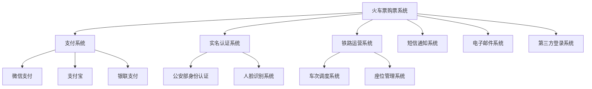

**系统集成说明：**
- **支付系统**：处理订单支付、退款、对账等金融交易
- **实名认证系统**：验证用户身份信息的真实性
- **铁路运营系统**：同步车次信息、座位库存、票价等数据
- **通知系统**：发送订单确认、出行提醒等消息
- **第三方登录**：支持微信、QQ等社交账号登录

### 1.4 业务目标与战略定位

**核心业务目标：**
1. 提供7×24小时不间断的在线购票服务
2. 支持春运期间日均1000万+订单处理能力
3. 确保热门车次开售时系统稳定运行
4. 实现用户购票全流程在线化、自助化

**战略定位：**
- 成为国内领先的铁路客运服务平台
- 打造智慧出行生态系统的核心入口
- 推动铁路客运数字化转型

---

## 2. 术语表

| 术语 | 英文 | 定义 | 说明 |
|------|------|------|------|
| 高并发 | High Concurrency | 系统同时处理大量请求的能力 | 本系统需支持每秒50万+并发 |
| QPS | Queries Per Second | 每秒查询率 | 衡量系统吞吐量的关键指标 |
| TPS | Transactions Per Second | 每秒事务数 | 衡量系统处理能力的指标 |
| RT | Response Time | 响应时间 | 从请求发出到收到响应的时间 |
| 超卖 | Overselling | 售出票数超过实际库存 | 需通过技术手段严格防止 |
| 限流 | Rate Limiting | 限制请求速率 | 保护系统不被流量冲垮 |
| 降级 | Degradation | 关闭非核心功能 | 保证核心功能在高负载下可用 |
| 熔断 | Circuit Breaking | 快速失败机制 | 防止故障扩散 |
| 分库分表 | Sharding | 数据库水平拆分 | 提升数据库处理能力 |
| 缓存穿透 | Cache Penetration | 查询不存在的数据 | 需要布隆过滤器等手段防护 |
| 缓存雪崩 | Cache Avalanche | 大量缓存同时失效 | 需要设置随机过期时间 |
| 热点数据 | Hot Data | 被频繁访问的数据 | 如热门车次信息 |
| 幂等性 | Idempotence | 多次操作结果一致 | 防止重复下单 |
| 分布式锁 | Distributed Lock | 跨节点的互斥锁 | 保证分布式环境下的数据一致性 |
| 消息队列 | Message Queue | 异步消息传递机制 | 削峰填谷、解耦系统 |
| 负载均衡 | Load Balancing | 流量分发机制 | 提高系统可用性和性能 |
| CDN | Content Delivery Network | 内容分发网络 | 加速静态资源访问 |
| 实名制 | Real-name System | 购票需实名认证 | 国家铁路安全要求 |
| 候补购票 | Waitlist Ticketing | 无票时排队候补 | 提升用户体验和座位利用率 |

---

## 3. 用户需求定义

### 3.1 目标用户群体分析

#### 3.1.1 用户画像

**主要用户群体：**

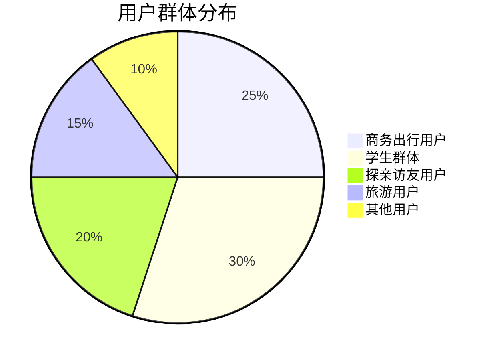

**用户特征分析：**

| 用户类型 | 年龄段 | 使用频率 | 主要需求 | 痛点 |
|----------|--------|----------|----------|------|
| 商务出行用户 | 25-45岁 | 高频（每月2-4次） | 快速购票、改签灵活、商务座 | 时间紧迫、需要发票 |
| 学生群体 | 18-25岁 | 中频（寒暑假、节假日） | 学生票优惠、抢票成功率 | 预算有限、高峰期抢票难 |
| 探亲访友用户 | 30-60岁 | 低频（春节、节假日） | 操作简单、多人购票 | 不熟悉操作、需要帮助 |
| 旅游用户 | 25-50岁 | 中低频（节假日、周末） | 行程规划、往返票 | 需要灵活退改 |
| 老年用户 | 60岁以上 | 低频 | 界面友好、语音辅助 | 操作困难、需要子女协助 |

#### 3.1.2 用户使用场景

**场景1：春运抢票**
- **用户**：返乡学生、务工人员
- **时间**：春运开售前后
- **行为**：提前设置抢票、多次尝试、使用候补功能
- **系统要求**：高并发承载、快速响应、公平性保证

**场景2：商务出行**
- **用户**：企业白领、销售人员
- **时间**：工作日
- **行为**：临时购票、频繁改签、需要报销凭证
- **系统要求**：实时库存、快速出票、电子发票

**场景3：家庭出游**
- **用户**：家庭用户
- **时间**：节假日、周末
- **行为**：多人购票、选择相邻座位、往返票
- **系统要求**：批量购票、座位分配优化

### 3.2 业务场景分析

#### 3.2.1 核心业务流程

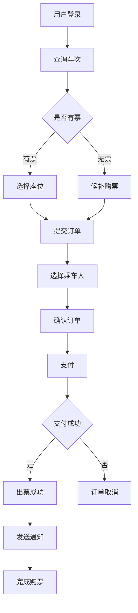

#### 3.2.2 详细业务场景

**场景A：车票查询**

用户需要根据出发地、目的地、出发日期查询可用车次。系统需要展示车次号、出发/到达时间、历时、票价、余票数量等信息。

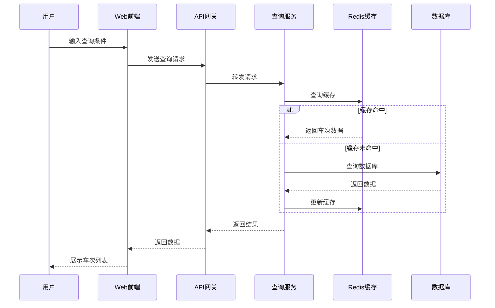

**场景B：购票流程**

用户选择车次和座位后，需要填写乘车人信息、提交订单并完成支付。系统需要锁定座位、验证身份信息、处理支付并出票。

**关键步骤：**
1. **座位锁定**：用户提交订单后，系统锁定座位15分钟
2. **身份验证**：验证乘车人身份证信息的真实性
3. **订单创建**：生成唯一订单号，记录订单详情
4. **支付处理**：调用支付接口，等待支付结果
5. **出票**：支付成功后生成电子车票

**场景C：退票流程**

用户可以在开车前申请退票，系统根据退票时间计算退票费，处理退款并释放座位。

**退票规则表：**

| 退票时间 | 退票费率 | 说明 |
|----------|----------|------|
| 开车前15天以上 | 不收费 | 全额退款 |
| 开车前48小时至15天 | 5% | 扣除5%票款 |
| 开车前24小时至48小时 | 10% | 扣除10%票款 |
| 开车前24小时以内 | 20% | 扣除20%票款 |

**退票费计算公式：**

```
退票费 = 票面价格 × 退票费率
实际退款金额 = 票面价格 - 退票费
```

**场景D：改签流程**

用户可以将车票改签到其他车次，系统需要检查目标车次余票、计算差价并处理改签。

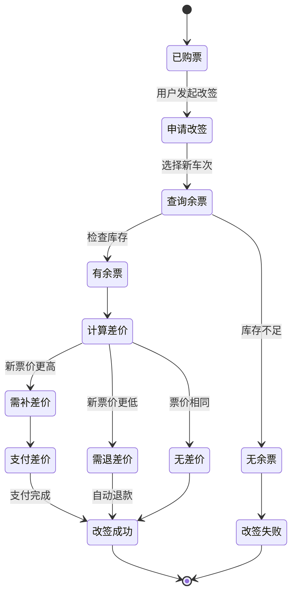

**场景E：候补购票**

当用户查询的车次无票时，可以提交候补订单。系统在有退票或新增座位时，自动为候补用户购票。

**候补规则：**
- 每个用户最多可以提交2个候补订单
- 每个候补订单最多可以选择3个车次
- 候补有效期最长为7天
- 按照候补提交时间先后顺序处理
- 候补成功后自动扣款并出票

### 3.3 用例图

#### 3.3.1 用户管理用例

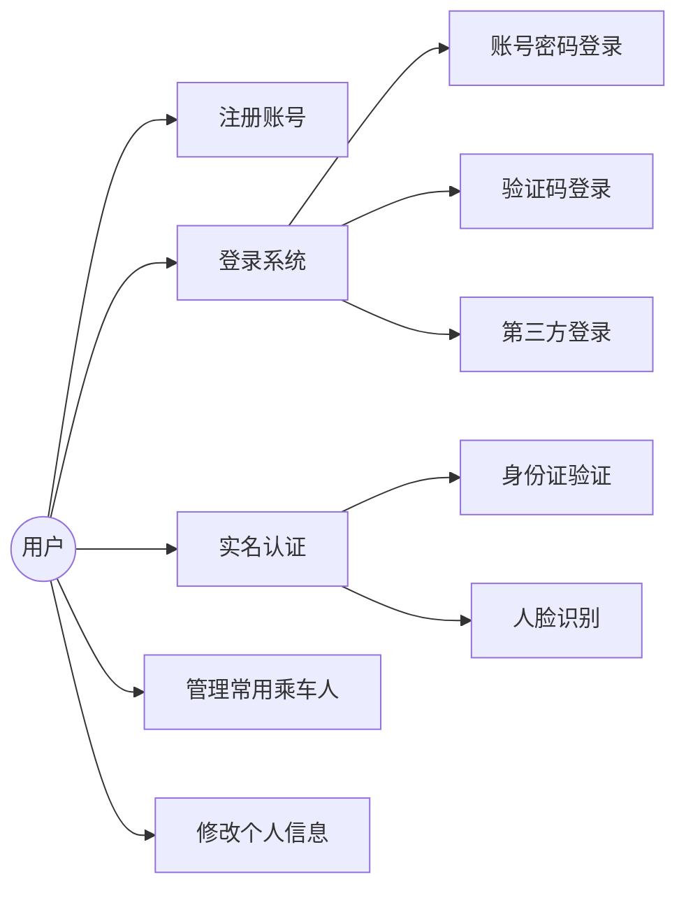

#### 3.3.2 购票流程用例

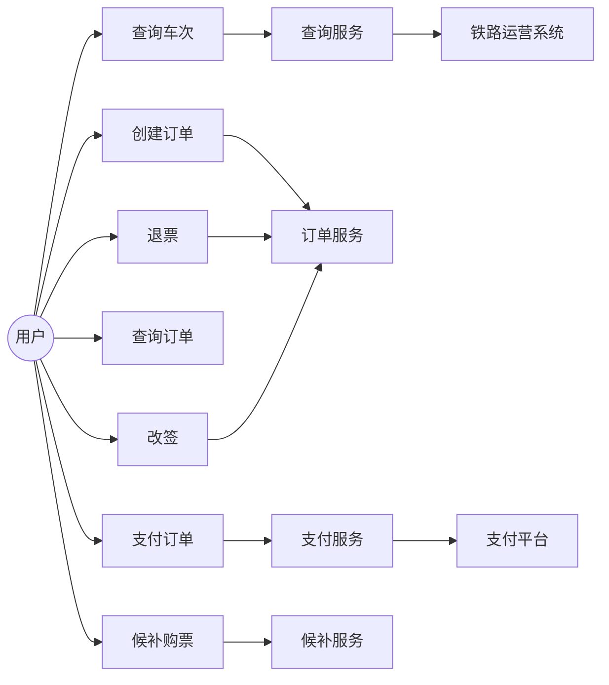

### 3.4 功能需求

#### 3.4.1 用户管理模块

**FR-UM-001：用户注册**
- **优先级**：P0（必须实现）
- **描述**：用户可以通过手机号或邮箱注册账号
- **输入**：手机号/邮箱、密码、验证码
- **输出**：注册成功/失败提示
- **规则**：
  - 手机号必须通过验证码验证
  - 密码长度8-20位，包含字母和数字
  - 同一手机号只能注册一个账号

**FR-UM-002：用户登录**
- **优先级**：P0
- **描述**：用户可以通过多种方式登录系统
- **登录方式**：
  - 账号密码登录
  - 手机验证码登录
  - 第三方登录（微信、QQ、支付宝）
  - 扫码登录
- **安全措施**：
  - 密码错误5次锁定账号30分钟
  - 支持双因素认证
  - 异地登录提醒

**FR-UM-003：实名认证**
- **优先级**：P0
- **描述**：用户必须完成实名认证才能购票
- **认证信息**：姓名、身份证号、手机号
- **验证方式**：
  - 与公安部身份信息库对接验证
  - 支持人脸识别认证
- **规则**：
  - 一个身份证最多关联5个账号
  - 认证信息不可修改，如需修改需联系客服

**FR-UM-004：常用乘车人管理**
- **优先级**：P1
- **描述**：用户可以添加、编辑、删除常用乘车人
- **乘车人信息**：姓名、证件类型、证件号、手机号、旅客类型
- **规则**：
  - 每个账号最多添加15个常用乘车人
  - 所有乘车人必须完成实名认证

#### 3.4.2 车次查询模块

**FR-TQ-001：车次查询**
- **优先级**：P0
- **描述**：用户可以查询指定日期、出发地到目的地的所有车次
- **查询条件**：
  - 出发地（必填）
  - 目的地（必填）
  - 出发日期（必填）
  - 车次类型（可选：高铁/动车/普快等）
  - 出发时间段（可选）
  - 座位类型（可选）
- **返回信息**：
  - 车次号
  - 出发/到达站点和时间
  - 历时
  - 各座位类型余票数量和价格
  - 是否可购买、候补

**FR-TQ-002：车次详情查询**
- **优先级**：P1
- **描述**：查看车次的详细信息
- **详情内容**：
  - 完整经停站信息
  - 各站到达/出发时间
  - 停靠时间
  - 各区间余票情况

**FR-TQ-003：余票监控**
- **优先级**：P2
- **描述**：用户可以设置余票提醒
- **功能**：
  - 监控指定车次余票变化
  - 有票时通过短信/推送通知用户
  - 最多可监控5个车次

#### 3.4.3 订单管理模块

**FR-OM-001：创建订单**
- **优先级**：P0
- **描述**：用户选择车次和座位后创建订单
- **流程**：
  1. 选择乘车人（支持多人购票）
  2. 选择座位类型
  3. 确认订单信息
  4. 提交订单
- **规则**：
  - 单次最多购买5张票
  - 订单提交后锁定座位15分钟
  - 超时未支付自动取消

**FR-OM-002：订单支付**
- **优先级**：P0
- **描述**：用户选择支付方式完成支付
- **支付方式**：
  - 微信支付
  - 支付宝
  - 银联支付
  - 铁路畅行会员余额
- **支付流程**：
  1. 选择支付方式
  2. 跳转支付页面
  3. 完成支付
  4. 接收支付结果回调
  5. 更新订单状态
  6. 出票

**FR-OM-003：订单查询**
- **优先级**：P0
- **描述**：用户可以查询历史订单
- **查询条件**：
  - 订单状态（全部/待支付/已支付/已取消/已退票）
  - 时间范围
  - 车次号
- **订单信息**：
  - 订单号
  - 车次信息
  - 乘车人信息
  - 订单金额
  - 订单状态
  - 操作按钮（支付/退票/改签）

**FR-OM-004：订单退票**
- **优先级**：P0
- **描述**：用户可以申请退票
- **退票流程**：
  1. 选择要退票的订单
  2. 系统计算退票费
  3. 用户确认退票
  4. 处理退款
  5. 释放座位
  6. 发送退票通知
- **规则**：
  - 按照退票规则表计算退票费
  - 开车后不可退票
  - 退款原路返回

**FR-OM-005：订单改签**
- **优先级**：P1
- **描述**：用户可以将车票改签到其他车次
- **改签规则**：
  - 只能改签一次
  - 开车前48小时可改签
  - 只能改签到同等级或更高等级座位
  - 差价多退少补

#### 3.4.4 候补购票模块

**FR-WL-001：提交候补订单**
- **优先级**：P1
- **描述**：无票时用户可以提交候补订单
- **候补信息**：
  - 选择1-3个备选车次
  - 选择座位类型
  - 选择乘车人
  - 设置候补截止时间
- **规则**：
  - 每个用户最多2个候补订单
  - 候补有效期最长7天
  - 需要预付全款

**FR-WL-002：候补订单处理**
- **优先级**：P1
- **描述**：系统自动处理候补订单
- **处理逻辑**：
  1. 监控候补车次余票
  2. 有票时按提交顺序处理候补
  3. 自动扣款并出票
  4. 发送候补成功通知
- **失败处理**：
  - 候补失败自动退款
  - 候补过期自动退款

#### 3.4.5 支付管理模块

**FR-PM-001：支付接口集成**
- **优先级**：P0
- **描述**：集成多种支付方式
- **支付渠道**：
  - 微信支付
  - 支付宝
  - 银联在线支付
  - 铁路畅行会员余额
- **支付功能**：
  - 支付
  - 退款
  - 对账

**FR-PM-002：支付安全**
- **优先级**：P0
- **描述**：保证支付过程的安全性
- **安全措施**：
  - HTTPS加密传输
  - 支付密码/指纹/面容验证
  - 支付限额设置
  - 异常支付拦截
  - 支付日志记录

#### 3.4.6 通知服务模块

**FR-NS-001：消息通知**
- **优先级**：P1
- **描述**：向用户发送各类通知消息
- **通知类型**：
  - 订单确认通知
  - 支付成功通知
  - 出行提醒（开车前24小时）
  - 退票/改签通知
  - 候补成功通知
  - 余票提醒
- **通知渠道**：
  - 短信
  - App推送
  - 邮件
  - 微信服务号

### 3.5 非功能性需求

#### 3.5.1 性能需求

**性能指标说明：**

系统需要支持三种不同的流量场景，性能指标如下：

| 流量场景 | QPS | TPS | 日订单量 | 瞬时并发 | 说明 |
|---------|-----|-----|---------|---------|------|
| 日常流量 | 10万/秒 | 2万/秒 | 500万单 | 50万 | 工作日正常业务量 |
| 高峰流量 | 50万/秒 | 10万/秒 | 1000万单 | 100万 | 节假日、春运期间 |
| 极限流量 | 100万/秒 | 20万/秒 | 2000万单 | 200万 | 热门车次开售瞬间 |

**NFR-P-001：响应时间要求**

| 操作类型 | 平均响应时间 | 95分位响应时间 | 99分位响应时间 |
|----------|--------------|----------------|----------------|
| 车次查询 | < 200ms | < 500ms | < 1s |
| 订单提交 | < 500ms | < 1s | < 2s |
| 支付处理 | < 1s | < 2s | < 3s |
| 订单查询 | < 300ms | < 800ms | < 1.5s |
| 退票/改签 | < 800ms | < 1.5s | < 3s |

**NFR-P-002：吞吐量要求**

系统需要支持三种不同的流量场景:

- **日常流量**: QPS 10万/秒, 日订单量500万
- **高峰流量**: QPS 50万/秒, 日订单量1000万
- **极限流量**: QPS 100万/秒, 瞬时并发200万

**NFR-P-003：容量规划**

- **用户规模**：注册用户5亿，日活用户5000万
- **数据存储**：
  - 订单数据：每年新增50亿条
  - 用户数据：5亿条
  - 车次数据：10万条
  - 总存储容量：100TB+

#### 3.5.2 可用性需求

**NFR-A-001：系统可用性**
- **目标**：99.99%可用性（年停机时间<53分钟）
- **措施**：
  - 多机房部署
  - 异地容灾
  - 故障自动切换
  - 实时监控告警

**NFR-A-002：故障恢复**
- **RTO（恢复时间目标）**：< 5分钟
- **RPO（恢复点目标）**：< 1分钟
- **措施**：
  - 数据实时备份
  - 主备切换机制
  - 灰度发布策略

**NFR-A-003：降级策略**

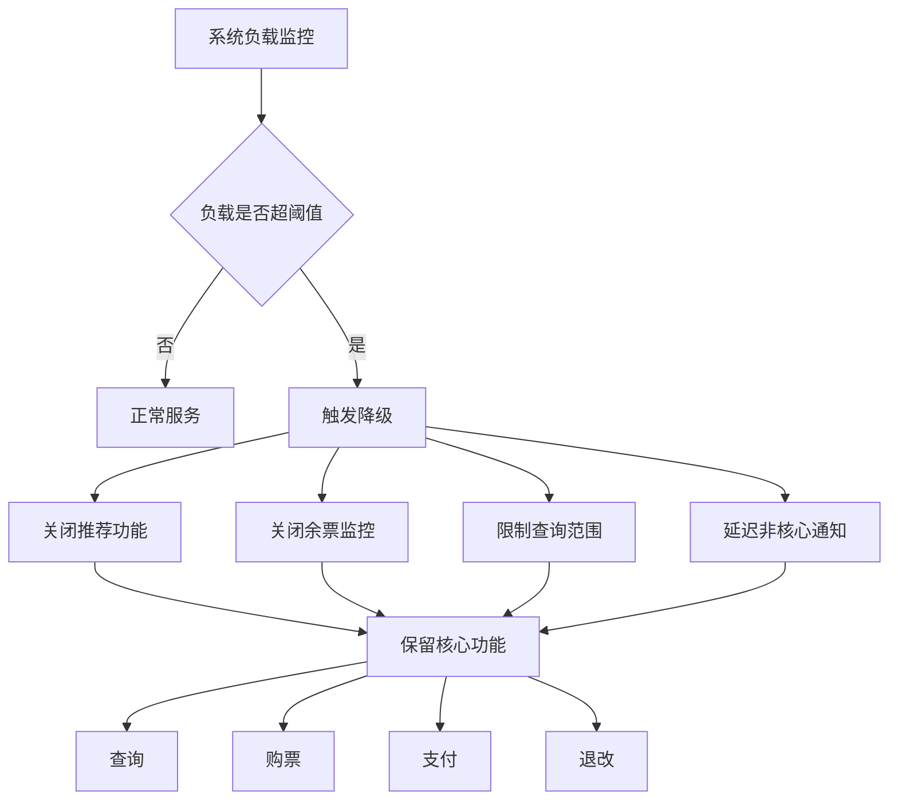

**降级优先级：**
1. **保留功能**（P0）：查询、购票、支付、退改
2. **降级功能**（P1）：推荐、余票监控、历史订单查询
3. **关闭功能**（P2）：数据统计、报表生成、营销活动

#### 3.5.3 安全性需求

**NFR-S-001：数据安全**
- **传输安全**：全站HTTPS加密
- **存储安全**：
  - 敏感数据加密存储（身份证号、手机号、银行卡号）
  - 密码使用bcrypt加密
  - 数据库访问权限控制
- **数据备份**：
  - 每日全量备份
  - 实时增量备份
  - 异地备份存储

**NFR-S-002：身份认证与授权**
- **认证机制**：
  - 用户名密码认证
  - 短信验证码认证
  - 第三方OAuth认证
  - 双因素认证（可选）
- **授权机制**：
  - 基于RBAC的权限控制
  - API接口鉴权
  - 操作日志记录

**NFR-S-003：防攻击措施**

| 攻击类型 | 防护措施 | 说明 |
|----------|----------|------|
| DDoS攻击 | CDN防护、流量清洗 | 防止流量洪水攻击 |
| SQL注入 | 参数化查询、输入验证 | 防止数据库被注入 |
| XSS攻击 | 输出编码、CSP策略 | 防止脚本注入 |
| CSRF攻击 | Token验证 | 防止跨站请求伪造 |
| 暴力破解 | 验证码、账号锁定 | 防止密码暴力破解 |
| 刷票行为 | IP限流、设备指纹 | 防止黄牛刷票 |

**NFR-S-004：隐私保护**
- **数据脱敏**：
  - 身份证号显示：`320***********1234`
  - 手机号显示：`138****5678`
  - 姓名显示：`张*`
- **权限控制**：
  - 用户只能查看自己的订单
  - 管理员操作需审计
- **合规要求**：
  - 符合《网络安全法》
  - 符合《个人信息保护法》
  - 符合《数据安全法》

#### 3.5.4 可扩展性需求

**NFR-E-001：水平扩展能力**
- **应用层**：支持无状态水平扩展，可快速增加服务器节点
- **数据层**：支持分库分表，可按需扩展数据库容量
- **缓存层**：支持Redis集群扩展
- **存储层**：支持分布式文件存储扩展

**NFR-E-002：业务扩展能力**
- **支持新车次类型**：如城际铁路、市域铁路
- **支持新支付方式**：如数字人民币
- **支持新业务场景**：如包车服务、团体票

#### 3.5.5 可维护性需求

**NFR-M-001：监控与告警**
- **系统监控**：
  - CPU、内存、磁盘、网络使用率
  - 应用性能监控（APM）
  - 数据库性能监控
  - 缓存命中率监控
- **业务监控**：
  - 订单量、支付成功率
  - 接口调用量、错误率
  - 用户行为分析
- **告警机制**：
  - 多级告警（警告、严重、紧急）
  - 多渠道通知（短信、邮件、电话）
  - 告警收敛和抑制

**NFR-M-002：日志管理**
- **日志类型**：
  - 应用日志
  - 访问日志
  - 错误日志
  - 审计日志
- **日志要求**：
  - 统一日志格式
  - 集中日志存储
  - 日志检索和分析
  - 日志保留策略（至少6个月）

**NFR-M-003：运维支持**
- **自动化部署**：支持CI/CD流水线
- **灰度发布**：支持按比例流量切换
- **快速回滚**：支持一键回滚到上一版本
- **配置管理**：支持动态配置更新

#### 3.5.6 兼容性需求

**NFR-C-001：浏览器兼容性**
- Chrome 90+
- Firefox 88+
- Safari 14+
- Edge 90+
- 移动端浏览器（iOS Safari、Android Chrome）

**NFR-C-002：设备兼容性**
- PC端（Windows、macOS、Linux）
- 移动端（iOS 12+、Android 8+）
- 平板设备

**NFR-C-003：接口兼容性**
- RESTful API向后兼容
- 版本化API管理
- 废弃API提前通知

### 3.6 系统集成需求

#### 3.6.1 支付系统集成

**集成目标**：
- 支持微信支付、支付宝、银联等主流支付方式
- 实现支付、退款、对账等完整功能
- 保证支付安全和数据一致性

**数据交互需求**：
- **支付请求**：订单号、金额、商品描述、回调地址
- **支付响应**：支付流水号、支付状态、支付时间
- **退款请求**：原订单号、退款金额、退款原因
- **退款响应**：退款流水号、退款状态、退款时间

**对账需求**：
- 每日自动对账
- 对比系统订单与支付平台账单
- 发现差异自动告警并人工处理

#### 3.6.2 实名认证系统集成

**集成目标**：
- 与公安部身份信息库对接
- 验证用户身份信息真实性
- 支持人脸识别核验

**接口需求**：
- **身份验证接口**：
  - 输入：姓名、身份证号
  - 输出：验证结果（通过/不通过）、失败原因
- **人脸识别接口**：
  - 输入：身份证号、人脸照片
  - 输出：相似度评分、验证结果

#### 3.6.3 铁路运营系统集成

**集成目标**：
- 同步车次信息和时刻表
- 实时更新座位库存
- 接收车次调整通知

**数据同步需求**：

| 数据类型 | 同步频率 | 数据内容 | 说明 |
|----------|----------|----------|------|
| 车次基础信息 | 每日1次 | 车次号、车型、经停站等 | 全量同步 |
| 票价信息 | 每日1次 | 各座位类型价格 | 全量同步 |
| 座位库存 | 实时 | 余票数量变化 | 增量同步 |
| 车次调整 | 实时 | 停运、晚点等异常情况 | 消息推送 |

**库存同步需求**：
- 购票后实时同步库存变化
- 定期（每5分钟）全量校验库存一致性
- 发现不一致立即触发全量同步

#### 3.6.4 短信/邮件通知系统集成

**集成目标**：
- 发送订单通知、出行提醒等消息
- 支持短信、邮件多渠道
- 保证消息送达率

**消息类型需求**：

| 消息类型 | 发送时机 | 渠道 | 优先级 |
|----------|----------|------|--------|
| 注册验证码 | 用户注册时 | 短信 | 高 |
| 登录验证码 | 验证码登录时 | 短信 | 高 |
| 订单确认 | 支付成功后 | 短信+邮件 | 高 |
| 出行提醒 | 开车前24小时 | 短信+推送 | 中 |
| 退票通知 | 退票成功后 | 短信+邮件 | 中 |
| 改签通知 | 改签成功后 | 短信+邮件 | 中 |
| 候补成功 | 候补出票后 | 短信+推送 | 高 |
| 营销活动 | 活动期间 | 邮件+推送 | 低 |

**发送策略需求**：
- 高优先级消息：实时发送，失败重试3次
- 中优先级消息：异步发送，失败重试2次
- 低优先级消息：批量发送，失败不重试
- 用户可设置消息接收偏好

---

## 5. 系统模型

### 5.1 对象模型（类图）

**核心领域对象**：

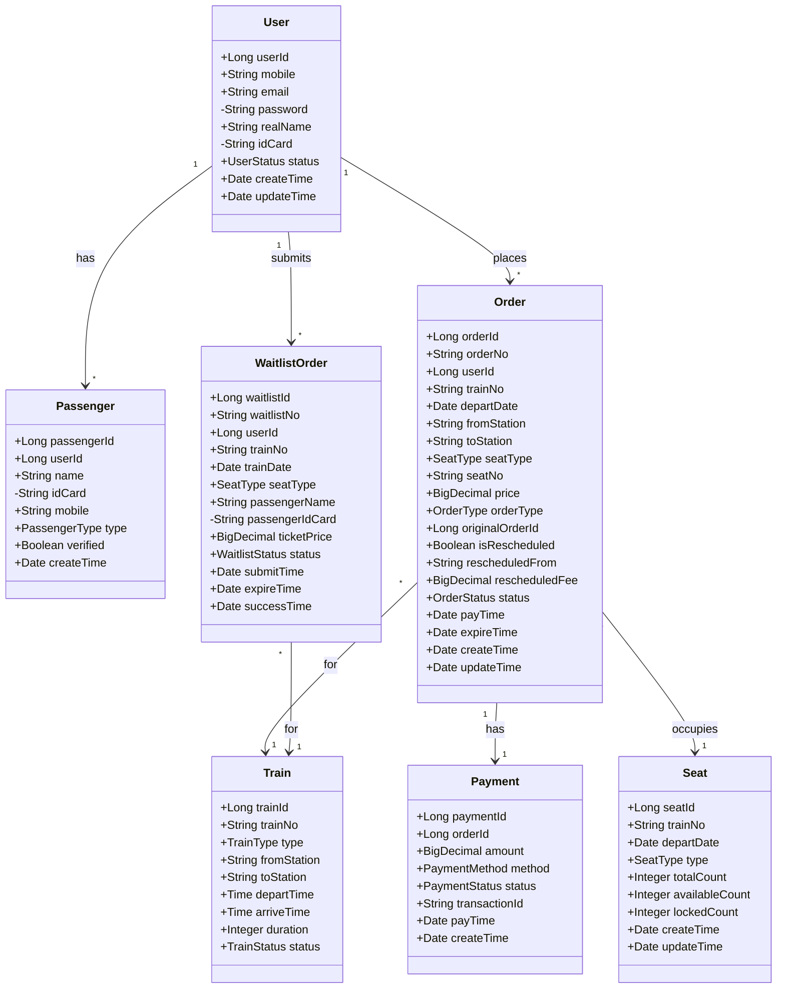

**图例说明**：
- `+` 表示public（公有属性）
- `-` 表示private（私有属性，如密码、身份证号等敏感信息）
- 领域对象只包含属性，不包含方法
- 关系说明：
  - User与Passenger: 一对多关系，一个用户可以添加多个常用乘车人
  - User与Order: 一对多关系，一个用户可以创建多个订单
  - User与WaitlistOrder: 一对多关系，一个用户可以提交多个候补订单
  - Order与Train: 多对一关系，多个订单可以对应同一车次
  - Order与Payment: 一对一关系，一个订单对应一个支付记录
  - Order与Seat: 多对一关系，多个订单可能占用同一座位类型的库存

### 5.2 订单状态机

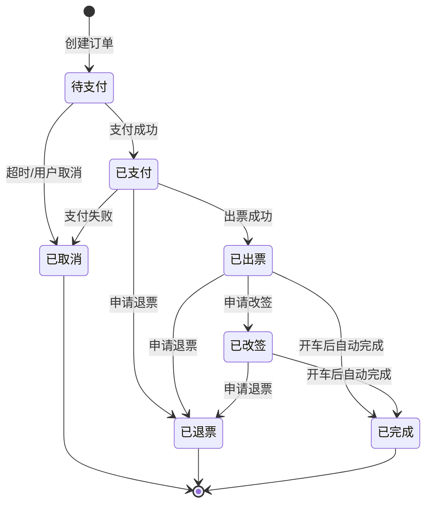

**状态说明**：
- **待支付（0-PENDING）**：订单已创建，等待支付，15分钟内未支付自动取消
- **已支付（1-PAID）**：支付完成，等待出票
- **已出票（2-ISSUED）**：车票已生成，可以改签或退票
- **已完成（3-COMPLETED）**：列车已开车，订单完成
- **已取消（4-CANCELLED）**：订单已取消，库存已释放
- **已退票（5-REFUNDED）**：退票完成，退款已处理
- **已改签（改签后生成新订单）**：改签后原订单标记为已改签，生成新订单

**状态转换规则**：
1. 待支付 → 已支付：用户完成支付
2. 待支付 → 已取消：15分钟内未支付或用户主动取消
3. 已支付 → 已出票：系统自动出票
4. 已支付 → 已取消：支付失败或系统异常
5. 已支付 → 已退票：用户在出票前申请退票
6. 已出票 → 已完成：列车开车后自动完成
7. 已出票 → 已退票：用户申请退票（需扣除退票费）
8. 已出票 → 已改签：用户申请改签（生成新订单，原订单关联新订单ID）

### 5.3 业务流程模型

**订单创建业务流程**：

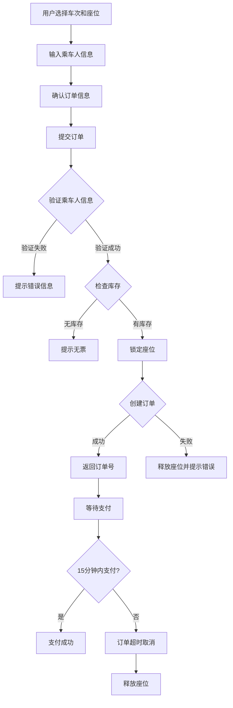

**支付业务流程**：

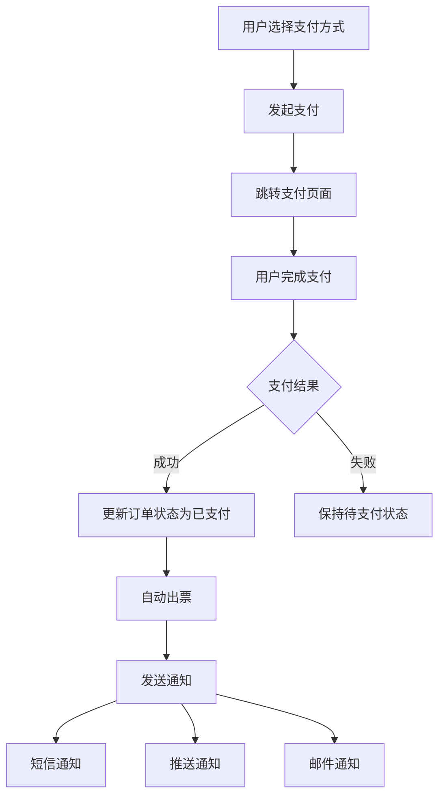

**退票业务流程**：

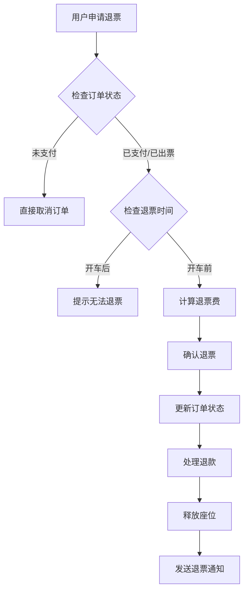

**候补购票业务流程**：

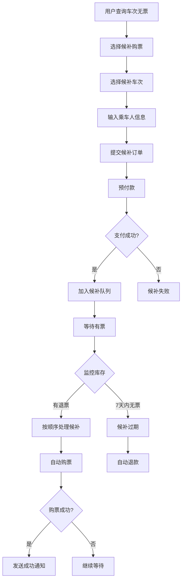

---

## 6. 附录

### 6.1 术语索引

- **高并发**：第2章 术语表
- **QPS/TPS**：第2章 术语表、第3.5.1节 性能需求
- **超卖**：第2章 术语表
- **分库分表**：第2章 术语表
- **缓存穿透/雪崩/击穿**：第2章 术语表

### 6.2 图表索引

- **用户群体分布饼图**：第3.1.1节
- **性能指标图**：第3.5.1节
- **系统集成关系图**：第1.3节
- **核心业务流程图**：第3.2.1节
- **用例图**：第3.3节
- **类图**：第5.1节
- **状态机图**：第5.2节
- **数据流图**：第5.3节

### 6.3 功能需求索引

- **用户注册**：FR-UM-001
- **用户登录**：FR-UM-002
- **实名认证**：FR-UM-003
- **车次查询**：FR-TQ-001
- **订单创建**：FR-OM-001
- **订单支付**：FR-OM-002
- **订单退票**：FR-OM-004
- **候补购票**：FR-WL-001

---

## 文档结束

本文档详细描述了高并发火车票购票系统的需求分析，涵盖了从用户需求到功能规格的各个方面。文档采用了标准UML图表和规范化描述，包括：

- **用例图**：展示用户与系统的交互
- **时序图**：展示跨系统的业务流程
- **状态机图**：展示订单等对象的状态转换
- **类图**：展示核心领域对象的结构（含可见性修饰符）
- **数据流图**：展示数据在系统中的流转
- **API文档**：详细的RESTful接口规范

文档遵循了需求分析的标准结构，确保了文档的完整性、规范性和可读性。
### 3.4 用例规约

本节提供核心业务用例的详细规约,包括前后置条件、主流程、扩展流程和特殊需求。

#### 3.4.1 UC-001: 用户注册

**用例编号**: UC-001  
**用例名称**: 用户注册  
**参与者**: 未注册用户  
**前置条件**: 
- 用户未注册过系统
- 用户拥有有效的手机号

**后置条件**: 
- 用户账号创建成功
- 系统发送注册成功通知
- 用户可以登录系统

**主流程**:
1. 用户访问注册页面
2. 用户输入手机号
3. 系统验证手机号格式
4. 用户点击"获取验证码"
5. 系统发送6位数字验证码到用户手机
6. 用户输入验证码和密码
7. 系统验证验证码和密码格式
8. 系统创建用户账号
9. 系统返回注册成功信息和登录凭证
10. 用例结束

**扩展流程**:

3a. 手机号格式错误
- 3a1. 系统提示"手机号格式错误,请输入11位数字"
- 3a2. 返回步骤2

3b. 手机号已注册
- 3b1. 系统提示"该手机号已注册,请直接登录或使用其他手机号"
- 3b2. 用例结束

5a. 验证码发送失败
- 5a1. 系统提示"验证码发送失败,请稍后重试"
- 5a2. 返回步骤4

5b. 同一手机号1分钟内重复获取验证码
- 5b1. 系统提示"验证码已发送,请稍后再试"
- 5b2. 返回步骤6

7a. 验证码错误
- 7a1. 系统提示"验证码错误,请重新输入"
- 7a2. 返回步骤6

7b. 验证码过期(2分钟)
- 7b1. 系统提示"验证码已过期,请重新获取"
- 7b2. 返回步骤4

7c. 密码格式不符合要求
- 7c1. 系统提示"密码长度应为8-20位,包含字母和数字"
- 7c2. 返回步骤6

8a. 系统异常导致注册失败
- 8a1. 系统记录错误日志
- 8a2. 系统提示"系统繁忙,请稍后重试"
- 8a3. 用例结束

**特殊需求**:
- 验证码有效期为2分钟
- 同一手机号每天最多获取10次验证码
- 密码必须加密存储,不得明文保存
- 注册成功后自动登录,生成有效期为7天的登录凭证
- 系统应在3秒内完成注册流程

**补充说明**:
- 注册成功后,用户需要完成实名认证才能购票
- 系统支持第三方账号(微信、QQ)快速注册
- 注册时不强制要求设置用户名,默认使用手机号

---

#### 3.4.2 UC-002: 用户登录

**用例编号**: UC-002  
**用例名称**: 用户登录  
**参与者**: 已注册用户  
**前置条件**: 
- 用户已注册系统
- 用户拥有有效的登录凭证(手机号+密码或验证码)

**后置条件**: 
- 用户登录成功
- 系统生成登录会话
- 用户可以访问需要登录的功能

**主流程**:
1. 用户访问登录页面
2. 用户选择登录方式(密码登录/验证码登录)
3. 用户输入手机号
4. 用户输入密码或验证码
5. 系统验证登录凭证
6. 系统生成登录会话(有效期30分钟)
7. 系统返回登录成功信息和会话凭证
8. 用例结束

**扩展流程**:

3a. 手机号格式错误
- 3a1. 系统提示"手机号格式错误"
- 3a2. 返回步骤3

3b. 手机号未注册
- 3b1. 系统提示"该手机号未注册,请先注册"
- 3b2. 用例结束

5a. 密码错误
- 5a1. 系统提示"密码错误,请重新输入"
- 5a2. 返回步骤4

5b. 密码连续错误5次
- 5b1. 系统锁定账号30分钟
- 5b2. 系统提示"密码错误次数过多,账号已锁定30分钟"
- 5b3. 用例结束

5c. 验证码错误
- 5c1. 系统提示"验证码错误,请重新输入"
- 5c2. 返回步骤4

5d. 账号已被禁用
- 5d1. 系统提示"您的账号已被禁用,请联系客服"
- 5d2. 用例结束

6a. 异地登录
- 6a1. 系统发送异地登录提醒短信
- 6a2. 继续步骤7

6b. 系统检测到异常登录行为
- 6b1. 系统要求用户完成二次验证(短信验证码)
- 6b2. 用户完成验证后继续步骤7

**特殊需求**:
- 登录会话有效期为30分钟,无操作自动过期
- 支持"记住我"功能,会话有效期延长至7天
- 密码错误5次锁定账号30分钟
- 支持第三方登录(微信、QQ、支付宝)
- 系统应在2秒内完成登录验证

**补充说明**:
- 登录成功后,系统记录登录日志(IP地址、设备信息、登录时间)
- 用户可以在"账号安全"页面查看登录历史
- 系统支持扫码登录功能

---

#### 3.4.3 UC-003: 查询车次

**用例编号**: UC-003  
**用例名称**: 查询车次  
**参与者**: 所有用户(包括未登录用户)  
**前置条件**: 
- 用户访问车次查询页面
- 系统已同步最新车次数据

**后置条件**: 
- 系统返回符合条件的车次列表
- 显示每个车次的余票信息

**主流程**:
1. 用户输入出发地、目的地、出发日期
2. 系统验证输入参数
3. 用户点击"查询"按钮
4. 系统查询符合条件的车次
5. 系统返回车次列表(车次号、出发/到达时间、历时、余票、票价)
6. 用户浏览车次列表
7. 用例结束

**扩展流程**:

2a. 出发地或目的地为空
- 2a1. 系统提示"请选择出发地和目的地"
- 2a2. 返回步骤1

2b. 出发日期为空或早于当前日期
- 2b1. 系统提示"请选择有效的出发日期"
- 2b2. 返回步骤1

2c. 出发地和目的地相同
- 2c1. 系统提示"出发地和目的地不能相同"
- 2c2. 返回步骤1

4a. 无符合条件的车次
- 4a1. 系统提示"暂无符合条件的车次,请更换查询条件"
- 4a2. 用例结束

4b. 系统查询超时
- 4b1. 系统提示"查询超时,请稍后重试"
- 4b2. 用例结束

5a. 用户筛选车次类型(高铁/动车/普快)
- 5a1. 系统过滤车次列表
- 5a2. 返回步骤5

5b. 用户筛选出发时间段
- 5b1. 系统过滤车次列表
- 5b2. 返回步骤5

6a. 用户点击某个车次查看详情
- 6a1. 系统显示车次详细信息(经停站、时刻表、余票分布)
- 6a2. 返回步骤6

6b. 用户点击"购买"按钮
- 6b1. 系统跳转到购票页面(参见UC-004)
- 6b2. 用例结束

**特殊需求**:
- 查询响应时间应<200ms
- 支持10万QPS并发查询
- 余票信息应实时更新(延迟<1秒)
- 支持按车次类型、出发时间段、座位类型筛选
- 查询结果按出发时间排序

**补充说明**:
- 查询结果默认显示当日所有车次
- 用户可以查询未来30天内的车次
- 系统支持站点模糊搜索(如输入"北京"可匹配"北京南"、"北京西"等)
- 查询结果缓存5分钟,减轻服务器压力

---

#### 3.4.4 UC-004: 购买车票

**用例编号**: UC-004  
**用例名称**: 购买车票  
**参与者**: 已登录且已实名认证的用户  
**前置条件**: 
- 用户已登录系统
- 用户已完成实名认证
- 车次有余票

**后置条件**: 
- 订单创建成功
- 库存扣减
- 订单状态为"待支付"
- 座位锁定15分钟

**主流程**:
1. 用户选择车次、日期、座位类型
2. 系统检查余票数量
3. 用户添加乘客信息(从常用乘车人选择或手动输入)
4. 系统验证乘客身份证号格式
5. 系统调用实名认证接口验证身份信息
6. 用户确认订单信息(车次、乘客、座位、金额)
7. 系统创建订单并锁定座位
8. 系统扣减库存
9. 系统返回订单号和支付二维码
10. 用例结束

**扩展流程**:

2a. 余票不足
- 2a1. 系统提示"余票不足,请选择其他车次或座位类型"
- 2a2. 系统推荐候补购票(参见UC-007)
- 2a3. 用例结束

3a. 用户未添加常用乘车人
- 3a1. 用户手动输入乘客信息(姓名、身份证号、手机号)
- 3a2. 继续步骤4

4a. 身份证号格式错误
- 4a1. 系统提示"身份证号格式错误,请重新输入"
- 4a2. 返回步骤3

5a. 身份证号验证失败
- 5a1. 系统提示"身份证号验证失败,请确认信息正确"
- 5a2. 返回步骤3

5b. 实名认证接口调用超时
- 5b1. 系统提示"实名认证服务繁忙,请稍后重试"
- 5b2. 用例结束

6a. 同一用户同一车次购票超过限制(5张)
- 6a1. 系统提示"您已购买该车次5张票,无法继续购买"
- 6a2. 用例结束

6b. 同一身份证号一天购票超过限制(10张)
- 6b1. 系统提示"该身份证号今日购票已达上限(10张)"
- 6b2. 用例结束

7a. 库存扣减失败(并发冲突)
- 7a1. 系统提示"座位已被他人购买,请重新选择"
- 7a2. 返回步骤1

7b. 订单创建失败(系统异常)
- 7b1. 系统回滚库存
- 7b2. 系统记录错误日志
- 7b3. 系统提示"系统繁忙,请稍后重试"
- 7b4. 用例结束

8a. 数据库写入失败
- 8a1. 系统回滚订单和库存
- 8a2. 系统提示"订单创建失败,请重试"
- 8a3. 用例结束

**特殊需求**:
- 订单锁定时间为15分钟,超时自动取消并释放库存
- 同一用户同一车次同一天最多购买5张票
- 同一身份证号一天最多购买10张票
- 系统应在3秒内完成订单创建
- 支持多人购票(最多5人)
- 订单创建成功率应>99%

**补充说明**:
- 订单创建后,用户需要在15分钟内完成支付
- 支付成功后,系统自动发送短信和推送通知
- 如果余票不足,用户可以选择候补购票(参见UC-007)
- 系统支持学生票、儿童票等特殊票种

---

#### 3.4.5 UC-005: 支付订单

**用例编号**: UC-005  
**用例名称**: 支付订单  
**参与者**: 已创建订单的用户  
**前置条件**: 
- 用户已创建订单
- 订单状态为"待支付"
- 订单未超时(15分钟内)

**后置条件**: 
- 订单支付成功
- 订单状态更新为"已支付"
- 系统自动出票
- 发送支付成功通知

**主流程**:
1. 用户进入订单支付页面
2. 系统显示订单信息(车次、乘客、金额、剩余支付时间)
3. 用户选择支付方式(微信/支付宝/银联)
4. 系统创建支付订单
5. 系统跳转到第三方支付页面
6. 用户完成支付
7. 第三方支付平台返回支付结果
8. 系统接收支付回调通知
9. 系统验证支付签名和金额
10. 系统更新订单状态为"已支付"
11. 系统自动出票
12. 系统发送支付成功通知(短信+推送)
13. 用例结束

**扩展流程**:

1a. 订单已超时
- 1a1. 系统提示"订单已超时,请重新下单"
- 1a2. 系统取消订单并释放库存
- 1a3. 用例结束

1b. 订单已支付
- 1b1. 系统提示"订单已支付,无需重复支付"
- 1b2. 系统跳转到订单详情页
- 1b3. 用例结束

4a. 支付订单创建失败
- 4a1. 系统提示"支付订单创建失败,请重试"
- 4a2. 返回步骤3

5a. 第三方支付页面加载超时
- 5a1. 系统提示"支付页面加载超时,请重试"
- 5a2. 返回步骤3

6a. 用户取消支付
- 6a1. 系统提示"您已取消支付,订单保留15分钟"
- 6a2. 返回步骤2

7a. 支付失败(余额不足/银行卡异常等)
- 7a1. 系统提示"支付失败,请检查支付方式或更换支付方式"
- 7a2. 返回步骤3

8a. 支付回调通知延迟或丢失
- 8a1. 系统主动查询支付状态(每10秒查询一次,最多查询6次)
- 8a2. 如果支付成功,继续步骤9
- 8a3. 如果支付失败或超时,返回步骤2

9a. 支付签名验证失败
- 9a1. 系统记录异常日志
- 9a2. 系统触发人工审核流程
- 9a3. 用例结束

9b. 支付金额与订单金额不符
- 9b1. 系统记录异常日志
- 9b2. 系统触发人工审核流程
- 9b3. 用例结束

11a. 出票失败
- 11a1. 系统标记订单为"出票失败"
- 11a2. 系统触发人工处理流程
- 11a3. 系统通知用户"出票中,请稍后查看"

**特殊需求**:
- 支付响应时间应<3秒
- 支付成功率应>99.5%
- 支付回调处理应保证幂等性
- 支持支付失败自动重试(最多3次)
- 支付数据必须加密传输(HTTPS)
- 每日凌晨自动对账,发现差异自动告警

**补充说明**:
- 支付成功后,系统自动发送短信和推送通知
- 支付失败时,订单保留15分钟,用户可以重新支付
- 系统支持部分退款(如改签时的差价退款)
- 支付记录永久保存,用于对账和审计

---

#### 3.4.6 UC-006: 退票

**用例编号**: UC-006  
**用例名称**: 退票  
**参与者**: 已购票用户  
**前置条件**: 
- 用户已登录系统
- 订单状态为"已支付"或"已出票"
- 列车未开车

**后置条件**: 
- 订单状态更新为"已退票"
- 退款处理完成
- 座位库存释放
- 发送退票通知

**主流程**:
1. 用户进入订单详情页
2. 用户点击"退票"按钮
3. 系统检查订单状态和退票时间
4. 系统计算退票费(根据退票规则表)
5. 系统显示退票费和实际退款金额
6. 用户确认退票
7. 系统更新订单状态为"已退票"
8. 系统处理退款(原路返回)
9. 系统释放座位库存
10. 系统发送退票通知(短信+推送)
11. 用例结束

**扩展流程**:

3a. 订单状态不允许退票
- 3a1. 系统提示"该订单不支持退票"
- 3a2. 用例结束

3b. 列车已开车
- 3b1. 系统提示"列车已开车,无法退票"
- 3b2. 用例结束

3c. 订单已退票
- 3c1. 系统提示"该订单已退票,无需重复操作"
- 3c2. 用例结束

6a. 用户取消退票
- 6a1. 系统提示"您已取消退票操作"
- 6a2. 用例结束

7a. 订单状态更新失败
- 7a1. 系统记录错误日志
- 7a2. 系统提示"退票失败,请稍后重试"
- 7a3. 用例结束

8a. 退款处理失败
- 8a1. 系统标记订单为"退款中"
- 8a2. 系统触发退款重试机制(每小时重试一次,最多重试24次)
- 8a3. 系统通知用户"退款处理中,请稍后查看"

8b. 退款接口调用超时
- 8b1. 系统主动查询退款状态
- 8b2. 如果退款成功,继续步骤9
- 8b3. 如果退款失败,执行8a流程

9a. 库存释放失败
- 9a1. 系统记录错误日志
- 9a2. 系统触发库存补偿机制
- 9a3. 继续步骤10

**特殊需求**:
- 退票响应时间应<3秒
- 退款应在3个工作日内到账
- 退票费计算规则:
  - 开车前48小时以上: 不收取退票费
  - 开车前24-48小时: 收取票价5%的退票费
  - 开车前24小时以内: 收取票价20%的退票费
- 退款原路返回(支付时使用的支付方式)
- 系统应记录退票原因(可选)

**补充说明**:
- 退票成功后,座位立即释放,其他用户可以购买
- 如果有候补订单,系统自动处理候补(参见UC-007)
- 改签后的订单不支持退票,只能退改签后的新订单
- 团体票退票规则可能不同,需要联系客服

---

#### 3.4.7 UC-007: 候补购票

**用例编号**: UC-007  
**用例名称**: 候补购票  
**参与者**: 已登录且已实名认证的用户  
**前置条件**: 
- 用户已登录系统
- 用户已完成实名认证
- 车次无余票
- 用户候补订单数量<2

**后置条件**: 
- 候补订单创建成功
- 用户预付款成功
- 候补订单加入候补队列
- 系统监控库存变化

**主流程**:
1. 用户查询车次,发现无余票
2. 系统提示"该车次暂无余票,您可以选择候补购票"
3. 用户点击"候补购票"按钮
4. 用户选择候补车次(最多3个)和座位类型
5. 用户添加乘客信息
6. 系统验证乘客身份信息
7. 用户确认候补订单信息
8. 系统创建候补订单
9. 用户完成预付款
10. 系统将候补订单加入候补队列(按提交时间排序)
11. 系统返回候补订单号和排队位置
12. 系统开始监控库存变化
13. 用例结束

**扩展流程**:

4a. 用户已有2个待候补订单
- 4a1. 系统提示"您已有2个待候补订单,无法继续提交"
- 4a2. 用例结束

6a. 身份信息验证失败
- 6a1. 系统提示"身份信息验证失败,请确认信息正确"
- 6a2. 返回步骤5

8a. 候补订单创建失败
- 8a1. 系统提示"候补订单创建失败,请重试"
- 8a2. 用例结束

9a. 预付款失败
- 9a1. 系统提示"预付款失败,请检查支付方式"
- 9a2. 系统取消候补订单
- 9a3. 用例结束

**候补成功流程**:
12a. 监控到有退票或新增座位
- 12a1. 系统从候补队列取出第一个候补订单
- 12a2. 系统检查候补订单是否有效(未过期、未取消)
- 12a3. 系统自动创建正式订单
- 12a4. 系统自动扣款(使用预付款)
- 12a5. 系统自动出票
- 12a6. 系统发送候补成功通知(短信+推送)
- 12a7. 系统从候补队列移除该订单

**候补失败流程**:
12b. 候补订单过期(7天后仍无票)
- 12b1. 系统更新候补订单状态为"已失败"
- 12b2. 系统处理退款(退还预付款)
- 12b3. 系统发送候补失败通知
- 12b4. 系统从候补队列移除该订单

12c. 用户主动取消候补订单
- 12c1. 系统更新候补订单状态为"已取消"
- 12c2. 系统处理退款
- 12c3. 系统从候补队列移除该订单

**特殊需求**:
- 每个用户最多可以提交2个候补订单
- 每个候补订单最多可以选择3个备选车次
- 候补有效期为7天
- 候补按提交时间先后顺序处理(先到先得)
- 候补成功后自动扣款并出票
- 候补失败或过期自动退款
- 系统应在2秒内响应库存变化并处理候补

**补充说明**:
- 候补订单需要预付全款
- 候补成功后,系统自动发送短信和推送通知
- 候补失败后,退款在3个工作日内到账
- 用户可以在"我的候补"页面查看候补订单状态和排队位置
- 候补订单可以随时取消,取消后自动退款

---

## 7. API接口文档

### 7.1 接口规范说明

**基础信息**:
- **协议**: HTTPS
- **请求格式**: JSON
- **响应格式**: JSON
- **字符编码**: UTF-8
- **API版本**: v1
- **Base URL**: `https://api.ticket.com/v1`

**通用请求头**:
```
Content-Type: application/json
Authorization: Bearer {access_token}
X-Request-ID: {unique_request_id}
X-Client-Version: {client_version}
```

**通用响应格式**:
```json
{
  "code": 200,
  "message": "success",
  "data": {},
  "timestamp": 1705737600000,
  "request_id": "req_123456789"
}
```

**状态码说明**:
| 状态码 | 说明 | 处理方式 |
|--------|------|----------|
| 200 | 成功 | 正常处理 |
| 400 | 请求参数错误 | 检查请求参数 |
| 401 | 未授权 | 重新登录 |
| 403 | 禁止访问 | 检查权限 |
| 404 | 资源不存在 | 检查请求路径 |
| 429 | 请求过于频繁 | 稍后重试 |
| 500 | 服务器错误 | 联系技术支持 |

---

### 7.2 用户管理接口

#### 7.2.1 用户注册

**接口**: `POST /api/user/register`

**请求参数**:
```json
{
  "mobile": "13800138000",
  "password": "Password123",
  "verify_code": "123456"
}
```

**响应示例**:
```json
{
  "code": 200,
  "message": "注册成功",
  "data": {
    "user_id": 123456,
    "mobile": "13800138000",
    "access_token": "eyJhbGciOiJIUzI1NiIsInR5cCI6IkpXVCJ9...",
    "token_type": "Bearer",
    "expires_in": 604800
  }
}
```

#### 7.2.2 用户登录

**接口**: `POST /api/user/login`

**请求参数**:
```json
{
  "mobile": "13800138000",
  "password": "Password123",
  "login_type": "password"
}
```

**响应示例**:
```json
{
  "code": 200,
  "message": "登录成功",
  "data": {
    "user_id": 123456,
    "mobile": "13800138000",
    "real_name": "张三",
    "verified": true,
    "access_token": "eyJhbGciOiJIUzI1NiIsInR5cCI6IkpXVCJ9...",
    "token_type": "Bearer",
    "expires_in": 1800
  }
}
```

#### 7.2.3 实名认证

**接口**: `POST /api/user/verify`

**请求参数**:
```json
{
  "real_name": "张三",
  "id_card": "320102199001011234",
  "mobile": "13800138000"
}
```

**响应示例**:
```json
{
  "code": 200,
  "message": "实名认证成功",
  "data": {
    "verified": true,
    "verify_time": "2025-01-24T10:30:00Z"
  }
}
```

---

### 7.3 车次查询接口

#### 7.3.1 查询车次列表

**接口**: `GET /api/train/search`

**请求参数**:
```
from_station: 北京南 (必填)
to_station: 上海虹桥 (必填)
depart_date: 2025-01-25 (必填,格式:YYYY-MM-DD)
train_type: G,D (可选,多个用逗号分隔)
```

**响应示例**:
```json
{
  "code": 200,
  "message": "查询成功",
  "data": {
    "trains": [
      {
        "train_number": "G123",
        "train_type": "高铁",
        "from_station": "北京南",
        "to_station": "上海虹桥",
        "depart_time": "08:00",
        "arrive_time": "13:28",
        "duration": 328,
        "seats": [
          {
            "seat_type": 1,
            "seat_name": "商务座",
            "price": 1748.0,
            "available": 10
          },
          {
            "seat_type": 2,
            "seat_name": "一等座",
            "price": 933.0,
            "available": 156
          },
          {
            "seat_type": 3,
            "seat_name": "二等座",
            "price": 553.0,
            "available": 0
          }
        ],
        "can_buy": true,
        "can_waitlist": true
      }
    ],
    "total": 15
  }
}
```

#### 7.3.2 查询车次详情

**接口**: `GET /api/train/detail/{train_number}`

**请求参数**:
```
train_number: G123 (路径参数)
depart_date: 2025-01-25 (查询参数)
```

**响应示例**:
```json
{
  "code": 200,
  "message": "查询成功",
  "data": {
    "train_number": "G123",
    "train_type": "高铁",
    "from_station": "北京南",
    "to_station": "上海虹桥",
    "depart_time": "08:00",
    "arrive_time": "13:28",
    "duration": 328,
    "stops": [
      {
        "station_name": "北京南",
        "arrive_time": "--",
        "depart_time": "08:00",
        "stop_duration": 0
      },
      {
        "station_name": "济南西",
        "arrive_time": "09:28",
        "depart_time": "09:30",
        "stop_duration": 2
      },
      {
        "station_name": "南京南",
        "arrive_time": "11:15",
        "depart_time": "11:17",
        "stop_duration": 2
      },
      {
        "station_name": "上海虹桥",
        "arrive_time": "13:28",
        "depart_time": "--",
        "stop_duration": 0
      }
    ]
  }
}
```

---

### 7.4 订单管理接口

#### 7.4.1 创建订单

**接口**: `POST /api/order/create`

**请求参数**:
```json
{
  "train_number": "G123",
  "depart_date": "2025-01-25",
  "from_station": "北京南",
  "to_station": "上海虹桥",
  "seat_type": 2,
  "passengers": [
    {
      "name": "张三",
      "id_card": "320102199001011234",
      "mobile": "13800138000",
      "passenger_type": 0
    },
    {
      "name": "李四",
      "id_card": "320102199002021234",
      "mobile": "13900139000",
      "passenger_type": 0
    }
  ]
}
```

**响应示例**:
```json
{
  "code": 200,
  "message": "订单创建成功",
  "data": {
    "order_id": 987654321,
    "order_no": "ORDER20250124001",
    "total_price": 1866.0,
    "order_status": 0,
    "expire_time": "2025-01-24T10:45:00Z",
    "pay_url": "https://pay.ticket.com/pay?order_no=ORDER20250124001"
  }
}
```

#### 7.4.2 查询订单列表

**接口**: `GET /api/order/list`

**请求参数**:
```
page: 1 (页码,默认1)
page_size: 10 (每页数量,默认10,最大50)
status: 0,1,2 (订单状态,可选,多个用逗号分隔)
start_date: 2025-01-01 (开始日期,可选)
end_date: 2025-01-31 (结束日期,可选)
```

**响应示例**:
```json
{
  "code": 200,
  "message": "查询成功",
  "data": {
    "orders": [
      {
        "order_id": 987654321,
        "order_no": "ORDER20250124001",
        "train_number": "G123",
        "from_station": "北京南",
        "to_station": "上海虹桥",
        "depart_time": "2025-01-25T08:00:00Z",
        "seat_type": 2,
        "seat_name": "一等座",
        "passenger_count": 2,
        "total_price": 1866.0,
        "order_status": 1,
        "order_status_name": "已支付",
        "create_time": "2025-01-24T10:30:00Z"
      }
    ],
    "total": 25,
    "page": 1,
    "page_size": 10
  }
}
```

#### 7.4.3 查询订单详情

**接口**: `GET /api/order/detail/{order_no}`

**请求参数**:
```
order_no: ORDER20250124001 (路径参数)
```

**响应示例**:
```json
{
  "code": 200,
  "message": "查询成功",
  "data": {
    "order_id": 987654321,
    "order_no": "ORDER20250124001",
    "user_id": 123456,
    "train_number": "G123",
    "from_station": "北京南",
    "to_station": "上海虹桥",
    "depart_time": "2025-01-25T08:00:00Z",
    "arrive_time": "2025-01-25T13:28:00Z",
    "seat_type": 2,
    "seat_name": "一等座",
    "passenger_count": 2,
    "total_price": 1866.0,
    "order_status": 1,
    "order_status_name": "已支付",
    "pay_time": "2025-01-24T10:32:15Z",
    "create_time": "2025-01-24T10:30:00Z",
    "passengers": [
      {
        "name": "张三",
        "id_card": "320102199001011234",
        "mobile": "13800138000",
        "seat_number": "01车06A",
        "ticket_price": 933.0
      },
      {
        "name": "李四",
        "id_card": "320102199002021234",
        "mobile": "13900139000",
        "seat_number": "01车06B",
        "ticket_price": 933.0
      }
    ]
  }
}
```

#### 7.4.4 支付订单

**接口**: `POST /api/order/pay`

**请求参数**:
```json
{
  "order_no": "ORDER20250124001",
  "payment_method": "wechat"
}
```

**响应示例**:
```json
{
  "code": 200,
  "message": "支付订单创建成功",
  "data": {
    "payment_id": 111222333,
    "order_no": "ORDER20250124001",
    "amount": 1866.0,
    "payment_method": "wechat",
    "pay_url": "weixin://wxpay/bizpayurl?pr=abc123",
    "qr_code": "https://pay.ticket.com/qrcode/abc123.png",
    "expire_time": "2025-01-24T10:45:00Z"
  }
}
```

#### 7.4.5 退票

**接口**: `POST /api/order/refund`

**请求参数**:
```json
{
  "order_no": "ORDER20250124001",
  "refund_reason": "行程变更"
}
```

**响应示例**:
```json
{
  "code": 200,
  "message": "退票成功",
  "data": {
    "order_no": "ORDER20250124001",
    "refund_fee": 93.3,
    "refund_amount": 1772.7,
    "refund_status": "processing",
    "estimated_arrival": "3个工作日内到账"
  }
}
```

#### 7.4.6 改签

**接口**: `POST /api/order/reschedule`

**请求参数**:
```json
{
  "order_no": "ORDER20250124001",
  "new_train_number": "G125",
  "new_depart_date": "2025-01-26",
  "new_seat_type": 2
}
```

**响应示例**:
```json
{
  "code": 200,
  "message": "改签成功",
  "data": {
    "old_order_no": "ORDER20250124001",
    "new_order_no": "ORDER20250124002",
    "price_diff": 50.0,
    "reschedule_fee": 10.0,
    "need_pay": 60.0,
    "pay_url": "https://pay.ticket.com/pay?order_no=ORDER20250124002"
  }
}
```

---

### 7.5 候补购票接口

#### 7.5.1 提交候补订单

**接口**: `POST /api/waitlist/submit`

**请求参数**:
```json
{
  "trains": [
    {
      "train_number": "G123",
      "depart_date": "2025-01-25"
    },
    {
      "train_number": "G125",
      "depart_date": "2025-01-25"
    }
  ],
  "from_station": "北京南",
  "to_station": "上海虹桥",
  "seat_type": 2,
  "passenger": {
    "name": "张三",
    "id_card": "320102199001011234",
    "mobile": "13800138000"
  }
}
```

**响应示例**:
```json
{
  "code": 200,
  "message": "候补订单提交成功",
  "data": {
    "waitlist_id": 555666777,
    "waitlist_no": "WAIT20250124001",
    "ticket_price": 933.0,
    "queue_position": 15,
    "expire_time": "2025-01-31T10:30:00Z",
    "pay_url": "https://pay.ticket.com/pay?waitlist_no=WAIT20250124001"
  }
}
```

#### 7.5.2 查询候补订单

**接口**: `GET /api/waitlist/list`

**请求参数**:
```
page: 1
page_size: 10
status: 0,1,2 (候补状态:0待候补,1已成功,2已失败,3已取消)
```

**响应示例**:
```json
{
  "code": 200,
  "message": "查询成功",
  "data": {
    "waitlists": [
      {
        "waitlist_id": 555666777,
        "waitlist_no": "WAIT20250124001",
        "train_number": "G123",
        "from_station": "北京南",
        "to_station": "上海虹桥",
        "depart_date": "2025-01-25",
        "seat_type": 2,
        "passenger_name": "张三",
        "ticket_price": 933.0,
        "status": 0,
        "status_name": "待候补",
        "queue_position": 15,
        "submit_time": "2025-01-24T10:30:00Z",
        "expire_time": "2025-01-31T10:30:00Z"
      }
    ],
    "total": 2,
    "page": 1,
    "page_size": 10
  }
}
```

#### 7.5.3 取消候补订单

**接口**: `POST /api/waitlist/cancel`

**请求参数**:
```json
{
  "waitlist_no": "WAIT20250124001"
}
```

**响应示例**:
```json
{
  "code": 200,
  "message": "候补订单取消成功",
  "data": {
    "waitlist_no": "WAIT20250124001",
    "refund_amount": 933.0,
    "refund_status": "processing"
  }
}
```

---

### 7.6 支付接口

#### 7.6.1 查询支付状态

**接口**: `GET /api/payment/status/{order_no}`

**请求参数**:
```
order_no: ORDER20250124001 (路径参数)
```

**响应示例**:
```json
{
  "code": 200,
  "message": "查询成功",
  "data": {
    "order_no": "ORDER20250124001",
    "payment_id": 111222333,
    "amount": 1866.0,
    "payment_method": "wechat",
    "payment_status": "paid",
    "transaction_id": "wx_20250124103215",
    "pay_time": "2025-01-24T10:32:15Z"
  }
}
```

---

### 7.7 通知接口

#### 7.7.1 查询消息列表

**接口**: `GET /api/notification/list`

**请求参数**:
```
page: 1
page_size: 20
type: order,payment,system (消息类型,可选)
read: false (是否已读,可选)
```

**响应示例**:
```json
{
  "code": 200,
  "message": "查询成功",
  "data": {
    "notifications": [
      {
        "notification_id": 123456,
        "type": "order",
        "title": "订单支付成功",
        "content": "您的订单ORDER20250124001已支付成功,请按时乘车",
        "read": false,
        "create_time": "2025-01-24T10:32:20Z"
      }
    ],
    "unread_count": 5,
    "total": 25,
    "page": 1,
    "page_size": 20
  }
}
```

---

### 7.8 错误码说明

| 错误码 | 错误信息 | 说明 | 解决方案 |
|--------|---------|------|----------|
| 10001 | 手机号格式错误 | 手机号不符合规范 | 检查手机号格式 |
| 10002 | 验证码错误 | 验证码不正确或已过期 | 重新获取验证码 |
| 10003 | 用户未登录 | 需要登录才能访问 | 重新登录 |
| 10004 | 用户未实名认证 | 需要实名认证才能购票 | 完成实名认证 |
| 20001 | 车次不存在 | 查询的车次不存在 | 检查车次号 |
| 20002 | 余票不足 | 该座位类型余票不足 | 选择其他座位或候补 |
| 20003 | 购票数量超限 | 超过单次购票限制 | 减少购票数量 |
| 30001 | 订单不存在 | 查询的订单不存在 | 检查订单号 |
| 30002 | 订单已超时 | 订单超过15分钟未支付 | 重新下单 |
| 30003 | 订单已支付 | 订单已完成支付 | 无需重复支付 |
| 30004 | 订单状态异常 | 订单状态不允许当前操作 | 检查订单状态 |
| 40001 | 支付失败 | 支付过程中出现错误 | 重新支付或更换支付方式 |
| 40002 | 退款失败 | 退款处理失败 | 联系客服处理 |
| 50001 | 候补订单数量超限 | 已有2个待候补订单 | 取消其他候补订单 |
| 50002 | 候补订单已过期 | 候补订单超过7天 | 重新提交候补 |
| 99999 | 系统繁忙 | 系统内部错误 | 稍后重试或联系客服 |

---
